# Module 01: Incident Handling Process

## Mục lục

- [Section 1/11 — Xử lý sự cố](#section-01)
- [Section 2/11 — Cyber Kill Chain](#section-02)
- [Section 3/11 — Tổng quan quy trình xử lý sự cố](#section-03)
- [Section 4/11 — Giai đoạn chuẩn bị (Phần 1)](#section-04)
- [Section 5/11 — Giai đoạn chuẩn bị (Phần 2)](#section-05)
- [Section 6/11 — Giai đoạn phát hiện và phân tích (Phần 1)](#section-06)
- [Section 7/11 — Giai đoạn phát hiện và phân tích (Phần 2)](#section-07)
- [Section 8/11 — Giai đoạn ngăn chặn, loại bỏ và phục hồi](#section-08)
- [Section 9/11 — Giai đoạn hoạt động sau sự cố](#section-09)
- [Section 10/11 — Phân tích vụ xâm nhập Insight Nexus](#section-10)
- [Section 11/11 — Đánh giá kỹ năng](#section-11)

<a id="section-01"></a>

## Section 1/11 — Xử lý sự cố

### Định nghĩa và phạm vi của xử lý sự cố

Incident handling (IH — xử lý sự cố) đã trở thành một phần quan trọng trong năng lực phòng vệ của tổ chức trước tội phạm mạng. Mặc dù các biện pháp bảo vệ liên tục được triển khai để ngăn chặn hoặc giảm số lượng sự cố an ninh, năng lực xử lý sự cố rõ ràng là điều cần thiết đối với bất kỳ tổ chức nào không thể chấp nhận việc tính bí mật, tính toàn vẹn hoặc tính sẵn sàng của dữ liệu bị xâm phạm. Một số tổ chức lựa chọn xây dựng năng lực này trong nội bộ, trong khi những tổ chức khác dựa vào các nhà cung cấp bên thứ ba để hỗ trợ liên tục hoặc khi cần. Trước khi đi sâu vào thế giới của các sự cố an ninh, hãy cùng định nghĩa một số thuật ngữ và thống nhất cách hiểu về chúng.

Event (sự kiện) là một hành động xảy ra trong hệ thống hoặc mạng. Ví dụ về sự kiện bao gồm:

- Một người dùng gửi email.
- Một cú nhấp chuột.
- Một tường lửa cho phép một yêu cầu kết nối.

Incident (sự cố) là một sự kiện gây ra hậu quả tiêu cực. Một ví dụ về sự cố là hệ thống bị sập. Một ví dụ khác là truy cập trái phép vào dữ liệu nhạy cảm. Sự cố cũng có thể xảy ra do thiên tai, mất điện, v.v.

Không có một định nghĩa duy nhất về sự cố an ninh CNTT, vì vậy định nghĩa này khác nhau giữa các tổ chức. Trong bài học này, chúng ta định nghĩa sự cố an ninh CNTT là một sự kiện được thực hiện nhằm vào một hệ thống máy tính với ý định gây hại rõ ràng. Ví dụ về sự cố bao gồm:

- Đánh cắp dữ liệu.
- Đánh cắp tiền.
- Truy cập trái phép vào dữ liệu.
- Cài đặt và sử dụng mã độc cùng các công cụ truy cập từ xa.

Xử lý sự cố là một tập hợp các quy trình được xác định rõ ràng để quản lý và ứng phó với các sự cố an ninh trong môi trường máy tính hoặc mạng.


Cần lưu ý rằng xử lý sự cố không chỉ giới hạn ở các sự cố xâm nhập.

Các loại sự cố khác, chẳng hạn như sự cố do người nội bộ có ý đồ xấu gây ra, các vấn đề về tính sẵn sàng và việc mất tài sản trí tuệ, cũng thuộc phạm vi xử lý sự cố. Một kế hoạch xử lý sự cố toàn diện cần bao quát nhiều loại sự cố và đưa ra các biện pháp thích hợp để nhận diện, ngăn chặn, loại bỏ và phục hồi sau sự cố, nhằm khôi phục hoạt động kinh doanh bình thường nhanh chóng và hiệu quả nhất có thể.

Hãy nhớ rằng có thể chưa xác định được ngay một sự kiện có phải là sự cố hay không cho đến khi tiến hành điều tra ban đầu. Tuy vậy, có một số sự kiện đáng ngờ cần được coi là sự cố trừ khi có bằng chứng chứng minh điều ngược lại.

### Giá trị của xử lý sự cố và những lưu ý chung

Các sự cố an ninh CNTT thường liên quan đến việc dữ liệu cá nhân và dữ liệu doanh nghiệp bị xâm phạm, vì vậy việc ứng phó nhanh chóng và hiệu quả là vô cùng quan trọng. Trong một số sự cố, tác động có thể chỉ giới hạn ở vài thiết bị, trong khi ở những sự cố khác, một phần lớn môi trường có thể bị xâm nhập. Một lợi ích lớn của việc có đội ngũ xử lý sự cố (thường được gọi là “đội ứng phó sự cố”) đảm nhiệm các sự kiện là đội ngũ đã qua đào tạo sẽ ứng phó một cách có hệ thống, nhờ đó các hành động thích hợp sẽ được thực hiện. Trên thực tế, mục tiêu của những đội này là giảm thiểu việc đánh cắp thông tin hoặc gián đoạn dịch vụ mà sự cố đang gây ra. Điều này được thực hiện thông qua các bước điều tra và khắc phục mà chúng ta sẽ sớm thảo luận sâu hơn. Nhìn chung, những quyết định được đưa ra trước, trong và sau sự cố sẽ ảnh hưởng đến mức độ tác động của sự cố đó.

Vì các sự cố khác nhau sẽ có tác động khác nhau đến tổ chức, chúng ta cần hiểu tầm quan trọng của việc xác định thứ tự ưu tiên. Các sự cố có mức độ nghiêm trọng cao hơn cần được chú ý ngay lập tức và được phân bổ nguồn lực, trong khi những sự cố được đánh giá ở mức thấp hơn cũng có thể cần điều tra ban đầu để xác định liệu chúng có thực sự là các sự cố an ninh CNTT mà chúng ta đang phải xử lý hay không.

Đội ngũ xử lý sự cố do incident manager (người quản lý sự cố) lãnh đạo. Vai trò này thường được giao cho người quản lý SOC, CISO/CIO hoặc nhà cung cấp bên thứ ba đáng tin cậy, và người đảm nhiệm thường cũng có khả năng chỉ đạo các bộ phận khác trong doanh nghiệp. Người quản lý sự cố phải có khả năng thu thập thông tin hoặc có thẩm quyền yêu cầu bất kỳ nhân viên nào trong tổ chức thực hiện một hoạt động kịp thời khi cần thiết. Người quản lý sự cố là đầu mối liên lạc duy nhất, theo dõi các hoạt động được thực hiện trong quá trình điều tra và trạng thái hoàn thành của chúng.

Một trong những tài liệu được sử dụng rộng rãi nhất về xử lý sự cố là Computer Security Incident Handling Guide của NIST. Tài liệu này nhằm hỗ trợ các tổ chức giảm thiểu rủi ro từ các sự cố an ninh máy tính bằng cách cung cấp những hướng dẫn thực tiễn để ứng phó với sự cố một cách hiệu quả và sử dụng nguồn lực hợp lý.

### Các loại sự cố khác nhau trong thực tế

#### Thông tin xác thực bị rò rỉ

- Cuộc tấn công ransomware vào Colonial Pipeline: Colonial Pipeline, một hệ thống đường ống dẫn dầu lớn của Mỹ, đã trở thành nạn nhân của một cuộc tấn công ransomware (mã độc tống tiền). Cuộc tấn công này bắt nguồn từ mật khẩu cá nhân của một nhân viên bị lộ, có khả năng được tìm thấy trên dark web, thay vì từ một cuộc tấn công trực tiếp vào mạng của công ty. Kẻ tấn công truy cập vào các hệ thống của công ty bằng một mật khẩu bị lộ của tài khoản VPN (Virtual Private Network — mạng riêng ảo) không còn hoạt động; tài khoản này chưa bật Multi-Factor Authentication (MFA — xác thực đa yếu tố).

#### Thông tin xác thực mặc định hoặc yếu

- Mirai Botnet (2016): Botnet Mirai quét tìm các thiết bị IoT sử dụng thông tin xác thực do nhà sản xuất thiết lập hoặc thông tin xác thực mặc định (ví dụ: admin/admin), rồi đưa chúng vào một botnet DDoS khổng lồ. Điều này dẫn đến các đợt gián đoạn do DDoS trên quy mô lớn, ảnh hưởng đến những công ty như Dyn và OVH, với hàng trăm nghìn thiết bị bị nhiễm. Nguyên nhân gốc rễ là các thiết bị được cung cấp với thông tin xác thực mặc định không được thay đổi và khả năng bảo mật truy cập từ xa yếu kém.
- Sự cố LogicMonitor (2023): Một số khách hàng của LogicMonitor bị xâm nhập vì nhà cung cấp cấp mật khẩu mặc định yếu cho các tài khoản khách hàng. Những khách hàng bị ảnh hưởng tiếp tục gặp các sự cố ransomware hoặc truy cập trái phép sau đó. Nguyên nhân gốc rễ liên quan đến thông tin xác thực yếu hoặc mặc định do nhà cung cấp cấp và việc chậm trễ bắt buộc áp dụng các biện pháp tăng cường độ an toàn của mật khẩu.

#### Phần mềm lỗi thời hoặc hệ thống chưa được vá

- Vụ xâm nhập Equifax (2017): Kẻ tấn công khai thác một lỗ hổng Apache Struts đã được biết đến (CVE-2017-5638) trong ứng dụng web của Equifax. Vụ xâm nhập này làm lộ dữ liệu cá nhân của khoảng 143–147 triệu người, dẫn đến những hậu quả nghiêm trọng về pháp lý và quản lý giám sát. Sự cố xảy ra do không áp dụng kịp thời một bản vá đã được phát hành công khai.
- WannaCry (2017): Ransomware WannaCry lây lan như một worm (sâu máy tính), sử dụng mã khai thác EternalBlue nhắm vào SMB, ảnh hưởng đến hơn 200,000 hệ thống tại hơn 150 quốc gia. Các đối tượng bị ảnh hưởng đáng chú ý bao gồm bệnh viện và doanh nghiệp. Sự cố này bắt nguồn từ các hệ thống Windows chưa được vá, mặc dù bản vá MS17-010 đã có sẵn trước khi đợt bùng phát xảy ra.

#### Nhân viên có hành vi sai trái hoặc mối đe dọa từ nội bộ

- Cash App / Block Inc. (Công bố năm 2021; thông báo công khai năm 2022): Một cựu nhân viên đã truy cập thông tin cá nhân của hàng triệu người dùng Cash App, theo các công bố của công ty. Khoảng 8.2 triệu khách hàng hiện tại và trước đây có thể đã bị ảnh hưởng, dẫn đến sự xem xét của cơ quan quản lý và các thỏa thuận dàn xếp. Nguyên nhân gốc rễ là việc lạm dụng quyền truy cập hợp lệ của nhân viên cùng các biện pháp kiểm soát và giám sát nội bộ chưa đầy đủ.

#### Phishing / Social Engineering

- Xu hướng trong ngành và dữ liệu tiêu biểu: Phishing (lừa đảo giả mạo) là một phương thức tấn công phổ biến được sử dụng để lấy thông tin xác thực, phát tán mã độc hoặc lừa người dùng cho phép truy cập từ xa. Phương thức này thường dẫn đến việc tài khoản bị chiếm quyền, gian lận và việc kẻ tấn công thiết lập được chỗ đứng trong mạng. Một tỷ lệ đáng kể các vụ xâm nhập trong nhiều năm có liên quan đến phishing.
- Cuộc tấn công phishing nhằm vào Bộ Nội vụ Hoa Kỳ: Kẻ tấn công sử dụng kỹ thuật “evil twin” để lừa các cá nhân kết nối với một mạng Wi-Fi giả mạo, qua đó cho phép tin tặc đánh cắp thông tin xác thực và truy cập vào mạng. Sự cố này bộc lộ việc thiếu cơ sở hạ tầng mạng không dây an toàn và các biện pháp bảo mật chưa đầy đủ, bao gồm cơ chế xác thực người dùng yếu và việc kiểm thử mạng không đầy đủ.
- Vụ chiếm đoạt tài khoản Twitter năm 2020: Năm 2020, nhiều tài khoản Twitter nổi tiếng đã bị các đối tượng bên ngoài chiếm quyền để quảng bá một vụ lừa đảo bitcoin. Kẻ tấn công truy cập được các công cụ quản trị của Twitter, cho phép chúng thay đổi tài khoản và trực tiếp đăng tweet. Chúng dường như đã sử dụng social engineering (kỹ thuật thao túng con người) để có được quyền truy cập vào các công cụ này thông qua nhân viên Twitter.

#### Tấn công chuỗi cung ứng

- SolarWinds Orion (2020): Các tác nhân tấn công cấp quốc gia đã xâm nhập môi trường build/phát hành của SolarWinds và cài một backdoor (cửa hậu) độc hại vào các bản cập nhật Orion được phân phối đến hàng nghìn khách hàng. Điều này gây ra hoạt động gián điệp và truy cập trái phép trên phạm vi rộng trong cả khu vực chính phủ lẫn tư nhân, dẫn đến những nỗ lực phát hiện và khắc phục kéo dài.

### Ví dụ về báo cáo sự cố

Chúng ta cần có khả năng ghi lại một sự cố an ninh thực tế theo trình tự, từng giai đoạn một, phù hợp với các framework như Cyber Kill Chain (được giải thích trong phần tiếp theo) và MITRE ATT&CK (tức là đi từ truy cập ban đầu đến tác động), giống như trong các báo cáo chuyên nghiệp của Mandiant, Palo Alto Unit 42, Proofpoint, v.v.

Một ví dụ về báo cáo sự cố từ DFIR Labs như sau:

Khai thác Confluence dẫn đến ransomware LockBit

Báo cáo này ghi lại các phát hiện về sự cố theo trình tự. Mỗi phần thể hiện một giai đoạn riêng biệt trong hoạt động của đối phương, tức là từ Initial Access (truy cập ban đầu) và Execution (thực thi) đến Exfiltration (đưa dữ liệu ra ngoài) và Impact (tác động). Điều này minh họa cách cuộc tấn công diễn tiến trong toàn bộ môi trường.

Nền tảng DFIR Labs còn có nhiều báo cáo sự cố khác. Bạn có thể xem chúng tại đây.

https://thedfirreport.com/

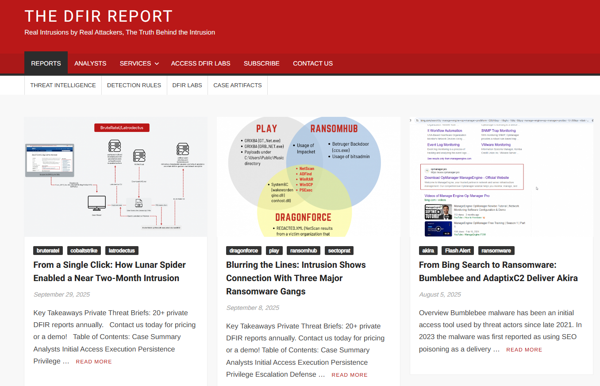

Dưới đây là một ví dụ khác về báo cáo sự cố từ Cybereason.

CHAES: Mã độc mới nhắm vào thương mại điện tử tại Mỹ Latinh

Đây là những báo cáo về từng sự cố cụ thể, tập trung vào một sự kiện hoặc đợt bùng phát nhất định. Ví dụ, báo cáo theo kiểu “Khai thác Confluence dẫn đến ransomware LockBit” trình bày từng bước những gì đã xảy ra trong cuộc tấn công đó: cách đối phương có được quyền truy cập, chúng đã làm gì, chúng bị phát hiện như thế nào, tác động ra sao, v.v. Mục tiêu là cung cấp một bản tường thuật điều tra số chi tiết cùng những phát hiện có thể dùng làm cơ sở hành động, dành riêng cho sự cố đó.

Cũng có các báo cáo ứng phó sự cố toàn cầu (chẳng hạn như báo cáo Unit 42 năm 2025), tổng hợp dữ liệu từ hàng trăm sự cố thuộc nhiều ngành, khu vực địa lý và tác nhân đe dọa khác nhau. Mục tiêu của chúng là xác định xu hướng, mô hình, các mối đe dọa mới nổi, đồng thời cung cấp những nhận định dựa trên thống kê và khuyến nghị ở mức tổng quan cho bên phòng thủ.

Ví dụ, báo cáo Unit 42 năm 2025 cho biết:

“Trong năm 2024, 86% các sự cố mà Unit 42 ứng phó có liên quan đến gián đoạn kinh doanh — bao gồm thời gian ngừng hoạt động, thiệt hại về danh tiếng hoặc cả hai”.

Ngoài ra, “Các cuộc tấn công vào chuỗi cung ứng phần mềm và đám mây đang gia tăng cả về tần suất lẫn mức độ tinh vi. Trong một chiến dịch, kẻ tấn công đã quét hơn 230 triệu mục tiêu riêng biệt để tìm thông tin nhạy cảm.”

Một báo cáo của PaloAlto Unit42 bao quát các sự cố trên toàn cầu như sau:

Báo cáo ứng phó sự cố toàn cầu

### Tình huống sự cố

Xuyên suốt module này, chúng ta sẽ tham chiếu đến một tình huống sự cố để hiểu một số thách thức mà người xử lý sự cố phải đối mặt. Sự cố này minh họa những mô hình được quan sát lặp đi lặp lại trong các sự cố thực tế. Nạn nhân trong tình huống này là Insight Nexus, một công ty nghiên cứu thị trường toàn cầu xử lý dữ liệu cạnh tranh nhạy cảm cho các khách hàng nổi tiếng trong lĩnh vực CNTT. Công ty trở thành mục tiêu của hai nhóm đe dọa riêng biệt, hoạt động đồng thời trong môi trường của công ty.

Sơ đồ dưới đây trình bày tổng quan về nạn nhân và các tác nhân đe dọa.

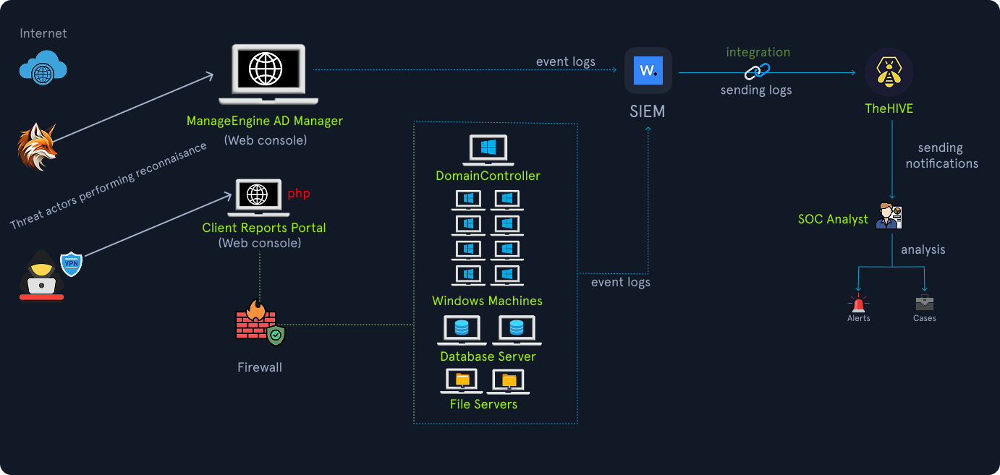

Dựa trên thông tin đã thu thập, tác nhân đe dọa thứ nhất xâm nhập được khi các quản trị viên hệ thống quên thay đổi mật khẩu mặc định admin/admin trên một ứng dụng có thể truy cập từ Internet, cụ thể là ManageEngine ADManager Plus, sau một lần cập nhật sản phẩm. Lợi dụng điều này, kẻ tấn công đăng nhập thành công, tiến hành trinh sát, lập bản đồ người dùng và máy tính, rồi cuối cùng tạo các tài khoản Active Directory mới có đặc quyền. Sử dụng một trong những tài khoản vừa tạo, đối phương tiếp tục pivot (di chuyển qua hệ thống trung gian) sâu hơn vào môi trường, xác định được một dịch vụ RDP bị mở ra bên ngoài do cấu hình sai. Khai thác điểm truy cập đó, chúng gia tăng quyền kiểm soát và cuối cùng sử dụng Group Policy Objects (GPOs — các đối tượng chính sách nhóm) để triển khai spyware (phần mềm gián điệp) bằng một gói MSI trên nhiều endpoint (thiết bị đầu cuối).

Trong phần tiếp theo, chúng ta sẽ tìm hiểu các framework Cyber Kill Chain và MITRE ATT&CK. Các giai đoạn trong những framework này phản ánh vòng đời hoạt động của kẻ tấn công và các hành động có thể quan sát được ở từng giai đoạn.

<a id="section-02"></a>

## Section 2/11 — Cyber Kill Chain

### Cyber Kill Chain là gì?

Trước khi bắt đầu nói về xử lý sự cố, chúng ta cần hiểu vòng đời tấn công (còn gọi là cyber kill chain). Vòng đời này mô tả cách các cuộc tấn công diễn ra. Hiểu được vòng đời này sẽ cung cấp cho chúng ta những thông tin hữu ích về mức độ kẻ tấn công đã tiến sâu vào mạng và những gì chúng có thể truy cập trong giai đoạn điều tra sự cố.

Cyber kill chain gồm bảy giai đoạn khác nhau, như minh họa trong hình dưới đây:

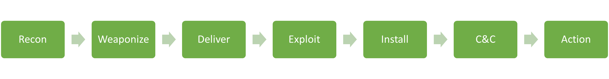

### Các giai đoạn của Cyber Kill Chain

Giai đoạn Recon (Reconnaissance — trinh sát) là giai đoạn đầu tiên, bao gồm việc kẻ tấn công lựa chọn mục tiêu. Ngoài ra, kẻ tấn công thu thập thông tin để hiểu rõ hơn về mục tiêu và thu thập càng nhiều dữ liệu hữu ích càng tốt; dữ liệu này có thể được sử dụng không chỉ trong giai đoạn này mà còn ở những giai đoạn khác của chuỗi. Một số kẻ tấn công thích thu thập thông tin thụ động từ các nguồn trên web như LinkedIn và Instagram, cũng như từ tài liệu trên các trang web của tổ chức mục tiêu. Tin tuyển dụng và các đối tác của công ty thường tiết lộ thông tin về công nghệ được sử dụng trong tổ chức mục tiêu. Chúng có thể cung cấp thông tin cực kỳ cụ thể về công cụ antivirus, hệ điều hành và công nghệ mạng. Những kẻ tấn công khác tiến thêm một bước: chúng bắt đầu “thăm dò” và chủ động quét các ứng dụng web bên ngoài cùng các địa chỉ IP thuộc tổ chức mục tiêu.

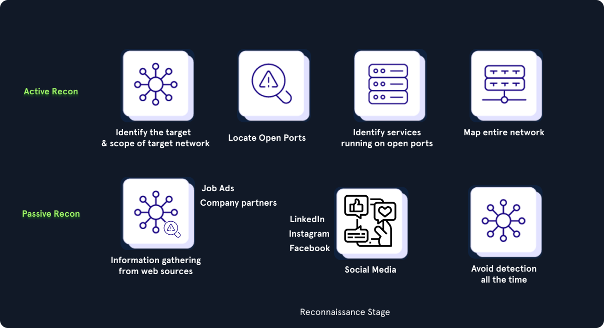

Trong giai đoạn Weaponize (chuẩn bị vũ khí), mã độc dùng để giành quyền truy cập ban đầu được phát triển và nhúng vào một dạng mã khai thác hoặc payload có thể chuyển đến mục tiêu. Mã độc này được thiết kế cực kỳ gọn nhẹ và không bị antivirus cùng các công cụ phát hiện nhận diện. Có khả năng kẻ tấn công đã thu thập thông tin để xác định công nghệ antivirus hoặc EDR đang có trong tổ chức mục tiêu. Xét tổng thể, mục đích duy nhất của giai đoạn ban đầu này là cung cấp khả năng truy cập từ xa vào một máy bị xâm nhập trong môi trường mục tiêu, đồng thời có khả năng duy trì hiện diện qua các lần khởi động lại máy và triển khai thêm công cụ cùng chức năng theo nhu cầu.

Trong giai đoạn Delivery (chuyển giao), mã khai thác hoặc payload được chuyển đến nạn nhân. Các cách tiếp cận truyền thống bao gồm email phishing chứa tệp đính kèm độc hại hoặc liên kết đến một trang web. Trang web có thể phục vụ hai mục đích: chứa mã khai thác hoặc lưu trữ payload độc hại để tránh phải gửi nó qua các công cụ quét email. Trong một số trường hợp, trang web còn có thể giả mạo một website hợp pháp mà tổ chức mục tiêu sử dụng, nhằm lừa nạn nhân nhập thông tin xác thực và thu thập chúng. Một số kẻ tấn công gọi điện cho nạn nhân với một lý do được dựng lên bằng social engineering để thuyết phục nạn nhân chạy payload. Trong những trường hợp tạo lòng tin này, payload được lưu trên một website do kẻ tấn công kiểm soát, giả mạo một website quen thuộc với nạn nhân (ví dụ: bản sao website của tổ chức mục tiêu). Rất hiếm khi payload được chuyển đến đòi hỏi nạn nhân làm nhiều hơn việc nhấp đúp vào một tệp thực thi hoặc một script (trong môi trường Windows, có thể là .bat, .cmd, .vbs, .js, .hta và các định dạng khác). Cuối cùng, có những trường hợp sử dụng tương tác vật lý để chuyển payload qua thiết bị USB và các công cụ lưu trữ tương tự được cố ý để lại ở những nơi xung quanh.

Giai đoạn Exploitation (khai thác) là thời điểm mã khai thác hoặc payload đã được chuyển đến được kích hoạt. Trong giai đoạn khai thác của Cyber Kill Chain, kẻ tấn công thường cố gắng thực thi mã trên hệ thống mục tiêu để giành quyền truy cập hoặc kiểm soát.

Trong giai đoạn Installation (cài đặt), stager ban đầu được thực thi và đang chạy trên máy bị xâm nhập. Như đã thảo luận, giai đoạn cài đặt có thể được thực hiện theo nhiều cách, tùy thuộc vào mục tiêu của kẻ tấn công và bản chất của vụ xâm nhập. Một số kỹ thuật phổ biến được sử dụng trong giai đoạn cài đặt bao gồm:

- Droppers: Kẻ tấn công có thể sử dụng dropper để đưa mã độc vào hệ thống mục tiêu. Dropper là một đoạn mã nhỏ được thiết kế để cài đặt và thực thi mã độc trên hệ thống. Dropper có thể được chuyển đến bằng nhiều cách, chẳng hạn như tệp đính kèm email, website độc hại hoặc các thủ thuật social engineering.
- Backdoors: Backdoor là một loại mã độc được thiết kế để cung cấp cho kẻ tấn công quyền truy cập liên tục vào hệ thống bị xâm nhập. Kẻ tấn công có thể cài backdoor trong giai đoạn khai thác hoặc chuyển nó đến thông qua dropper. Sau khi được cài đặt, backdoor có thể được sử dụng để thực hiện các cuộc tấn công tiếp theo hoặc đánh cắp dữ liệu từ hệ thống bị xâm nhập.
- Rootkits: Rootkit là một loại mã độc được thiết kế để che giấu sự hiện diện của nó trên hệ thống bị xâm nhập. Rootkit thường được sử dụng trong giai đoạn cài đặt để né tránh sự phát hiện của phần mềm antivirus và các công cụ bảo mật khác. Kẻ tấn công có thể cài rootkit trong giai đoạn khai thác hoặc chuyển nó đến thông qua dropper.

Trong giai đoạn Command and Control (chỉ huy và điều khiển), kẻ tấn công thiết lập khả năng truy cập từ xa vào máy bị xâm nhập. Như đã thảo luận, việc sử dụng một stager ban đầu dạng mô-đun để nạp thêm script ngay trong lúc hoạt động không phải là điều hiếm gặp. Tuy nhiên, các nhóm có trình độ cao sẽ sử dụng những công cụ riêng biệt để bảo đảm nhiều biến thể mã độc của chúng cùng tồn tại trong mạng bị xâm nhập; nếu một biến thể bị phát hiện và ngăn chặn, chúng vẫn còn phương tiện để quay lại môi trường.

Giai đoạn cuối của chuỗi là Action (hành động) hoặc mục tiêu của cuộc tấn công. Mục tiêu của từng cuộc tấn công có thể khác nhau. Một số đối phương có thể nhằm đưa dữ liệu bí mật ra ngoài, trong khi những đối phương khác muốn có được mức quyền truy cập cao nhất có thể trong mạng để triển khai ransomware. Ransomware là một loại mã độc khiến toàn bộ dữ liệu lưu trên các thiết bị đầu cuối và máy chủ không thể sử dụng hoặc truy cập, trừ khi tiền chuộc được trả trong một khoảng thời gian giới hạn (không khuyến nghị trả tiền chuộc).

Cần hiểu rằng đối phương không hoạt động theo một trình tự tuyến tính như Cyber Kill Chain gợi ý. Một số giai đoạn trước đó của Cyber Kill Chain sẽ được lặp lại nhiều lần. Ví dụ, sau giai đoạn Installation của một vụ xâm nhập thành công, bước tiếp theo hợp lý đối với đối phương là bắt đầu lại giai đoạn Recon (Reconnaissance) để xác định thêm mục tiêu và tìm lỗ hổng để khai thác, cho phép chúng tiến sâu hơn vào mạng và cuối cùng đạt được các mục tiêu của cuộc tấn công.

Mục tiêu của chúng ta là ngăn kẻ tấn công tiến xa hơn trong kill chain, lý tưởng nhất là ở một trong những giai đoạn sớm nhất.

### Framework MITRE ATT&CK

Một framework khác để hiểu hành vi của đối phương là MITRE ATT&CK. Đây là một cơ sở tri thức chi tiết hơn, có dạng ma trận, về các chiến thuật và kỹ thuật mà đối phương sử dụng để đạt được những mục tiêu cụ thể. Các chuyên gia an ninh mạng sử dụng cả hai framework để hiểu và phòng vệ trước các cuộc tấn công mạng.

MITRE ATT&CK Enterprise Matrix là một cơ sở tri thức ghi lại hành vi của đối phương đã được quan sát trong thực tế, nhắm vào các môi trường CNTT doanh nghiệp (Windows, Linux, macOS, đám mây, mạng, thiết bị di động, v.v.). Nó được trình bày dưới dạng ma trận, trong đó các cột thể hiện mục tiêu của đối phương (chiến thuật), còn các ô là những kỹ thuật kẻ tấn công sử dụng để đạt được các mục tiêu đó. Framework này giúp bên phòng thủ hiểu, mô hình hóa, phát hiện và ứng phó với hành vi của kẻ tấn công một cách có cấu trúc.

Ảnh chụp màn hình dưới đây minh họa một ví dụ về MITRE ATT&CK Enterprise Matrix:

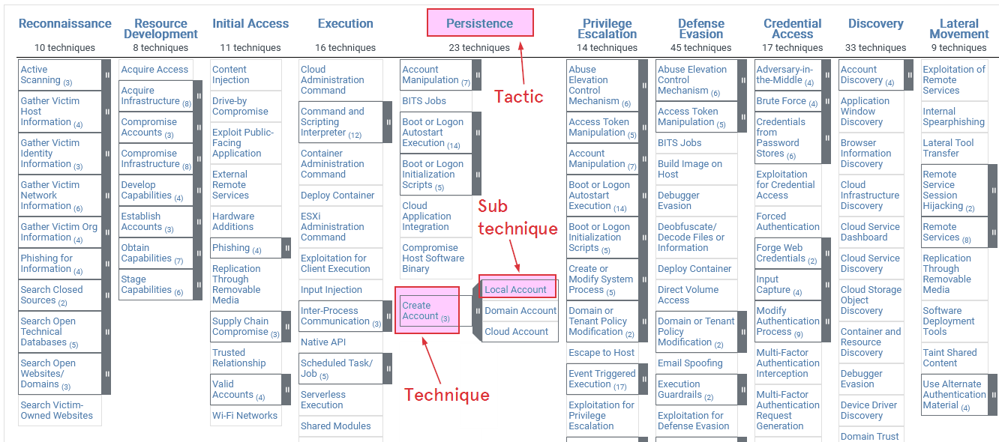

https://attack.mitre.org/matrices/enterprise/

#### Tactic (chiến thuật)

Tactic là một mục tiêu ở mức tổng quát của đối phương trong một vụ xâm nhập (mục tiêu chúng muốn đạt được ở giai đoạn đó). Ví dụ:

- Initial Access (truy cập ban đầu).
- Persistence (duy trì hiện diện).
- Privilege Escalation (leo thang đặc quyền).

#### Technique (kỹ thuật)

Technique là một phương pháp cụ thể mà đối phương sử dụng để thực hiện một chiến thuật. Kỹ thuật mô tả hành vi cụ thể của kẻ tấn công (công cụ, lệnh, API, giao thức, v.v.).

Các kỹ thuật có mã định danh như T1105 (Ingress Tool Transfer) hoặc T1021 (Remote Services). Ví dụ:

- T1105 Ingress Tool Transfer: Đề cập đến các công cụ kẻ tấn công sử dụng để tải một công cụ xuống, chẳng hạn như wget, curl, v.v.; thường là các lệnh hoặc công cụ có sẵn trong hệ điều hành.
- T1021 Remote Services: Đề cập đến việc đối phương sử dụng các giao thức như SSH, RDP và SMB để di chuyển ngang.

#### Sub-technique (kỹ thuật con)

Sub-technique là các kỹ thuật con của một kỹ thuật, mô tả một cách triển khai hoặc mục tiêu cụ thể. Mã kỹ thuật con mở rộng mã kỹ thuật cha: T1003.001 (Credential Dumping -> LSASS Memory), T1021.002 (Remote Services -> SMB/Windows Admin Shares). Ví dụ:

- T1003.001 - OS Credentials: LSASS Memory: Đề cập đến việc đối phương trích xuất thông tin xác thực trực tiếp từ bộ nhớ của tiến trình LSASS khi có được các đặc quyền cần thiết.
- T1021.002 - Remote Services: SMB/Windows Admin Shares: Đề cập đến việc đối phương tương tác với các tài nguyên chia sẻ bằng thông tin xác thực hợp lệ.

Điều này cho phép phát hiện, quy kết và báo cáo chính xác hơn (chúng ta có thể nói “Đã phát hiện T1003.001 — trích xuất bộ nhớ LSASS” thay vì chỉ nói T1003).

### Pyramid of Pain

Trong sơ đồ dưới đây, Pyramid of Pain (kim tự tháp mức độ khó khăn đối với đối phương) minh họa mức độ nỗ lực mà đối phương phải bỏ ra để thay đổi chiến thuật khi bên phòng thủ phát hiện và chặn các loại chỉ báo khác nhau. Ở đáy kim tự tháp là những chỉ báo đơn giản như giá trị hash, địa chỉ IP và tên miền — kẻ tấn công có thể dễ dàng thay đổi chúng (mức độ khó khăn thấp).

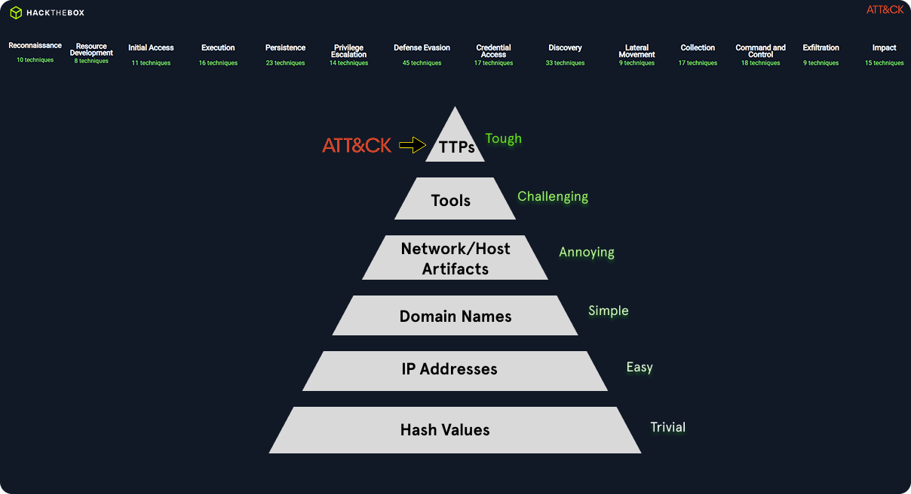

Ví dụ, chặn một IP độc hại trong tình huống “Command and Control” (T1071) của MITRE ATT&CK chỉ làm chậm đối phương đôi chút vì chúng có thể nhanh chóng chuyển sang một máy chủ C2 mới. Tiến lên phía trên, các dấu vết trên mạng và máy tính (như khóa registry, tên mutex hoặc tên tệp) tương ứng với những kỹ thuật cụ thể trong ATT&CK (ví dụ: T1547.001 – Registry Run Keys/Startup Folder). Chúng đòi hỏi nhiều nỗ lực hơn để thay đổi và là những chỉ báo bền vững hơn đối với bên phòng thủ.

Ở đỉnh kim tự tháp là công cụ, chiến thuật, kỹ thuật và quy trình (TTPs) — những yếu tố này gắn trực tiếp với phần cốt lõi của MITRE ATT&CK. Phát hiện và làm gián đoạn chúng (ví dụ: xác định việc lạm dụng PowerShell theo T1059 hoặc chèn mã vào tiến trình theo T1055) buộc đối phương phải thay đổi căn bản cách hoạt động, gây ra mức độ khó khăn cao nhất.

Tóm lại:

- Phát hiện dựa trên hash/IP = dễ né tránh.
- Phát hiện TTP dựa trên hành vi (dựa vào MITRE) = khó né tránh, tăng chi phí của kẻ tấn công và thể hiện mức độ trưởng thành cao hơn của năng lực phòng thủ.

Nhà phân tích ánh xạ các sự kiện và chỉ báo quan sát được vào những kỹ thuật và chiến thuật ATT&CK để nhanh chóng hiểu ý định của đối phương và các bước tiếp theo có khả năng xảy ra. Thông thường, cách này cũng được dùng để ưu tiên cảnh báo dựa trên các kỹ thuật nhắm vào tài sản có giá trị cao. Ngoài ra, có thể sử dụng nó để tham chiếu những hành động giảm thiểu, ngăn chặn và loại bỏ nhằm làm gián đoạn kill chain của kẻ tấn công.

### Tích hợp MITRE ATT&CK trong TheHive

TheHive là một nền tảng quản lý case (hồ sơ sự cố), được thiết kế để các đội an ninh mạng xử lý sự cố hiệu quả thông qua việc xử lý cảnh báo. Người dùng có thể tạo case và liên kết nhiều cảnh báo có liên quan vào đó. Nền tảng này đóng vai trò đầu mối tập trung để thu thập và quản lý toàn bộ cảnh báo bảo mật từ nhiều thiết bị trên một trang tổng hợp duy nhất. Ngoài ra, TheHive có khả năng nhập toàn bộ Tactics, Techniques, and Procedures (TTPs — chiến thuật, kỹ thuật và quy trình) của MITRE ATT&CK Framework vào hệ thống quản lý cảnh báo. Việc tích hợp này làm phong phú quá trình phân tích sự cố bằng cách liên kết những mẫu tấn công phát hiện được với các cảnh báo.

Để truy cập nền tảng TheHive, hãy mở http://TARGET_IP:9000 và sử dụng thông tin xác thực sau:

```text
Username: htb-analyst
Password: P3n#31337@LOG
```

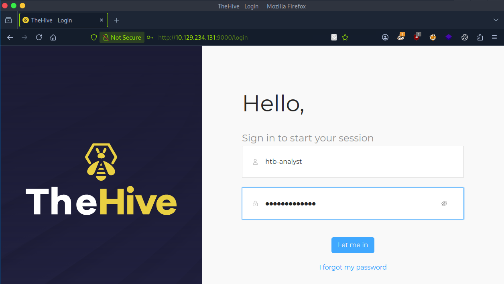

Sau khi đăng nhập, dashboard sẽ được hiển thị. Chúng ta có thể xem trang cảnh báo như trong ảnh chụp màn hình dưới đây để xem và quản lý cảnh báo hiệu quả.

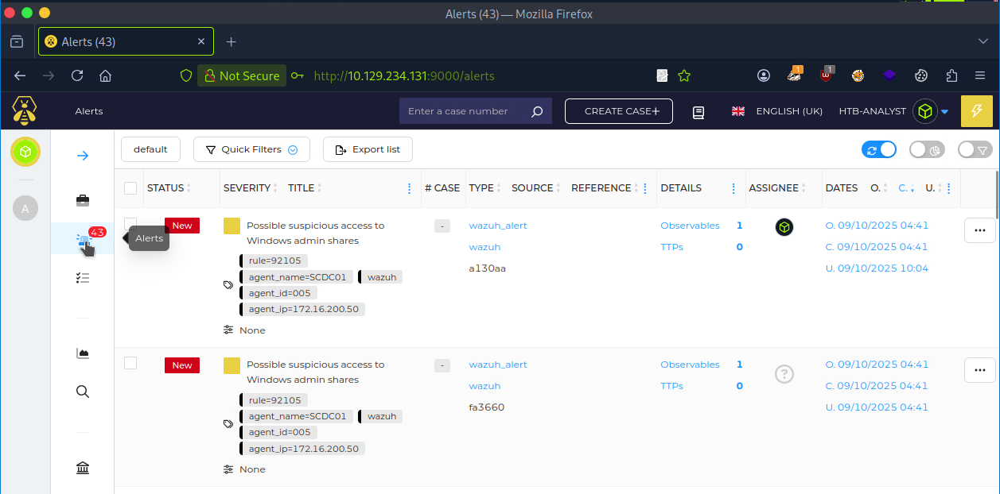

### Ví dụ ánh xạ MITRE ATT&CK

Bảng dưới đây trình bày một số kỹ thuật MITRE ATT&CK được quan sát trong sự cố.

| Chiến thuật | Kỹ thuật | ID | Mô tả |
| --- | --- | --- | --- |
| Initial Access | Exploit Public-Facing Application | T1190 | CVE của Confluence bị khai thác |
| Execution | Command and Scripting Interpreter: PowerShell | T1059.001 | PowerShell được dùng để tải payload |
| Persistence | Windows Service | T1543.003 | Windows Service được dùng để duy trì hiện diện |
| Credential Access | LSASS Memory Dumping | T1003.001 | Thông tin xác thực bị trích xuất |
| Lateral Movement | Remote Desktop Protocol | T1021.001 | Di chuyển ngang qua RDP |
| Impact | Data Encrypted for Impact | T1486 | Ransomware LockBit |

<a id="section-03"></a>

## Section 3/11 — Tổng quan quy trình xử lý sự cố

Giờ đây, khi đã quen với Cyber Kill Chain và các giai đoạn của nó, chúng ta có thể dự đoán và lường trước các bước tiếp theo trong một cuộc tấn công tốt hơn, đồng thời đề xuất các biện pháp thích hợp để đối phó.

Tương tự Cyber Kill Chain, việc ứng phó sự cố cũng có những giai đoạn khác nhau, được xác định trong Incident Handling Process (quy trình xử lý sự cố). Quy trình xử lý sự cố xác định năng lực để các tổ chức chuẩn bị, phát hiện và ứng phó với các sự kiện độc hại. Lưu ý rằng quy trình này phù hợp để ứng phó với các sự kiện an ninh CNTT, nhưng các giai đoạn của nó không tương ứng một-một với các giai đoạn của Cyber Kill Chain.

Theo định nghĩa của NIST, quy trình xử lý sự cố gồm bốn giai đoạn riêng biệt sau:

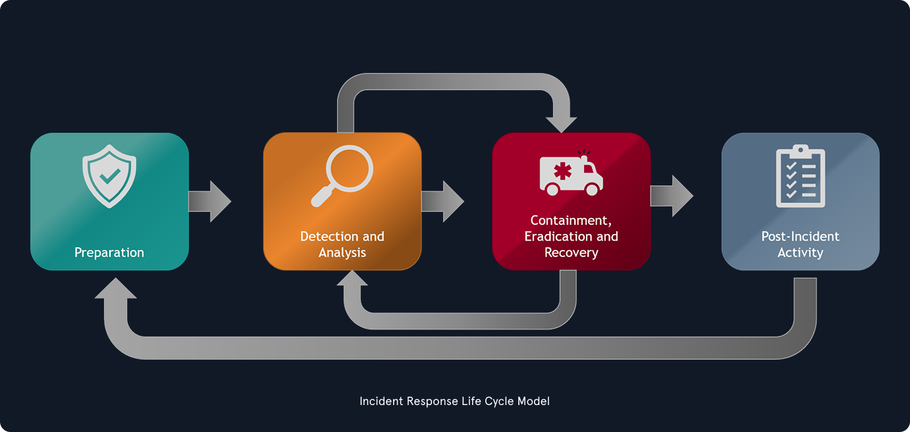

Người xử lý sự cố dành phần lớn thời gian cho hai giai đoạn đầu: chuẩn bị và phát hiện, phân tích. Đây là nơi chúng ta, với vai trò người xử lý sự cố, dành nhiều thời gian để nâng cao năng lực và tìm kiếm sự kiện độc hại tiếp theo. Khi phát hiện một sự kiện độc hại, chúng ta chuyển sang giai đoạn tiếp theo và ứng phó với sự kiện đó (nhưng phải luôn có nguồn lực hoạt động ở hai giai đoạn đầu để năng lực chuẩn bị và phát hiện không bị gián đoạn). Như có thể thấy trong hình, quy trình mang tính chu kỳ chứ không tuyến tính. Điểm chính cần hiểu ở đây là khi phát hiện bằng chứng mới, các bước tiếp theo cũng có thể thay đổi. Điều hết sức quan trọng là bảo đảm chúng ta không bỏ qua bước nào trong quy trình và hoàn tất một bước trước khi chuyển sang bước tiếp theo. Ví dụ, nếu phát hiện mười máy bị nhiễm, chắc chắn chúng ta không nên chỉ ngăn chặn năm máy rồi bắt đầu loại bỏ trong khi năm máy còn lại vẫn bị nhiễm. Cách tiếp cận như vậy có thể không hiệu quả vì ít nhất chúng ta đang báo cho kẻ tấn công biết rằng đã phát hiện và đang truy tìm chúng; như có thể hình dung, điều này có thể dẫn đến những hậu quả khó lường.

Như vậy, xử lý sự cố có hai hoạt động chính là điều tra và phục hồi. Hoạt động điều tra nhằm:

- Phát hiện nạn nhân đầu tiên, “patient zero”, và xây dựng dòng thời gian của sự cố đang tiếp diễn (nếu sự cố vẫn hoạt động).
- Xác định những công cụ và mã độc mà đối phương đã sử dụng.
- Ghi lại các hệ thống bị xâm nhập và những gì đối phương đã thực hiện.

Sau điều tra, hoạt động phục hồi bao gồm xây dựng và triển khai một kế hoạch phục hồi. Khi kế hoạch được triển khai, doanh nghiệp cần trở lại hoạt động bình thường nếu sự cố đã gây gián đoạn.

Khi một sự cố đã được xử lý hoàn toàn, một báo cáo sẽ được ban hành, trình bày chi tiết nguyên nhân và chi phí của sự cố. Ngoài ra, các hoạt động “rút kinh nghiệm” được thực hiện, trong số những hoạt động khác, để hiểu tổ chức cần làm gì nhằm ngăn các sự cố cùng loại tái diễn.

Trong những section tiếp theo, chúng ta sẽ lần lượt tìm hiểu toàn bộ các giai đoạn của quy trình xử lý sự cố.

<a id="section-04"></a>

## Section 4/11 — Giai đoạn chuẩn bị (Phần 1)

Trong giai đoạn Preparation (chuẩn bị), chúng ta có hai mục tiêu riêng biệt. Mục tiêu thứ nhất là thiết lập năng lực xử lý sự cố trong tổ chức. Mục tiêu thứ hai là có khả năng phòng vệ và ngăn ngừa các sự cố an ninh CNTT bằng cách triển khai các biện pháp bảo vệ phù hợp. Những biện pháp này bao gồm tăng cường bảo mật thiết bị đầu cuối và máy chủ, phân tầng Active Directory, xác thực đa yếu tố, quản lý truy cập đặc quyền, v.v. Mặc dù phòng vệ trước sự cố không phải trách nhiệm của đội xử lý sự cố, hoạt động này là nền tảng cho thành công chung của đội.

### Các điều kiện tiên quyết cho việc chuẩn bị

Trong giai đoạn chuẩn bị, chúng ta cần bảo đảm có:

- Các thành viên đội xử lý sự cố có kỹ năng (có thể thuê ngoài các thành viên đội xử lý sự cố, nhưng dù thế nào nội bộ vẫn cần có năng lực cơ bản và hiểu biết về xử lý sự cố).
- Đội ngũ nhân viên được đào tạo (ở mức tối đa có thể, thông qua hoạt động nâng cao nhận thức bảo mật hoặc những hình thức đào tạo khác).
- Các chính sách và tài liệu rõ ràng.
- Công cụ (phần mềm và phần cứng).

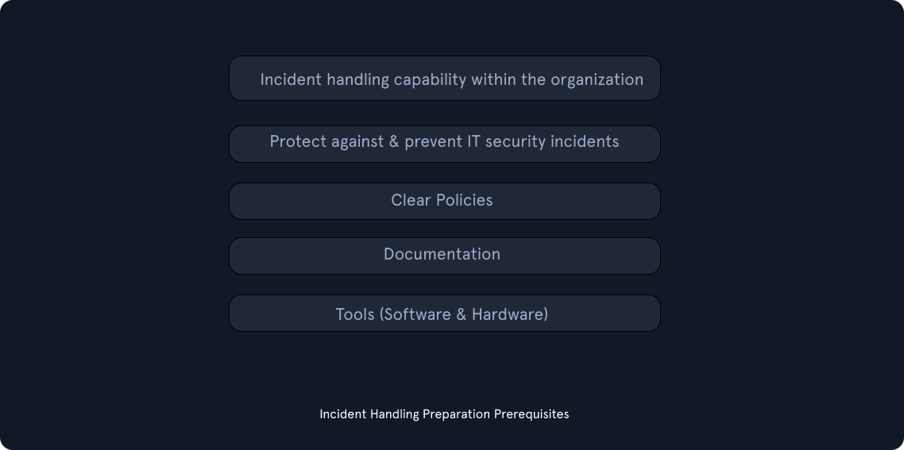

### Chính sách và tài liệu rõ ràng

Một số chính sách và tài liệu bằng văn bản cần chứa phiên bản cập nhật của những thông tin sau:

- Thông tin liên hệ và vai trò của các thành viên đội xử lý sự cố.
- Thông tin liên hệ của bộ phận pháp lý và tuân thủ, ban quản lý, bộ phận hỗ trợ CNTT, bộ phận truyền thông và quan hệ báo chí, cơ quan thực thi pháp luật, nhà cung cấp dịch vụ Internet, bộ phận quản lý cơ sở vật chất và đội ứng phó sự cố bên ngoài.
- Chính sách, kế hoạch và quy trình ứng phó sự cố.
- Chính sách và quy trình chia sẻ thông tin sự cố.
- Baseline (trạng thái chuẩn) của các hệ thống và mạng, lấy từ golden image (bản ảnh hệ thống chuẩn) và một môi trường ở trạng thái sạch.
- Sơ đồ mạng.
- Cơ sở dữ liệu quản lý tài sản trên toàn tổ chức.
- Các tài khoản người dùng có quyền vượt mức thông thường để đội có thể sử dụng theo nhu cầu khi cần thiết (bao gồm cả các hệ thống trọng yếu đối với hoạt động kinh doanh, được xử lý bởi người có kỹ năng cần thiết để quản trị hệ thống cụ thể đó). Các tài khoản này thường được bật khi sự cố được xác nhận trong quá trình điều tra ban đầu, rồi tắt khi sự cố kết thúc. Khi vô hiệu hóa người dùng, cũng phải thực hiện đặt lại mật khẩu bắt buộc.
- Khả năng mua phần cứng, phần mềm hoặc thuê nguồn lực bên ngoài mà không phải đi qua toàn bộ quy trình mua sắm (mua khẩn cấp trong một hạn mức nhất định). Điều bạn ít muốn gặp nhất trong sự cố là phải chờ hàng tuần để được duyệt một công cụ giá $500.
- Các bảng tra cứu nhanh phục vụ điều tra số hoặc điều tra sự cố.

Một số trường hợp không nghiêm trọng có thể được xử lý tương đối nhanh và không gặp nhiều trở ngại trong hoặc ngoài tổ chức. Những trường hợp khác có thể đòi hỏi thông báo cho cơ quan thực thi pháp luật và truyền thông ra bên ngoài với khách hàng cùng nhà cung cấp bên thứ ba, đặc biệt khi sự cố làm phát sinh vấn đề pháp lý. Ví dụ, một vụ rò rỉ dữ liệu liên quan đến dữ liệu khách hàng phải được báo cáo cho cơ quan thực thi pháp luật trong một thời hạn nhất định theo GDPR. Có thể tồn tại nhiều yêu cầu tuân thủ tùy theo địa điểm và/hoặc các chi nhánh nơi sự cố xảy ra, vì vậy cách tốt nhất để hiểu các yêu cầu này là thảo luận với đội pháp lý và tuân thủ theo từng sự cố (hoặc chủ động từ trước).

Mặc dù việc có sẵn tài liệu là rất quan trọng, việc ghi chép sự cố trong lúc điều tra cũng quan trọng không kém. Vì vậy, trong giai đoạn này, chúng ta cũng phải thiết lập năng lực báo cáo hiệu quả. Sự cố có thể gây căng thẳng rất lớn, và chúng ta dễ quên phần việc này khi sự cố diễn tiến, đặc biệt khi đang tập trung và hành động cực kỳ nhanh để giải quyết nó sớm nhất có thể. Chúng ta nên cố gắng giữ bình tĩnh, ghi chép và bảo đảm ghi chép có dấu thời gian, hoạt động đã thực hiện, kết quả của hoạt động và người thực hiện. Nhìn chung, chúng ta nên tìm câu trả lời cho: ai, việc gì, khi nào, ở đâu, tại sao và bằng cách nào.

### Công cụ (phần mềm và phần cứng)

Tiếp theo, chúng ta cũng cần bảo đảm có các công cụ phù hợp để thực hiện công việc. Chúng bao gồm, nhưng không giới hạn ở:

- Một laptop bổ sung hoặc máy trạm điều tra số cho mỗi thành viên đội xử lý sự cố để lưu giữ ảnh đĩa và tệp log, phân tích dữ liệu, cũng như điều tra mà không bị hạn chế (chúng ta biết mã độc sẽ được thử nghiệm ở đây, vì vậy các công cụ như antivirus cần được tắt). Những thiết bị này phải được sử dụng và quản lý phù hợp, tránh cách làm phát sinh rủi ro cho tổ chức.
- Công cụ thu thập ảnh phục vụ điều tra số và phân tích.
- Công cụ thu thập và phân tích bộ nhớ.
- Công cụ thu thập và phân tích dữ liệu live response (ứng phó trên hệ thống đang chạy).
- Công cụ phân tích log.
- Công cụ thu thập và phân tích lưu lượng mạng.
- Cáp mạng và switch.
- Write blocker (thiết bị chặn ghi).
- Ổ cứng phục vụ tạo ảnh điều tra số.
- Cáp nguồn.
- Tua vít, nhíp và các công cụ liên quan khác để sửa chữa hoặc tháo rời thiết bị phần cứng khi cần.
- Công cụ tạo Indicator of Compromise (IOC — chỉ báo xâm nhập) và khả năng tìm kiếm IOC trên toàn tổ chức.
- Biểu mẫu chain of custody (chuỗi quản lý và bàn giao bằng chứng).
- Phần mềm mã hóa.
- Hệ thống theo dõi ticket.
- Khu vực an toàn để lưu trữ và điều tra.
- Hệ thống xử lý sự cố độc lập với hạ tầng của tổ chức.

Nhiều công cụ nêu trên sẽ nằm trong bộ dụng cụ được gọi là jump bag — luôn sẵn sàng với các công cụ cần thiết để có thể cầm lên và mang đi ngay lập tức. Nếu không có bộ dụng cụ chuẩn bị sẵn này, việc gom đủ mọi công cụ cần thiết ngay khi phát sinh nhu cầu có thể mất nhiều ngày hoặc nhiều tuần trước khi chúng ta sẵn sàng ứng phó.

Cuối cùng, chúng ta muốn nhấn mạnh tầm quan trọng của việc có một hệ thống tài liệu hoàn toàn độc lập với hạ tầng tổ chức và được bảo vệ phù hợp. Ngay từ đầu, hãy giả định toàn bộ domain đã bị xâm nhập và mọi hệ thống đều có thể trở nên không khả dụng. Tương tự, việc trao đổi về sự cố cần được thực hiện qua những kênh không thuộc các hệ thống của tổ chức; hãy giả định đối phương kiểm soát mọi thứ và có thể đọc các kênh liên lạc như email.

<a id="section-05"></a>

## Section 5/11 — Giai đoạn chuẩn bị (Phần 2)

Một phần khác của giai đoạn chuẩn bị là phòng vệ trước sự cố. Mặc dù việc bảo vệ không nhất thiết thuộc trách nhiệm của đội xử lý sự cố, đội cần biết mọi hoạt động liên quan đến bảo vệ để hiểu rõ hơn loại sự cố, mức độ tinh vi của nó và biết phải tìm dấu vết hoặc bằng chứng hỗ trợ điều tra ở đâu.

Bây giờ, hãy xem một số biện pháp bảo vệ rất được khuyến nghị, có hiệu quả giảm thiểu cao đối với phần lớn các mối đe dọa.

### DMARC

DMARC là một cơ chế bảo vệ email chống phishing, được xây dựng trên SPF và DKIM vốn đã tồn tại. Ý tưởng đằng sau DMARC là từ chối những email “giả vờ” xuất phát từ tổ chức của chúng ta. Vì vậy, nếu đối phương giả mạo email của một nhân viên yêu cầu thanh toán hóa đơn, hệ thống sẽ từ chối email trước khi nó đến người nhận dự kiến. DMARC dễ triển khai và ít tốn kém; tuy nhiên, cần nhấn mạnh rằng bắt buộc phải kiểm thử kỹ lưỡng. Nếu không (và đây là điều thường xảy ra), chúng ta có nguy cơ chặn email hợp lệ mà không có khả năng khôi phục chúng.

Với các quy tắc lọc email, chúng ta có thể đưa DMARC lên một “cấp độ” tiếp theo và bổ sung khả năng bảo vệ trước các email không vượt qua kiểm tra DMARC từ những domain không thuộc sở hữu của mình. Điều này khả thi vì một số hệ thống email thực hiện kiểm tra DMARC và thêm một header cho biết DMARC thành công hay thất bại trong phần header của thư. Mặc dù cách này có thể rất mạnh trong việc phát hiện email phishing từ bất kỳ domain nào, nó đòi hỏi kiểm thử sâu rộng trước khi đưa vào môi trường production. Một nguồn false positive (dương tính giả) lớn ở đây là các email được gửi “thay mặt” qua một dịch vụ gửi email nào đó, vì chúng thường không vượt qua DMARC do domain không khớp.

### Tăng cường bảo mật endpoint (và EDR)

Các thiết bị đầu cuối (máy trạm, laptop, v.v.) là điểm xâm nhập của phần lớn các cuộc tấn công mà chúng ta đối mặt hằng ngày. Xét đến việc phần lớn mối đe dọa bắt nguồn từ Internet và nhắm vào người dùng đang duyệt website, mở tệp đính kèm hoặc chạy tệp thực thi độc hại, một tỷ lệ đáng kể các hoạt động này sẽ xảy ra trên thiết bị đầu cuối của doanh nghiệp mà họ sử dụng.

Hiện có một số tiêu chuẩn tăng cường bảo mật endpoint được công nhận rộng rãi, trong đó baseline của CIS và Microsoft phổ biến nhất; chúng thực sự nên là các khối nền tảng cho baseline tăng cường bảo mật của tổ chức. Một số hành động rất quan trọng (thực sự hiệu quả) cần lưu ý và thực hiện là:

- Tắt LLMNR/NetBIOS.
- Triển khai LAPS và gỡ quyền quản trị khỏi người dùng thông thường.
- Tắt PowerShell hoặc cấu hình ở chế độ "ConstrainedLanguage".
- Bật các quy tắc Attack Surface Reduction (ASR — giảm bề mặt tấn công) nếu sử dụng Microsoft Defender.
- Triển khai whitelisting (danh sách cho phép). Chúng ta biết việc triển khai này gần như bất khả thi. Ít nhất hãy cân nhắc chặn thực thi từ những thư mục người dùng có thể ghi (Downloads, Desktop, AppData, v.v.). Đây là các vị trí mà mã khai thác và payload độc hại sẽ xuất hiện ban đầu. Nhớ chặn cả những loại script như .hta, .vbs, .cmd, .bat, .js và tương tự. Cần chú ý đến các tệp LOLBin khi triển khai whitelisting. Đừng bỏ qua chúng; chúng thực sự được sử dụng ngoài thực tế để giành quyền truy cập ban đầu và vượt qua whitelisting.
- Sử dụng tường lửa trên máy tính. Tối thiểu, chặn giao tiếp giữa các máy trạm và chặn lưu lượng đi ra đến các LOLBin.
- Triển khai một sản phẩm EDR. Ở thời điểm này, AMSI cung cấp khả năng quan sát rất tốt đối với các script bị làm rối, giúp sản phẩm chống mã độc kiểm tra nội dung trước khi nó được thực thi. Rất nên chỉ chọn những sản phẩm tích hợp với AMSI.

### Bảo vệ mạng

Phân đoạn mạng là một kỹ thuật mạnh để ngăn một vụ xâm nhập lan ra toàn tổ chức. Các hệ thống trọng yếu đối với hoạt động kinh doanh phải được cô lập và chỉ cho phép những kết nối cần thiết cho hoạt động kinh doanh. Tài nguyên nội bộ không nên được tiếp xúc trực tiếp với Internet (trừ khi được đặt trong DMZ).

Ngoài ra, khi nói đến bảo vệ mạng, chúng ta nên cân nhắc các hệ thống IDS/IPS (Intrusion Detection System/Intrusion Prevention System — hệ thống phát hiện/ngăn chặn xâm nhập). Sức mạnh của chúng thực sự được thể hiện khi thực hiện chặn bắt SSL/TLS để có thể nhận diện lưu lượng độc hại dựa trên nội dung truyền qua mạng, thay vì dựa vào uy tín của địa chỉ IP — một cách phát hiện lưu lượng độc hại truyền thống và rất kém hiệu quả.

Ngoài ra, hãy bảo đảm chỉ các thiết bị được tổ chức phê duyệt mới có thể truy cập mạng. Có thể sử dụng các giải pháp như 802.1x để giảm rủi ro từ thiết bị cá nhân mang vào sử dụng (BYOD) hoặc thiết bị độc hại kết nối với mạng doanh nghiệp. Nếu chúng ta là công ty chỉ sử dụng đám mây, chẳng hạn Azure/Azure AD (nay gọi là Microsoft Entra ID), có thể đạt được mức bảo vệ tương tự với các chính sách Conditional Access, chỉ cho phép truy cập tài nguyên tổ chức khi kết nối từ một thiết bị do công ty quản lý.

### Quản lý danh tính đặc quyền / MFA / mật khẩu

Ở thời điểm này, đánh cắp thông tin xác thực của người dùng đặc quyền là con đường leo thang phổ biến nhất trong môi trường Active Directory. Ngoài ra, một sai lầm thường gặp là người dùng quản trị có mật khẩu yếu (nhưng thường phức tạp) hoặc dùng chung mật khẩu với tài khoản người dùng thông thường của họ (có thể bị lấy qua nhiều phương thức tấn công như keylogging — ghi lại thao tác bàn phím). Để minh họa, một mật khẩu yếu nhưng phức tạp là "Password1!". Nó bao gồm chữ hoa, chữ thường, số và ký tự đặc biệt, nhưng dù vậy vẫn dễ đoán và có mặt trong nhiều danh sách mật khẩu mà đối phương dùng để tấn công. Nên hướng dẫn nhân viên sử dụng passphrase (cụm mật khẩu) vì chúng khó đoán hơn và khó brute force (thử vét cạn). Một ví dụ về cụm mật khẩu dễ nhớ nhưng dài và phức tạp là "i LIK3 my coffeE warm". Nếu biết một ngôn ngữ thứ hai, có thể kết hợp các từ từ nhiều ngôn ngữ để tăng khả năng bảo vệ.

Xác thực đa yếu tố (MFA) là một giải pháp bảo vệ danh tính khác cần được triển khai, ít nhất cho mọi hình thức truy cập quản trị vào tất cả ứng dụng và thiết bị.

### Quét lỗ hổng

Thực hiện quét lỗ hổng liên tục trong môi trường và khắc phục ít nhất các lỗ hổng được phát hiện ở mức "High" (cao) và "Critical" (nghiêm trọng). Mặc dù việc quét có thể tự động hóa, việc khắc phục thường cần sự tham gia thủ công. Nếu vì một lý do nào đó không thể áp dụng bản vá, chúng ta nhất định cần phân đoạn các hệ thống có lỗ hổng.

### Đào tạo nhận thức người dùng

Đào tạo người dùng nhận biết hành vi đáng ngờ và báo cáo khi phát hiện là một lợi ích lớn đối với chúng ta. Mặc dù khó đạt tỷ lệ thành công 100% trong việc này, các buổi đào tạo như vậy được biết là làm giảm đáng kể số vụ xâm nhập thành công. Những lần kiểm tra “bất ngờ” định kỳ cũng nên là một phần của chương trình đào tạo, ví dụ như email phishing hằng tháng, USB được để lại trong tòa nhà văn phòng, v.v.

### Đánh giá bảo mật Active Directory

Cách tốt nhất để phát hiện cấu hình bảo mật sai hoặc những lỗ hổng nghiêm trọng đang lộ ra là tìm kiếm chúng từ góc nhìn của kẻ tấn công. Tự tiến hành đánh giá (hoặc thuê bên thứ ba nếu tổ chức thiếu kỹ năng) sẽ giúp bảo đảm rằng khi một thiết bị đầu cuối bị xâm nhập, kẻ tấn công không thể chỉ qua một bước là leo thang lên đặc quyền cao trong mạng. Càng nhiều công cụ bổ sung và hoạt động được kẻ tấn công tạo ra, khả năng chúng ta phát hiện chúng càng cao, vì vậy chúng ta cố gắng loại bỏ tối đa các cơ hội dễ khai thác và các điểm yếu dễ bị tận dụng.

Active Directory có một số con đường leo thang đặc quyền hoặc lỗi riêng biệt đã được biết đến. Những con đường hoặc lỗi mới cũng được phát hiện khá thường xuyên. Đánh giá bảo mật Active Directory có vai trò thiết yếu đối với tình trạng bảo mật của toàn bộ môi trường. Chúng ta không giả định rằng quản trị viên hệ thống biết tất cả những lỗi đã được phát hiện hoặc công bố, vì trên thực tế, có lẽ họ không biết hết.

### Diễn tập Purple Team

Chúng ta cần đào tạo người xử lý sự cố và duy trì sự tham gia tích cực của họ. Điều này là không phải bàn cãi, và nơi tốt nhất để làm việc đó là ngay trong môi trường của tổ chức. Về bản chất, diễn tập purple team là các cuộc đánh giá bảo mật do red team thực hiện, trong đó red team thông báo liên tục hoặc sau cùng cho blue team về các hành động, phát hiện, những thiếu sót về khả năng quan sát hoặc bảo mật, v.v. Các cuộc diễn tập này sẽ giúp nhận diện lỗ hổng trong tổ chức, đồng thời kiểm tra năng lực phòng thủ của blue team về ghi log, giám sát, phát hiện và khả năng ứng phó. Nếu một mối đe dọa không bị phát hiện, đó là cơ hội để cải thiện. Với những mối đe dọa đã bị phát hiện, blue team có thể kiểm tra các playbook và quy trình xử lý sự cố để bảo đảm chúng vững chắc và đạt được kết quả mong đợi.

Để thực hành các bài tập liên quan đến purple team, bạn có thể tham khảo những module như Intro to Academy's Purple Modules và Detection & OpSec Cyber Range, cung cấp môi trường để thực hiện diễn tập purple team.

<a id="section-06"></a>

## Section 6/11 — Giai đoạn phát hiện và phân tích (Phần 1)

Đến đây, chúng ta đã xây dựng các quy trình, thủ tục và có hướng dẫn về cách hành động khi gặp sự cố an ninh.

Giai đoạn Detection & Analysis (phát hiện và phân tích) bao gồm mọi khía cạnh của việc phát hiện sự cố, chẳng hạn sử dụng cảm biến, log và nhân sự đã được đào tạo. Giai đoạn này cũng bao gồm chia sẻ thông tin, kiến thức và sử dụng threat intelligence (thông tin tình báo về mối đe dọa) dựa trên ngữ cảnh. Phân đoạn kiến trúc, hiểu rõ mạng và có khả năng quan sát bên trong mạng cũng là những yếu tố quan trọng.

Các mối đe dọa được đưa vào tổ chức thông qua vô số phương thức tấn công, và việc phát hiện chúng có thể đến từ những nguồn như:

- Một nhân viên nhận thấy hành vi bất thường.
- Một cảnh báo từ một trong các công cụ của chúng ta (EDR, IDS, Firewall, SIEM, v.v.).
- Các hoạt động threat hunting (chủ động săn tìm mối đe dọa).
- Thông báo từ bên thứ ba cho biết họ phát hiện dấu hiệu tổ chức của chúng ta bị xâm nhập.

Rất nên tạo các lớp phát hiện bằng cách phân loại mạng một cách hợp lý như sau:

- Phát hiện tại vành đai mạng (sử dụng tường lửa, hệ thống phát hiện/ngăn chặn xâm nhập mạng hướng ra Internet, vùng phi quân sự DMZ, v.v.).
- Phát hiện ở cấp mạng nội bộ (sử dụng tường lửa cục bộ, hệ thống phát hiện/ngăn chặn xâm nhập trên máy tính, v.v.).
- Phát hiện ở cấp thiết bị đầu cuối (sử dụng hệ thống antivirus, hệ thống phát hiện và ứng phó trên endpoint, v.v.).
- Phát hiện ở cấp ứng dụng (sử dụng log ứng dụng, log dịch vụ, v.v.).

### Điều tra ban đầu

Khi phát hiện một sự cố an ninh, chúng ta nên tiến hành điều tra ban đầu và xác lập ngữ cảnh trước khi tập hợp đội và huy động hoạt động ứng phó sự cố trên toàn tổ chức. Hãy nghĩ đến cách thông tin được trình bày trong một sự kiện mà tài khoản quản trị kết nối đến một địa chỉ IP vào HH:MM:SS. Nếu không biết hệ thống nào nằm ở địa chỉ IP đó và thời gian thuộc múi giờ nào, chúng ta có thể dễ dàng đi đến kết luận sai về ý nghĩa của sự kiện. Tóm lại, ở giai đoạn này, chúng ta nên cố gắng thu thập càng nhiều thông tin càng tốt về những nội dung sau:

- Ngày/giờ sự cố được báo cáo. Ngoài ra, ai phát hiện sự cố và/hoặc ai báo cáo nó?
- Sự cố được phát hiện như thế nào?
- Sự cố là gì? Phishing? Hệ thống không khả dụng? v.v.
- Lập danh sách các hệ thống bị ảnh hưởng (nếu phù hợp).
- Ghi lại ai đã truy cập các hệ thống bị ảnh hưởng và những hành động đã được thực hiện. Ghi chú liệu sự cố vẫn đang tiếp diễn hay hoạt động đáng ngờ đã bị dừng.
- Vị trí vật lý, hệ điều hành, địa chỉ IP và hostname, chủ sở hữu hệ thống, mục đích của hệ thống, trạng thái hiện tại của hệ thống.
- Danh sách địa chỉ IP; nếu có mã độc thì ghi nhận thời gian và ngày phát hiện, loại mã độc, hệ thống bị ảnh hưởng, bản xuất các tệp độc hại cùng thông tin điều tra số về chúng (chẳng hạn giá trị hash, bản sao tệp, v.v.).

Khi có những thông tin đó, chúng ta có thể đưa ra quyết định dựa trên kiến thức đã thu thập. Điều này có nghĩa gì? Có lẽ chúng ta sẽ hành động khác nếu biết laptop của CEO bị xâm nhập so với laptop của một thực tập sinh.

Với thông tin thu thập ban đầu, chúng ta có thể bắt đầu xây dựng dòng thời gian sự cố. Dòng thời gian này sẽ giúp chúng ta làm việc có tổ chức trong suốt sự kiện và cung cấp bức tranh tổng thể về những gì đã xảy ra. Các sự kiện trong dòng thời gian được sắp xếp theo thời điểm xảy ra. Lưu ý rằng trong quá trình điều tra về sau, chúng ta không nhất thiết phát hiện bằng chứng theo thứ tự thời gian này. Tuy nhiên, khi sắp xếp bằng chứng theo thời điểm xảy ra, chúng ta sẽ có được ngữ cảnh từ các sự kiện riêng lẻ. Dòng thời gian cũng có thể làm rõ liệu bằng chứng mới phát hiện có thuộc sự cố hiện tại hay không. Ví dụ, hãy tưởng tượng thứ chúng ta cho là payload ban đầu của một cuộc tấn công sau đó lại được phát hiện đã có trên một thiết bị khác từ hai tuần trước. Chúng ta sẽ gặp những tình huống dữ liệu đang xem xét cực kỳ liên quan, và cả những tình huống dữ liệu không liên quan, khiến chúng ta đang tìm sai chỗ. Nhìn chung, dòng thời gian cần chứa thông tin được mô tả trong các cột sau:

| Ngày | Thời gian xảy ra sự kiện | hostname | Mô tả sự kiện | Nguồn dữ liệu |
| --- | --- | --- | --- | --- |

Hãy lấy một sự kiện và điền vào bảng ví dụ phía trên. Kết quả sẽ như sau:

| Ngày | Thời gian xảy ra sự kiện | hostname | Mô tả sự kiện | Nguồn dữ liệu |
| --- | --- | --- | --- | --- |
| 09/09/2021 | 13:31 CET | SQLServer01 | Phát hiện công cụ của tin tặc 'Mimikatz' | Phần mềm antivirus |

Như có thể suy ra, dòng thời gian chủ yếu tập trung vào hành vi của kẻ tấn công, vì vậy các hoạt động được ghi lại thể hiện thời điểm cuộc tấn công xảy ra, thời điểm một kết nối mạng được thiết lập để truy cập hệ thống, thời điểm các tệp được tải xuống, v.v. Điều quan trọng là bảo đảm ghi lại nơi hoạt động được phát hiện hoặc tìm thấy và những hệ thống liên quan đến nó.

Chúng ta cũng có thể xem một cảnh báo liên quan đến bản ghi sự kiện này trong nền tảng quản lý case TheHive.

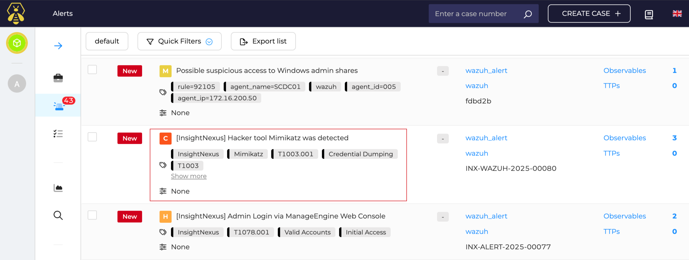

Hãy di chuyển xuống cuối section này và nhấp vào "Click here to spawn the target system!" (nhấp vào đây để khởi tạo hệ thống mục tiêu). Sau đó, mở trang web TheHive tại "Target IP:9000", trên cổng 9000, sử dụng thông tin xác thực được cung cấp để xem các cảnh báo.

Chúng ta có thể tự nhận xử lý cảnh báo, tạo case, làm việc trên đó, thêm chi tiết về sự cố vào case; sau khi điều tra hoàn tất, có thể ghi lại toàn bộ phát hiện và bài học trong case rồi đóng nó.

### Các câu hỏi về mức độ nghiêm trọng và phạm vi sự cố

Khi xử lý sự cố an ninh, chúng ta cũng nên cố gắng trả lời các câu hỏi sau để hình dung mức độ nghiêm trọng và phạm vi của sự cố:

- Tác động của việc khai thác là gì?
- Các điều kiện cần để khai thác là gì?
- Có hệ thống trọng yếu nào đối với hoạt động kinh doanh có thể bị ảnh hưởng bởi sự cố không?
- Có các bước khắc phục nào được đề xuất không?
- Có bao nhiêu hệ thống đã bị ảnh hưởng?
- Mã khai thác có đang được sử dụng trong thực tế không?
- Mã khai thác có khả năng tương tự worm không?

Hai câu cuối có thể cho thấy mức độ tinh vi của đối phương.

Như có thể hình dung, các sự cố có tác động lớn sẽ được xử lý ngay, và những sự cố có số lượng lớn hệ thống bị ảnh hưởng sẽ phải được chuyển lên cấp xử lý cao hơn.

### Tính bảo mật và việc trao đổi thông tin về sự cố

Sự cố là chủ đề có tính bảo mật rất cao, vì vậy mọi thông tin thu thập được cần được giới hạn theo nguyên tắc chỉ những người cần biết mới được biết, trừ khi luật áp dụng hoặc quyết định của ban quản lý yêu cầu khác. Có nhiều lý do cho điều này. Chẳng hạn, đối phương có thể là một nhân viên của công ty; hoặc nếu đã xảy ra xâm nhập, việc trao đổi với các bên nội bộ và bên ngoài cần do người được chỉ định đảm nhiệm, phù hợp với yêu cầu của bộ phận pháp lý.

Khi bắt đầu một cuộc điều tra, chúng ta sẽ đặt ra một số kỳ vọng và mục tiêu. Chúng thường bao gồm loại sự cố đã xảy ra, các nguồn bằng chứng sẵn có và ước tính sơ bộ thời gian đội cần để điều tra. Ngoài ra, dựa trên sự cố, chúng ta sẽ đặt kỳ vọng về việc có thể xác định được đối phương hay không. Tất nhiên, nhiều nội dung ở trên có thể thay đổi khi điều tra tiến triển và xuất hiện manh mối mới. Điều quan trọng là cập nhật cho mọi người tham gia và ban quản lý về những tiến triển cùng các kỳ vọng.

### Tiếp theo

Trong section tiếp theo, chúng ta sẽ đi sâu hơn vào chi tiết điều tra, những gì có thể là chỉ báo xâm nhập và cách bắt đầu điều tra dựa trên chúng.

<a id="section-07"></a>

## Section 7/11 — Giai đoạn phát hiện và phân tích (Phần 2)

Khi bắt đầu một cuộc điều tra, chúng ta muốn hiểu chuyện gì đã xảy ra và nó xảy ra như thế nào. Để phân tích dữ liệu liên quan đến sự cố một cách đúng đắn và hiệu quả, các thành viên đội xử lý sự cố cần có kiến thức kỹ thuật chuyên sâu và kinh nghiệm trong lĩnh vực này. Có người có thể hỏi: “Tại sao chúng ta quan tâm sự cố xảy ra như thế nào? Tại sao không đơn giản dựng lại các hệ thống bị ảnh hưởng rồi xem như chuyện đó chưa từng xảy ra?”

Nếu không biết sự cố xảy ra như thế nào hoặc những gì bị ảnh hưởng, bất kỳ bước khắc phục nào chúng ta thực hiện cũng sẽ không bảo đảm kẻ tấn công không thể lặp lại hành động để giành lại quyền truy cập. Ngược lại, nếu biết chính xác đối phương đã xâm nhập bằng cách nào, dùng công cụ gì và những hệ thống nào bị ảnh hưởng, chúng ta có thể lập kế hoạch khắc phục để bảo đảm con đường tấn công này không thể được lặp lại.

### Cuộc điều tra

Cuộc điều tra bắt đầu từ thông tin thu thập ban đầu (và còn hạn chế), chứa những gì chúng ta đã biết về sự cố đến thời điểm đó. Với dữ liệu ban đầu này, chúng ta sẽ bắt đầu một quy trình chu kỳ gồm 3 bước, lặp đi lặp lại khi cuộc điều tra tiến triển. Quy trình này bao gồm:

- Tạo và sử dụng các chỉ báo xâm nhập (IOC).
- Xác định manh mối mới và các hệ thống bị ảnh hưởng.
- Thu thập và phân tích dữ liệu từ những manh mối mới và hệ thống bị ảnh hưởng.

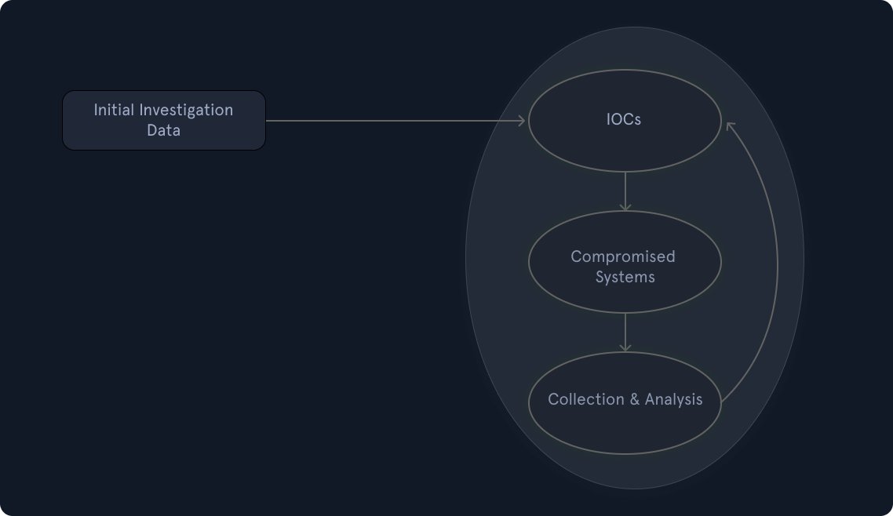

Bây giờ, hãy giải thích kỹ hơn về quy trình được minh họa phía trên.

### Dữ liệu điều tra ban đầu

Để đi đến kết luận, cuộc điều tra nên dựa trên các manh mối hợp lệ được phát hiện không chỉ trong giai đoạn ban đầu mà trong suốt quá trình điều tra. Đội xử lý sự cố cần liên tục tìm ra manh mối mới và không chỉ tập trung vào một phát hiện cụ thể, chẳng hạn một công cụ đã biết là độc hại. Thu hẹp cuộc điều tra vào một hoạt động cụ thể thường dẫn đến ít phát hiện, kết luận quá sớm và hiểu biết không đầy đủ về tác động tổng thể.

### Tạo và sử dụng IOC

Indicator of Compromise (IOC — chỉ báo xâm nhập) là một dấu hiệu cho thấy sự cố đã xảy ra. IOC được ghi chép theo một cấu trúc nhất định, biểu diễn các dấu vết của vụ xâm nhập. Ví dụ về IOC có thể là địa chỉ IP, giá trị hash của tệp và tên tệp. Trên thực tế, vì IOC rất quan trọng đối với điều tra, các ngôn ngữ chuyên biệt như OpenIOC đã được phát triển để ghi lại và chia sẻ chúng theo một cách chuẩn hóa. Một tiêu chuẩn khác được sử dụng rộng rãi cho IOC là YARA. Có một số công cụ miễn phí, chẳng hạn IOC Editor của Mandiant, có thể được sử dụng để tạo hoặc chỉnh sửa IOC. Với các ngôn ngữ này, chúng ta có thể mô tả và sử dụng những dấu vết phát hiện trong quá trình điều tra sự cố. Thậm chí, chúng ta có thể nhận IOC từ bên thứ ba nếu đối phương hoặc cuộc tấn công đã được biết đến. Ví dụ, CISA công bố IOC ở một định dạng gọi là STIX (Structured Threat Information eXpression). STIX là một ngôn ngữ mã nguồn mở, máy có thể đọc được, đồng thời là định dạng tuần tự hóa, chủ yếu ở dạng JSON, được dùng để trao đổi cyber threat intelligence (CTI — thông tin tình báo về mối đe dọa mạng) một cách chuẩn hóa và nhất quán.

Ví dụ, trong báo cáo này, chúng ta có thể xem mục "Downloadable copy of IOCs associated with this malware" (bản sao có thể tải xuống của các IOC liên quan đến mã độc này) để lấy tệp STIX chứa IOC ở định dạng JSON.

```json
...SNIP...
        {
            "type": "file",
            "spec_version": "2.1",
            "id": "file--474454e8-d393-5a4f-9069-19631ea9d397",
            "hashes": {
                "MD5": "40e609840ef3f7fea94d53998ec9f97f",
                "SHA-1": "141af6bcefdcf6b627425b5b2e02342c081e8d36",
                "SHA-256": "3461da3a2ddcced4a00f87dcd7650af48f97998a3ac9ca649d7ef3b7332bd997",
                "SHA-512": "deaed6b7657cc17261ae72ebc0459f8a558baf7b724df04d8821c7a5355e037a05c991433e48d36a5967ae002459358678873240e252cdea4dcbcd89218ce5c2",
                "SSDEEP": "384:cMQLQ5VU1DcZugg2YBAxeFMxeFAReF9ReFj4U0QiKy8Mg3AxeFaxeFAReFLxTYma:ElHh1gtX10u5A"
            },
            "size": 13373,
            "name": "osvmhdfl.dll",
            "object_marking_refs": [
                "marking-definition--94868c89-83c2-464b-929b-a1a8aa3c8487",
                "marking-definition--d896763f-3f6f-4917-86e8-1a4b043d9771"
            ],
            "extensions": {
                "windows-pebinary-ext": {
                    "pe_type": "dll",
                    "number_of_sections": 4,
                    "time_date_stamp": "2025-07-22T08:33:22Z",
                    "size_of_optional_header": 512,
                    "sections": [
                        {
                            "name": "header",
                            "size": 512,
                            "entropy": 2.545281,
                            "hashes": {
                                "MD5": "2a11da5809d47c180a7aa559605259b5"
                            }
                        },
                        {
                            "name": ".text",
                            "size": 4608,
                            "entropy": 4.532967,
                            "hashes": {
                                "MD5": "531ff1038e010be3c55de9cf1f212b56"
                            }
                        },
                        {
                            "name": ".rsrc",
                            "size": 1024,
                            "entropy": 2.170401,
                            "hashes": {
                                "MD5": "ef6793ef1a2f938cddc65b439e44ea07"
                            }
                        },
                        {
                            "name": ".reloc",
                            "size": 512,
                            "entropy": 0.057257,
                            "hashes": {
                                "MD5": "403090c0870bb56c921d82a159dca5a3"
                            }
                        }
                    ]
                }
            }
        },
...SNIP...
```

Trong TheHive, chúng ta có thể thêm IOC vào mục observables (các đối tượng quan sát được) của một cảnh báo.

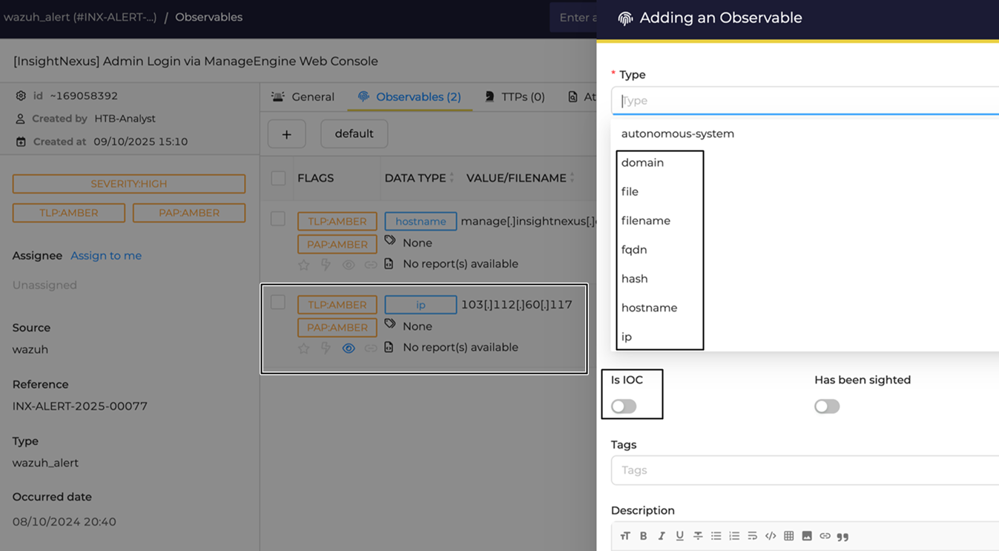

Để sử dụng IOC, chúng ta phải triển khai một công cụ thu thập hoặc tìm kiếm IOC (có sẵn hoặc của bên thứ ba, và có thể trên quy mô lớn). Một cách tiếp cận phổ biến là sử dụng WMI hoặc PowerShell cho các thao tác liên quan đến IOC trong môi trường Windows.

Một lời cảnh báo! Trong quá trình điều tra, chúng ta phải đặc biệt cẩn thận để tránh thông tin xác thực của những người dùng có đặc quyền cao bị lưu vào bộ nhớ đệm khi kết nối đến các hệ thống có khả năng đã bị xâm nhập (thực ra là với bất kỳ hệ thống nào). Cụ thể hơn, cần bảo đảm chỉ sử dụng các giao thức kết nối và công cụ không lưu thông tin xác thực vào bộ nhớ đệm sau khi đăng nhập thành công (chẳng hạn WinRM). Các lần đăng nhập Windows có logon type 3 (Network Logon) thường không lưu thông tin xác thực vào bộ nhớ đệm trên hệ thống từ xa. Ví dụ điển hình nhất về việc “hiểu công cụ của mình” là "PsExec". Khi sử dụng "PsExec" với thông tin xác thực được chỉ định tường minh, thông tin đó sẽ được lưu vào bộ nhớ đệm trên máy từ xa. Khi sử dụng "PsExec" mà không cung cấp thông tin xác thực, thông qua phiên của người dùng đang đăng nhập, thông tin xác thực không được lưu vào bộ nhớ đệm trên máy từ xa. Đây là một ví dụ rất rõ cho thấy cùng một công cụ để lại những dấu vết khác nhau, vì vậy chúng ta phải nắm được điều đó.

### Xác định manh mối mới và các hệ thống bị ảnh hưởng

Sau khi tìm kiếm IOC, chúng ta kỳ vọng có một số kết quả khớp, làm lộ ra những hệ thống khác có cùng dấu hiệu xâm nhập. Các kết quả khớp này có thể không liên quan trực tiếp đến sự cố đang điều tra. Ví dụ, IOC của chúng ta có thể quá chung chung. Cần xác định và loại bỏ false positive. Chúng ta cũng có thể gặp tình huống xuất hiện một số lượng lớn kết quả khớp. Trong trường hợp này, nên xác định thứ tự ưu tiên cho các kết quả cần tập trung, lý tưởng nhất là những kết quả có thể cung cấp manh mối mới sau khi thực hiện phân tích điều tra số.

### Thu thập và phân tích dữ liệu từ manh mối mới và hệ thống bị ảnh hưởng

Sau khi xác định những hệ thống có IOC của chúng ta, chúng ta sẽ muốn thu thập và bảo toàn trạng thái của các hệ thống đó để phân tích sâu hơn, nhằm tìm ra manh mối mới và/hoặc trả lời những câu hỏi điều tra về sự cố. Tùy hệ thống, có nhiều cách tiếp cận về cách thu thập và loại dữ liệu cần thu thập. Đôi khi chúng ta muốn thực hiện “live response” trên một hệ thống đang chạy, trong khi ở trường hợp khác có thể muốn tắt hệ thống rồi mới phân tích. Live response là cách tiếp cận phổ biến nhất, trong đó chúng ta thu thập một tập dữ liệu định trước, thường chứa nhiều dấu vết có thể giải thích điều gì đã xảy ra với hệ thống. Tắt hệ thống không phải quyết định dễ dàng khi cần bảo toàn thông tin có giá trị, vì trong nhiều trường hợp, phần lớn dấu vết chỉ tồn tại trong RAM của máy và sẽ mất khi tắt máy. Bất kể chọn cách thu thập nào, điều thiết yếu là bảo đảm tương tác với hệ thống ở mức tối thiểu để tránh làm thay đổi bằng chứng hoặc dấu vết.

Sau khi thu thập dữ liệu, đã đến lúc phân tích nó. Đây thường là quá trình tốn thời gian nhất trong một sự cố. Phân tích mã độc và điều tra số trên đĩa là các loại kiểm tra phổ biến nhất. Mọi manh mối mới được phát hiện và xác thực đều được thêm vào dòng thời gian, vốn được cập nhật liên tục. Cũng cần lưu ý rằng điều tra số bộ nhớ là một năng lực ngày càng phổ biến và cực kỳ phù hợp khi xử lý các cuộc tấn công tinh vi.

Hãy nhớ rằng trong quá trình thu thập dữ liệu, chúng ta nên theo dõi chain of custody để bảo đảm dữ liệu được kiểm tra có thể được chấp nhận làm bằng chứng trước tòa nếu tiến hành hành động pháp lý đối với đối phương.

### Sử dụng AI trong phát hiện mối đe dọa

Trí tuệ nhân tạo (AI) đang thay đổi cách các tổ chức phát hiện, triage (phân loại, đánh giá ban đầu) và ứng phó với sự cố an ninh. Trong các quy trình ứng phó sự cố truyền thống, nhà phân tích xem xét log, cảnh báo và báo cáo theo cách thủ công. Quá trình này thường mất hàng giờ hoặc hàng ngày. AI tự động hóa phần lớn công việc phân tích này, giảm thời gian ứng phó và cải thiện độ chính xác bằng cách học từ những sự cố trong quá khứ và xác định bất thường về hành vi nhanh hơn con người.

Ví dụ: tính năng "Attack Discovery" của Elastic Security sử dụng AI tạo sinh để phân tích các sự kiện từ hàng nghìn kết quả phát hiện, tóm tắt và gom nhóm các cảnh báo liên quan thành một bản tường thuật cuộc tấn công.

AI Attack Discovery sử dụng LLM (large language model — mô hình ngôn ngữ lớn) để phân tích cảnh báo trong một môi trường và xác định mối đe dọa. Bản tóm tắt thể hiện một cuộc tấn công và chỉ ra mối quan hệ giữa nhiều cảnh báo để giúp xác định những người dùng và máy tính có liên quan. Nó cũng hiển thị các ánh xạ MITRE ATT&CK. Dưới đây là một ví dụ về giao diện kết quả phát hiện cuộc tấn công:

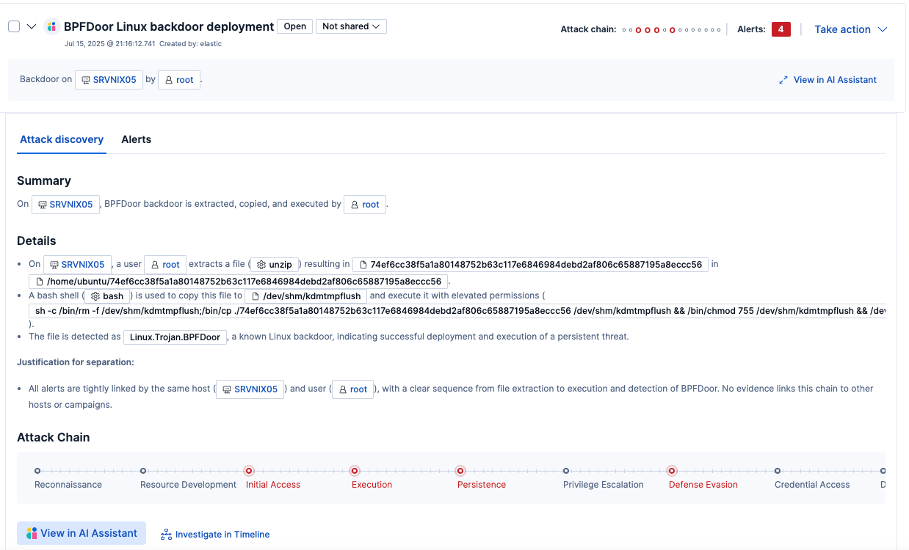

Trong kết quả phát hiện này, AI hỗ trợ bằng cách xem xét nhiều cảnh báo và tạo ra một cái nhìn tổng quan đầy đủ về cuộc tấn công, xác định những hoạt động chính đã xảy ra trong sự cố. AI cũng có thể hỗ trợ ứng phó sự cố. Một số trường hợp sử dụng bao gồm:

- Tự động triage và xác định thứ tự ưu tiên cảnh báo.
- Tương quan sự cố và tái dựng dòng thời gian.
- Playbook ứng phó tự động.
- AI hỗ trợ phân tích và rút kinh nghiệm sau sự cố.

### Tổng kết

Trong hai section vừa qua, chúng ta đã đi qua các bước ban đầu của giai đoạn phát hiện và phân tích, quản lý những quy trình quan trọng và ghi chép từng bước cần thiết trong một sự cố. Duy trì sự tập trung và cách làm việc có tổ chức là một trong những điều cốt lõi cần giữ để thực hiện đúng giai đoạn này.

Hãy di chuyển xuống cuối section này và nhấp vào "Click here to spawn the target system!" (nhấp vào đây để khởi tạo hệ thống mục tiêu). Sau đó, mở trang web TheHive tại "Target IP:9000", trên cổng 9000, sử dụng thông tin xác thực được cung cấp để xem các cảnh báo.

<a id="section-08"></a>

## Section 8/11 — Giai đoạn ngăn chặn, loại bỏ và phục hồi

Khi điều tra hoàn tất và chúng ta đã hiểu loại sự cố cùng tác động đối với hoạt động kinh doanh (dựa trên toàn bộ manh mối thu thập được và thông tin tập hợp trong dòng thời gian), đã đến lúc bước vào giai đoạn ngăn chặn để tránh sự cố gây thêm thiệt hại.

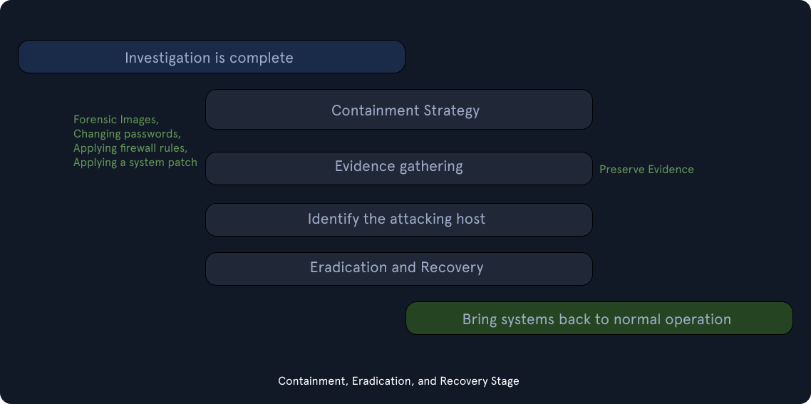

### Containment (ngăn chặn)

Trong giai đoạn này, chúng ta hành động để ngăn sự cố lan rộng. Các hành động được chia thành ngăn chặn ngắn hạn và ngăn chặn dài hạn. Điều quan trọng là phối hợp và thực hiện các hành động ngăn chặn đồng thời trên tất cả hệ thống. Nếu không, chúng ta có nguy cơ báo cho kẻ tấn công biết mình đang truy tìm chúng; khi đó, chúng có thể thay đổi kỹ thuật và công cụ để duy trì hiện diện trong môi trường.

Trong ngăn chặn ngắn hạn, các hành động được thực hiện để lại dấu vết tác động tối thiểu trên hệ thống. Một số hành động có thể bao gồm đặt hệ thống vào một VLAN riêng biệt hoặc cô lập, rút cáp mạng khỏi các hệ thống, hoặc thay đổi tên DNS C2 của kẻ tấn công để trỏ đến một hệ thống do chúng ta kiểm soát hoặc một hệ thống không tồn tại. Các hành động ở đây hạn chế thiệt hại và tạo thời gian để xây dựng chiến lược khắc phục cụ thể hơn. Ngoài ra, vì giữ hệ thống ít thay đổi nhất có thể, chúng ta có cơ hội tạo ảnh điều tra số và bảo toàn bằng chứng nếu chưa làm trong quá trình điều tra (đây còn được gọi là bước sao lưu trong giai đoạn ngăn chặn). Nếu một hành động ngăn chặn ngắn hạn đòi hỏi tắt hệ thống, phải bảo đảm việc này được thông báo cho phía doanh nghiệp và được cấp phép phù hợp.

Trong các hành động ngăn chặn dài hạn, chúng ta tập trung vào những hành động và thay đổi có tính duy trì lâu dài. Chúng có thể bao gồm đổi mật khẩu người dùng, áp dụng quy tắc tường lửa, bổ sung hệ thống phát hiện xâm nhập trên máy tính, áp dụng bản vá hệ thống và tắt hệ thống. Khi thực hiện các hoạt động này, chúng ta nên cập nhật thông tin cho phía doanh nghiệp và những bên liên quan. Hãy nhớ rằng việc một hệ thống đã được vá không có nghĩa là sự cố đã kết thúc. Các hoạt động loại bỏ, phục hồi và sau sự cố vẫn còn phải thực hiện.

### Eradication (loại bỏ)

Sau khi sự cố được ngăn chặn, cần thực hiện loại bỏ để xóa cả nguyên nhân gốc rễ lẫn những gì sự cố để lại, bảo đảm đối phương đã bị đẩy ra khỏi các hệ thống và mạng. Một số hoạt động ở giai đoạn này bao gồm gỡ mã độc đã phát hiện khỏi hệ thống, dựng lại một số hệ thống và khôi phục các hệ thống khác từ bản sao lưu. Trong giai đoạn loại bỏ, chúng ta có thể mở rộng những hoạt động ngăn chặn đã thực hiện bằng cách áp dụng thêm các bản vá chưa cần thiết phải cài ngay trước đó. Các hoạt động tăng cường bảo mật hệ thống bổ sung thường được thực hiện trong giai đoạn loại bỏ (không chỉ trên hệ thống bị ảnh hưởng mà trong một số trường hợp còn trên toàn mạng).

### Recovery (phục hồi)

Trong giai đoạn phục hồi, chúng ta đưa các hệ thống trở lại hoạt động bình thường. Tất nhiên, phía doanh nghiệp cần xác minh rằng hệ thống thực sự hoạt động đúng như mong đợi và có đầy đủ dữ liệu cần thiết. Khi mọi thứ đã được xác minh, các hệ thống này được đưa vào môi trường production. Tất cả hệ thống được khôi phục sẽ được ghi log và giám sát chặt chẽ sau sự cố, vì những hệ thống đã bị xâm nhập thường trở thành mục tiêu lần nữa nếu đối phương giành lại quyền truy cập môi trường trong thời gian ngắn. Các sự kiện đáng ngờ điển hình cần giám sát là:

- Đăng nhập bất thường (ví dụ: tài khoản người dùng hoặc dịch vụ chưa từng đăng nhập vào đó trước đây).
- Tiến trình bất thường.
- Thay đổi registry tại những vị trí thường bị mã độc sửa đổi.

Giai đoạn phục hồi trong một số sự cố lớn có thể mất nhiều tháng vì thường được triển khai theo từng đợt. Trong các đợt đầu, trọng tâm là tăng cường bảo mật tổng thể để ngăn sự cố trong tương lai thông qua các biện pháp nhanh chóng mang lại hiệu quả và loại bỏ những điểm yếu dễ khai thác. Các đợt sau tập trung vào thay đổi lâu dài, bền vững để giữ tổ chức an toàn nhất có thể.

<a id="section-09"></a>

## Section 9/11 — Giai đoạn hoạt động sau sự cố

Trong giai đoạn này, mục tiêu của chúng ta là ghi lại sự cố và cải thiện năng lực dựa trên những bài học rút ra từ nó. Giai đoạn này cho chúng ta cơ hội nhìn lại mối đe dọa bằng cách hiểu những gì đã xảy ra, những gì mình đã làm và kết quả của các hành động, hoạt động đó. Cách tốt nhất để thu thập và phân tích thông tin này là tổ chức cuộc họp với tất cả các bên liên quan đã tham gia trong sự cố. Cuộc họp thường diễn ra trong vòng vài ngày sau sự cố, khi báo cáo sự cố đã được hoàn thiện.

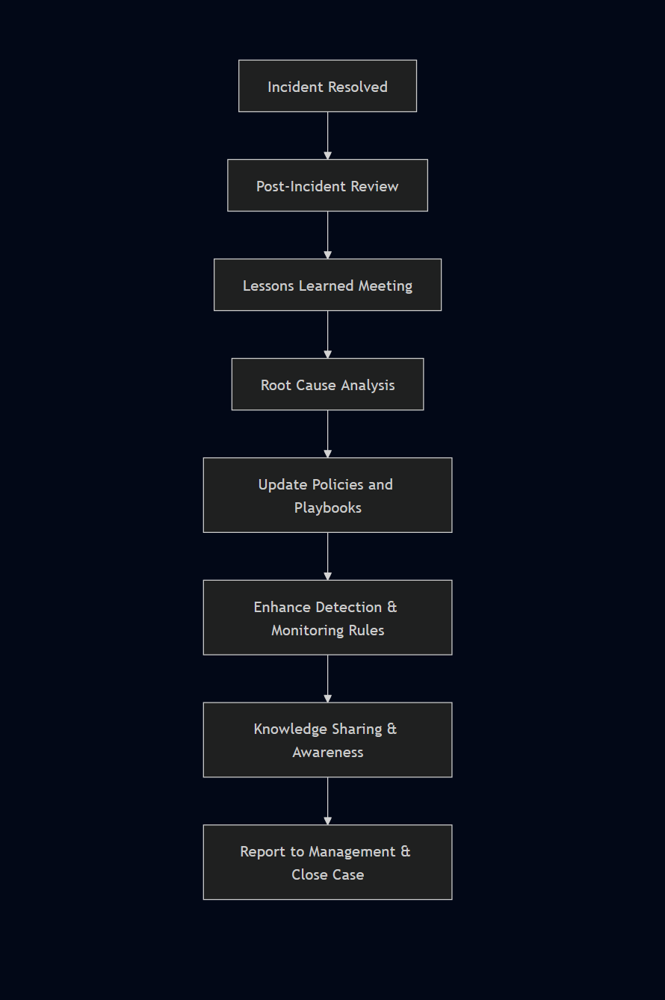

### Báo cáo

Báo cáo cuối cùng là một phần thiết yếu của toàn bộ quy trình. Một báo cáo đầy đủ sẽ chứa câu trả lời cho các câu hỏi như:

- Điều gì đã xảy ra và vào lúc nào?
- Đội đã xử lý sự cố như thế nào khi xét theo các kế hoạch, playbook, chính sách và quy trình?
- Phía doanh nghiệp có cung cấp thông tin cần thiết và phản hồi kịp thời để hỗ trợ xử lý sự cố hiệu quả không? Có thể cải thiện điều gì?
- Những hành động nào đã được triển khai để ngăn chặn và loại bỏ sự cố?
- Cần áp dụng những biện pháp phòng ngừa nào để ngăn các sự cố tương tự trong tương lai?
- Cần những công cụ và nguồn lực nào để phát hiện, phân tích các sự cố tương tự trong tương lai?

Các báo cáo như vậy cuối cùng có thể cung cấp những kết quả đo lường được. Ví dụ, chúng có thể cho biết đã xử lý bao nhiêu sự cố, đội dành bao nhiêu thời gian cho mỗi sự cố và các hành động khác nhau được thực hiện trong quá trình xử lý. Ngoài ra, báo cáo sự cố cung cấp tài liệu tham chiếu để xử lý các sự kiện tương tự trong tương lai. Trong những tình huống cần thực hiện hành động pháp lý, báo cáo sự cố cũng sẽ được sử dụng tại tòa và làm nguồn xác định chi phí, tác động của sự cố.

Giai đoạn này cũng là cơ hội rất tốt để đào tạo thành viên mới bằng cách cho họ thấy những đồng nghiệp giàu kinh nghiệm đã xử lý sự cố như thế nào. Đội cũng nên đánh giá có cần cập nhật kế hoạch, playbook, chính sách và quy trình hay không. Trong giai đoạn hoạt động sau sự cố, điều quan trọng là đánh giá lại công cụ, hoạt động đào tạo, mức độ sẵn sàng của đội và cả cơ cấu tổng thể của đội, thay vì chỉ tập trung vào tài liệu và quy trình.

Lưu ý: Chúng ta sẽ tìm hiểu phần báo cáo của quy trình xử lý sự cố chi tiết hơn trong module Security Incident Reporting thuộc lộ trình nghề nghiệp SOC Analyst.

<a id="section-10"></a>

## Section 10/11 — Phân tích vụ xâm nhập Insight Nexus

### Tình huống sự cố

Nạn nhân trong sự cố này là Insight Nexus, một công ty nghiên cứu thị trường và phân tích dữ liệu quy mô vừa có trụ sở tại Singapore. Họ cung cấp thông tin tình báo cạnh tranh và hiểu biết về người tiêu dùng cho khách hàng toàn cầu, bao gồm các công ty Fortune 500 trong lĩnh vực CNTT và tài chính. Hạ tầng của họ có nhiều ứng dụng, máy chủ và máy tính, nhưng chúng ta sẽ tập trung vào các thành phần quan trọng như một tập hợp ứng dụng hướng ra Internet phục vụ khách hàng, một máy chủ ManageEngine để quản trị CNTT và một cổng báo cáo khách hàng dựa trên PHP. Do tính chất công việc, họ trở thành mục tiêu hấp dẫn đối với những đối phương quan tâm đến việc đánh cắp dữ liệu khách hàng.

Hãy xem xét sự cố để hiểu một số thách thức người xử lý sự cố phải đối mặt. Sự cố này minh họa các mô hình được quan sát lặp đi lặp lại trong thực tế. Nạn nhân trong tình huống là Insight Nexus, một công ty nghiên cứu thị trường toàn cầu xử lý dữ liệu cạnh tranh nhạy cảm cho các khách hàng nổi tiếng trong lĩnh vực CNTT. Công ty trở thành mục tiêu của hai nhóm đe dọa riêng biệt hoạt động đồng thời trong môi trường của mình. Tác nhân đe dọa thứ nhất xâm nhập được khi các quản trị viên hệ thống quên đổi mật khẩu mặc định admin/admin trên một ứng dụng hướng ra Internet, cụ thể là ManageEngine ADManager Plus, sau một lần cập nhật sản phẩm. Lợi dụng điều này, kẻ tấn công đăng nhập thành công, tiến hành trinh sát, lập bản đồ người dùng và máy tính, rồi cuối cùng tạo các tài khoản Active Directory mới có đặc quyền. Sử dụng một trong những tài khoản vừa tạo, đối phương tiếp tục pivot sâu hơn vào môi trường, xác định được một dịch vụ RDP bị mở ra bên ngoài do cấu hình sai. Khai thác điểm truy cập đó, chúng gia tăng quyền kiểm soát và cuối cùng dùng Group Policy Objects (GPOs) để triển khai spyware qua một gói MSI trên nhiều endpoint.

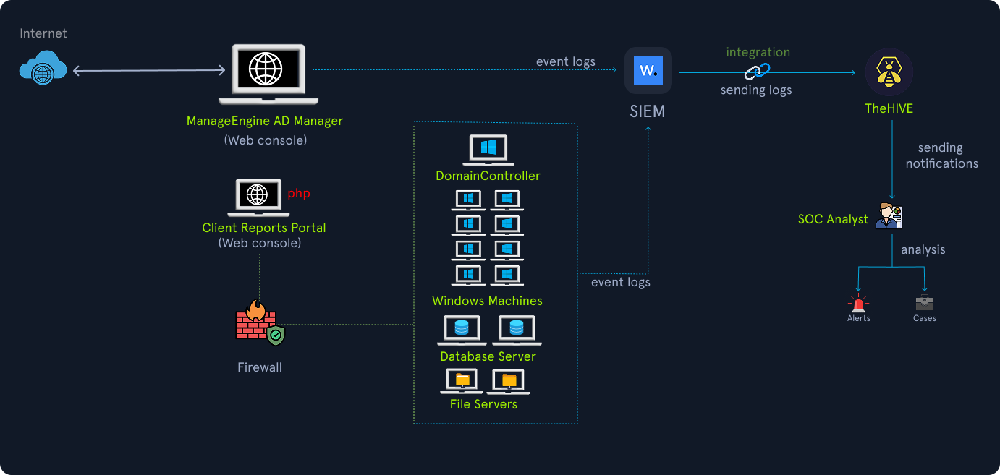

Các hoạt động này không bị phát hiện trong nhiều ngày. Sự cố lần đầu được phát hiện vào một ngày khi một nhà phân tích SOC điều tra cảnh báo trên TheHive (nền tảng ứng phó sự cố an ninh) liên quan đến việc tạo một tệp đáng ngờ tên checkme.txt trong thư mục gốc của máy chủ web. Khi điều tra, họ phát hiện tệp được cố ý đặt ở đó như một chữ ký — "SilentJackal was here". Dấu vết bất thường này thúc đẩy cuộc điều tra sâu hơn. Điều khiến tình hình phức tạp hơn là sau đó đội SOC nhận ra hai nhóm tác nhân đe dọa khác nhau đang hoạt động trong cùng môi trường. Trong khi nhóm thứ nhất vẫn đang thăm dò và triển khai các cơ chế duy trì hiện diện, một tác nhân thứ hai trước đó đã xâm nhập một ứng dụng PHP có lỗ hổng, đưa dữ liệu nghiên cứu thị trường nhạy cảm ra ngoài và giảm đáng kể hoạt động sau khi đạt mục tiêu, chỉ còn thỉnh thoảng kết nối đến một IP bên ngoài.

### Các tác nhân đe dọa

- Crimson Fox (tác nhân đe dọa chính): Một nhóm được biết là có liên hệ với các hoạt động nhắm vào chuỗi cung ứng ngành CNTT, bị nghi ngờ được nhà nước hậu thuẫn. Chúng chuyên đánh cắp thông tin xác thực và duy trì hiện diện lâu dài để đưa dữ liệu ra ngoài. Đây là một nhóm có năng lực và kiên trì, được biết đến qua một số cuộc tấn công thành công trước đây liên quan đến chuỗi cung ứng và tình báo doanh nghiệp.
- Silent Jackal (tác nhân thứ hai): Một nhóm tội phạm có tổ chức lỏng lẻo, tập trung vào thay đổi giao diện website trái phép theo cơ hội và các vụ xâm nhập nhằm chứng minh khả năng; không nhất thiết có động cơ tài chính nhưng gây gián đoạn. Thành viên của nhóm là những kẻ xâm nhập web có kỹ năng thấp.

### Môi trường và tài sản quan trọng

#### Internet công cộng

- Ứng dụng web bên ngoài (manage.insightnexus.com): Ứng dụng web ManageEngine ADManager Plus cung cấp khả năng quản lý Active Directory cho quản trị viên hệ thống của tổ chức. HTTPS (cổng 443) có thể truy cập từ Internet (cổng quản trị).
- Cổng báo cáo khách hàng (portal.insightnexus.com): Một cổng báo cáo khách hàng dựa trên PHP (bật tải tệp lên để nộp báo cáo).

#### Cấu trúc môi trường nội bộ

- Domain Controller: DC01.insight.local
- File Server: FS01.insight.local (tài nguyên chia sẻ tệp: `\fs01\projects`)
- Database Server: DB01.insight.local chứa các cơ sở dữ liệu nhạy cảm.
- Máy trạm: Bao gồm nhóm máy của nhà phát triển (từ DEV-001 đến DEV-120), trong đó có một số máy trạm được phép nhận kết nối RDP. Trong quá trình trinh sát, một máy Windows có RDP bị mở ra bên ngoài được phát hiện: DEV-021 (cấu hình sai).

#### Bảo mật

- Tường lửa vành đai với chế độ ghi log mặc định (không tích hợp Threat Intelligence).
- IDS cơ bản có tỷ lệ false positive cao.
- Agent Wazuh trên phần lớn máy Windows (chỉ bao phủ một phần).
- SIEM tập trung (Wazuh) tiếp nhận Windows Sysmon, Windows Security, log máy chủ web và log tường lửa (thời gian lưu giữ hạn chế).
- TheHive được dùng để quản lý case, có Cortex để enrichment (bổ sung thông tin ngữ cảnh).

### Phân tích sự cố

Một quản trị viên hệ thống nhận thấy những kết nối đi ra bất thường từ máy chủ ManageEngine đến một địa chỉ IP ở Đông Âu khi đang làm việc trên máy chủ để bảo trì theo lịch. Anh ấy gọi đội SOC và phối hợp với họ điều tra cảnh báo để tìm dấu hiệu đáng ngờ. Một nhà phân tích SOC bắt đầu điều tra các cảnh báo và tìm thấy một cảnh báo đề cập đến tệp checkme.txt đáng ngờ trên cùng máy chủ.

Khoảng trống phát hiện: Có quá nhiều cảnh báo về việc tạo tệp mới trên các máy chủ, và cảnh báo này không được chuyển lên cấp xử lý cao hơn do alert fatigue (mệt mỏi vì quá tải cảnh báo). Họ cần giảm một số false positive và bổ sung bộ lọc.

Đội SOC bắt đầu điều tra sự cố này và phát hiện nhiều lần trinh sát các ứng dụng web bên ngoài.


Khi điều tra thêm, đội ứng phó phát hiện rằng vào 2025-10-01 03:12:02, tác nhân đe dọa Crimson Fox có được quyền truy cập ban đầu thông qua ManageEngine. Ban đầu, chúng thực hiện các lần thử đăng nhập có chủ đích vào manage.insightnexus.com. Chúng phát hiện thông tin xác thực mặc định (tức admin/admin) có hiệu lực, nghĩa là quản trị viên hệ thống đã quên đổi thông tin xác thực mặc định sau một lần cập nhật hoặc đã để ứng dụng web có thể được mọi người trên Internet công cộng truy cập. Kết quả là điều không may cho tổ chức, và các tác nhân đe dọa thực hiện đăng nhập web tương tác qua HTTPS. Báo cáo kiểm toán đăng nhập thể hiện hoạt động đăng nhập thành công này.

Sơ suất của tổ chức: Dù có khuyến cáo từ nhà cung cấp, thông tin xác thực mặc định chưa từng được thay đổi. Không bắt buộc xác thực đa yếu tố và không có WAF kiểm tra tại endpoint này. Các sự kiện đăng nhập của ứng dụng web không được gửi đến SIEM tập trung.

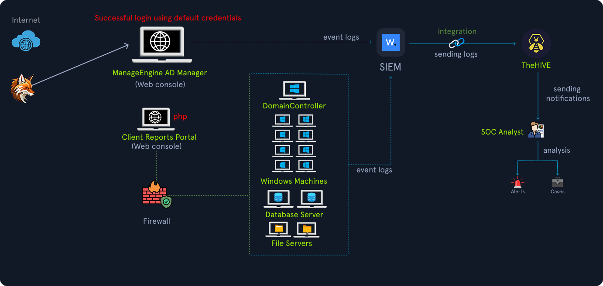

Có một lỗ hổng web Java liên quan đến sản phẩm ManageEngine ADManager Plus, cho phép thực thi mã từ xa mà không cần xác thực. Tác nhân đã tận dụng lỗ hổng này và thiết lập C2 đi ra qua HTTPS đến 103.112.60.117 (một máy trên đám mây do kẻ tấn công kiểm soát), giả dạng lưu lượng cập nhật. Sysmon Event ID 3 (phát hiện kết nối mạng) sau đây đã được ghi lại:

```cmd
Event 3, Sysmon

Network Connection detected:
UtcTime: 2025-10-01 03:18:32.557
Image: C:\ManageEngine\jre\bin\java.exe
DestinationIp: 103.112.60.117
DestinationPort: 443
```

Vào 2025-10-02 04:02:11, kẻ tấn công liệt kê người dùng và máy tính trong domain thông qua các truy vấn từ console ManageEngine. Tận dụng chỗ đứng trên ManageEngine, chúng cũng tạo một tài khoản Domain Administrator mới. Khi liệt kê Active Directory, chúng phát hiện một máy Windows 10 (DEV-021) có cổng RDP mở công khai. Máy desktop này thỉnh thoảng được các nhà phát triển sử dụng để thực hiện công việc phát triển và phát hành bằng cách kết nối RDP trực tiếp đến IP công cộng của máy khi làm việc tại nhà. Kẻ tấn công kết nối RDP trực tiếp vào máy này bằng tài khoản Domain Administrator vừa tạo.

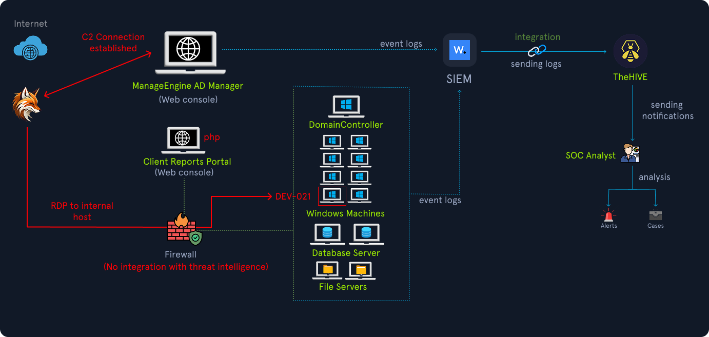

Đối với hoạt động này, bản ghi sự kiện sau được tạo trong Windows Event Logs với Event ID 4624.

```cmd
An account was successfully logged on.

 Subject:
    Security ID: SYSTEM
    Account Name: DEV-021$
    Account Domain: INSIGHT
    Time: 2025-10-04T02:03:12Z

 Logon Information:
    Logon Type: 10

 Network Information:
    Workstation Name: DEV-021
    Source Network Address: 103.112.60.117

 New Logon:
    SubjectUserName: insight\svc_deployer
    SourceNetworkAddress: 103.112.60.117
```

Sau khi đăng nhập thành công, kẻ tấn công tiến hành trinh sát domain. Chúng tìm thấy một số tài nguyên chia sẻ tệp đáng quan tâm trên file server và nhiều lần thử truy cập. Trên file server, chúng tìm được những thư mục dự án khách hàng chứa báo cáo dự thảo, dữ liệu khảo sát và dự báo thị trường.

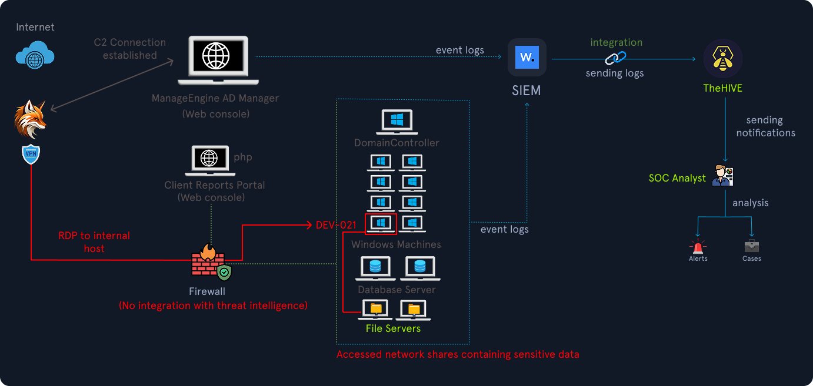

Trên file server, nhiều bản ghi sự kiện được tạo, chẳng hạn 5140(S, F): A network share object was accessed (một đối tượng chia sẻ mạng đã được truy cập). Tuy nhiên, chưa có quy tắc tạo cảnh báo riêng cho những sự kiện RDP từ IP công cộng này.

Có thể phát hiện các loại bản ghi sự kiện này bằng Sigma rule sau, ví dụ:

```sigma
title: External Remote RDP Logon from Public IP
id: 259a9cdf-c4dd-4fa2-b243-2269e5ab18a2
related:
    - id: 78d5cab4-557e-454f-9fb9-a222bd0d5edc
      type: derived
status: test
description: Detects successful logon from public IP address via RDP. This can indicate a publicly-exposed RDP port.
references:
    - https://www.inversecos.com/2020/04/successful-4624-anonymous-logons-to.html
    - https://twitter.com/Purp1eW0lf/status/1616144561965002752
author: Micah Babinski (@micahbabinski), Zach Mathis (@yamatosecurity)
date: 2023-01-19
modified: 2024-03-11
tags:
    - attack.initial-access
    - attack.credential-access
    - attack.t1133
    - attack.t1078
    - attack.t1110
logsource:
    product: windows
    service: security
detection:
    selection:
        EventID: 4624
        LogonType: 10
    filter_main_local_ranges:
        IpAddress|cidr:
            - '::1/128'  # IPv6 loopback
            - '10.0.0.0/8'
            - '127.0.0.0/8'
            - '172.16.0.0/12'
            - '192.168.0.0/16'
            - '169.254.0.0/16'
            - 'fc00::/7'  # IPv6 private addresses
            - 'fe80::/10'  # IPv6 link-local addresses
    filter_main_empty:
        IpAddress: '-'
    condition: selection and not 1 of filter_main_*
falsepositives:
    - Legitimate or intentional inbound connections from public IP addresses on the RDP port.
level: medium
```

[Dịch chú thích trong code: IPv6 loopback — địa chỉ loopback IPv6; IPv6 private addresses — địa chỉ IPv6 riêng; IPv6 link-local addresses — địa chỉ IPv6 trong phạm vi liên kết cục bộ.]

Sau khi thăm dò và quan sát trong một tuần, chúng bắt đầu nén và đưa những dữ liệu được lựa chọn ra ngoài. Kẻ tấn công đóng gói tài liệu khách hàng đã đánh cắp vào một tệp tên diagnostics_data.zip; tên này được chọn để giống dữ liệu telemetry thông thường. Sau đó, tệp nén được tải lên máy do kẻ tấn công kiểm soát qua HTTPS. Vì tên tệp giống dữ liệu chẩn đoán hợp lệ và quá trình tải lên sử dụng HTTPS tiêu chuẩn, hoạt động này không lập tức gây báo động. Chiến thuật này làm tăng cơ hội đưa dữ liệu ra ngoài của kẻ tấn công trước khi bên phòng thủ chuyển sự việc lên cấp xử lý cao hơn.

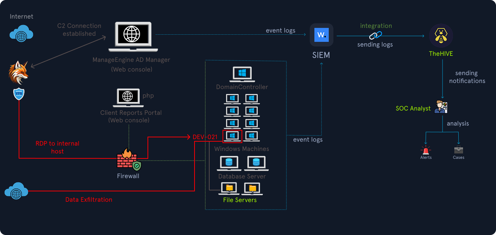

Sau đó, vào 2025-10-04 02:10:45, từ DEV-021, chúng thực thi một số script PowerShell sử dụng thông tin xác thực quản trị domain để tạo một Group Policy Object (GPO) nhằm đẩy gói MSI (java-update.msi) ra toàn domain. Gói MSI này tạo một scheduled task (tác vụ theo lịch) để chạy một tiến trình thực hiện hoạt động gián điệp và đưa dữ liệu ra ngoài trên các máy.

Các sự kiện này cũng được ghi nhận trong event log, chẳng hạn việc tạo một tệp .msi mới dưới dạng Sysmon Event ID 11.

```cmd
Sysmon Event 11: TargetFilename: C:\Windows\Temp\java-update.msi
```

Ngoài ra, Sysmon Event ID 1 ghi lại dòng lệnh thực thi tệp .msi trong nền.

```cmd
Sysmon Event 1: Image: C:\Windows\System32\msiexec.exe CommandLine: "msiexec /i C:\Windows\Temp\java-update.msi /quiet"
```

Mã độc có khả năng gián điệp và đưa dữ liệu ra ngoài này được triển khai trên tất cả máy trong domain bằng GPO.

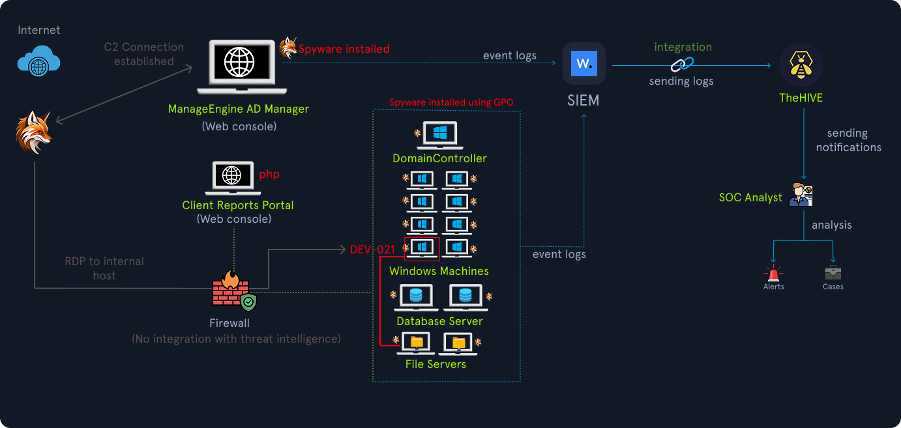

Vào khoảng cùng thời điểm, một tác nhân đe dọa khác là Silent Jackal cũng thực hiện một số hoạt động trên cổng báo cáo riêng biệt dựa trên PHP. Máy chủ này có một lỗ hổng tải tệp lên chưa được vá, bị tác nhân khai thác để giành quyền truy cập máy chủ. Silent Jackal tải một tệp vào thư mục gốc của máy chủ web. Hoạt động của chúng dường như chỉ giới hạn ở việc để lại tệp đánh dấu checkme.txt. Điều này tạo ra nhiễu trong môi trường và cung cấp cho bên phòng thủ manh mối đầu tiên về vụ xâm nhập.

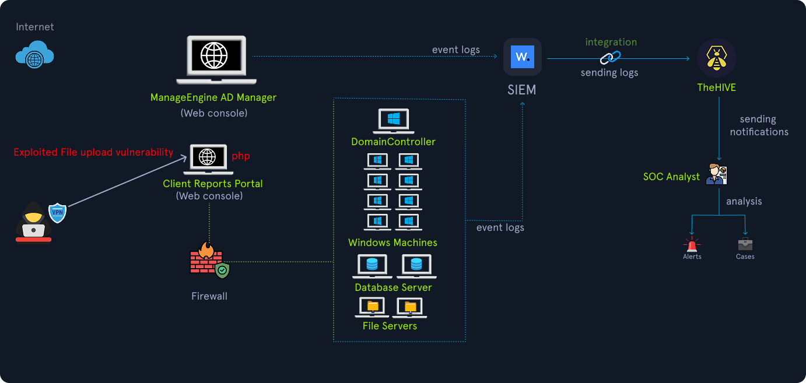

Tuy nhiên, tác nhân đe dọa không tiến xa hơn quyền truy cập ban đầu. Đây có khả năng là một vụ xâm nhập có kỹ năng thấp nhằm báo hiệu sự hiện diện, thay vì gây thiệt hại ngay lập tức.

Sơ suất của tổ chức: Không có giám sát bằng tường lửa ứng dụng web và không đánh giá lỗ hổng định kỳ đối với các cổng hướng ra Internet.

Crimson Fox giảm các hoạt động có cường độ cao, chỉ thỉnh thoảng gửi beacon với tần suất thấp đến 103.112.60.117 để kiểm tra chỉ thị mới. Silent Jackal cũng giảm hoạt động tương tự.

### Các hành động ứng phó sự cố tức thời

Phát hiện cụ thể đầu tiên là tệp checkme.txt do một nhà phân tích SOC tìm thấy. Riêng tệp đó thông thường sẽ có mức ưu tiên thấp, nhưng nhà phân tích SOC khi thực hiện tương quan nhận thấy trong cùng khoảng thời gian có các sự kiện ManageEngine với lưu lượng đi ra bất thường và nhiều sự kiện đăng nhập từ một IP nước ngoài không quen thuộc.

Các thông tin sau được đối chiếu tương quan:

- Các lần đăng nhập admin thành công vào ManageEngine từ IP nước ngoài.
- Sự kiện tạo tiến trình msiexec của Sysmon, cài một MSI trên nhiều máy.
- Log liệt kê LDAP và các thay đổi GPO.
- Log nén tệp và tải lên từ file server.
- HTTPS đi ra đến một địa chỉ IP bất thường.

Sau khi tương quan, nhà phân tích SOC lập tức chuyển sự cố lên đội ứng phó sự cố và mở một case trong TheHive. Những hành động và phát hiện sau hoàn tất quá trình điều tra và ứng phó:

#### Tạo case và triage

- SOC tạo một case TheHive có tiêu đề “Insight Nexus — ManageEngine Compromise”, liên kết toàn bộ cảnh báo liên quan (đăng nhập admin ManageEngine, sự kiện msiexec của Sysmon, liệt kê LDAP, tải tệp lên từ file server và sự kiện checkme.txt trên cổng thông tin), rồi phân công vai trò: nhà phân tích triage, trưởng nhóm điều tra số, trưởng nhóm ngăn chặn và trưởng nhóm truyền thông.
- Mức ưu tiên được đặt là Critical vì đã xác nhận có dữ liệu bị đưa ra ngoài.

#### Ngăn chặn — kiểm soát mạng

- Chặn lưu lượng đi ra đến 103.112.60.117 tại tường lửa vành đai và tường lửa trên máy tính. Thêm các quy tắc chặn lưu lượng đi ra tạm thời đối với IP của kẻ tấn công.
- Thêm chữ ký IDS để cảnh báo khi có kết nối đến 103.112.60.117 và các endpoint tương tự.

#### Ngăn chặn — hành động với thông tin xác thực và tài khoản

- Vô hiệu hóa tài khoản admin ManageEngine và thay mới toàn bộ thông tin xác thực có đặc quyền cao bị lộ trong log (tài khoản dịch vụ, tài khoản triển khai và bất kỳ tài khoản nào có hoạt động đáng ngờ).
- Giới hạn web console ManageEngine để chỉ có thể truy cập từ nội bộ.
- Bắt buộc đổi mật khẩu và thu hồi ngay các phiên đang hoạt động khi có thể.

#### Cô lập máy

- Cô lập manage.insightnexus.com, DEV-021 và bất kỳ máy nào có bằng chứng cài MSI khỏi mạng production để thu thập dữ liệu điều tra số (chặn truy cập mạng nhưng bảo toàn theo cách cho phép phân tích).
- Tạm dừng các scheduled task và vô hiệu hóa việc triển khai khởi phát từ GPO cho đến khi xác nhận đã khắc phục.

#### Thu thập dấu vết điều tra số

- Trên các máy đã cô lập, thu thập bộ nhớ khả biến, danh sách tiến trình, registry hive và ảnh đĩa. Xuất log kiểm toán ManageEngine cùng log truy cập máy chủ web với dấu thời gian đầy đủ.
- Bảo toàn các bản sao tệp MSI (java-update.msi), gói dữ liệu nén đã bị đưa ra ngoài (diagnostics_data.zip) và mọi tệp web shell tìm thấy trong các thư mục ứng dụng quản trị.

#### Ánh xạ sang MITRE ATT&CK

- Reconnaissance (trinh sát): Quét các tài sản công khai; MITRE T1595 (Active Scanning).
- Weaponization / Initial Access (chuẩn bị vũ khí / truy cập ban đầu): Thông tin xác thực mặc định ManageEngine (T1078.004 - Valid Accounts), khai thác tải tệp lên PHP (T1190 - Exploit Public-Facing Application).
- Delivery / Exploitation (chuyển giao / khai thác): Tải web shell lên, thực thi lệnh trên console; (T1505 - Server Software Component).
- Installation / Persistence (cài đặt / duy trì hiện diện): Scheduled task, dịch vụ, MSI triển khai bằng GPO (T1547, T1543, T1069).
- Command & Control (chỉ huy và điều khiển): HTTPS đến IP do kẻ tấn công kiểm soát (T1071.001 - Web Protocols).
- Action on Objective / Exfiltration (thực hiện mục tiêu / đưa dữ liệu ra ngoài): Nén và tải dữ liệu dự án lên (T1560/T1041).

### Bài học rút ra

Những bài học sau đã được rút ra:

- Thông tin xác thực mặc định trên các ứng dụng hướng ra Internet vẫn là một trong những sơ suất đơn giản nhất nhưng gây thiệt hại lớn nhất.
- Nhiều tác nhân đe dọa có thể đồng thời hiện diện trong một môi trường với động cơ khác nhau — một bên hành động theo cơ hội, một bên nhắm mục tiêu rất cụ thể. Điều này làm phức tạp việc ứng phó vì bên phòng thủ có thể đánh giá thấp mức độ nghiêm trọng nếu chỉ nhìn thấy kẻ xâm nhập “ồn ào”.
- Không tương quan cảnh báo giữa các đội làm chậm việc ngăn chặn, cho các tác nhân tinh vi thêm thời gian để đạt mục tiêu.
- Giám sát sau sự cố phải bao gồm việc quét tìm các cơ chế duy trì hiện diện, vì xóa tệp đánh dấu của kẻ tấn công không loại bỏ được nguyên nhân gốc rễ.

<a id="section-11"></a>

## Section 11/11 — Đánh giá kỹ năng

Trong bài đánh giá kỹ năng, bạn đóng vai một nhân viên ứng phó sự cố mới vào nghề và cần thực hiện một số nhiệm vụ.

Hãy di chuyển xuống cuối section này và nhấp vào "Click here to spawn the target system!" (nhấp vào đây để khởi tạo hệ thống mục tiêu). Sau đó, mở trang web TheHive tại "Target IP:9000", trên cổng 9000, sử dụng thông tin xác thực được cung cấp để xem các cảnh báo.

### Triage các cảnh báo

TheHive đã được nạp những cảnh báo liên quan đến vụ xâm nhập Insights Nexus. Bạn được yêu cầu triage chúng, bắt đầu bằng:

Nhiệm vụ 1: Tạo một case mới trong TheHive. Tìm tất cả cảnh báo dành riêng cho tình huống xâm nhập Insights Nexus và liên kết các cảnh báo vào case. Bài tập này giúp bạn làm quen với việc xử lý cảnh báo và case trong TheHive.

Nhiệm vụ 2: Thực hiện triage, enrichment và correlation (tương quan) trong TheHive. Trong phần ghi chú của một cảnh báo, bạn có thể thêm thông tin hữu ích để bổ sung ngữ cảnh.

Nhiệm vụ 3: Một trong các cảnh báo liên quan đến Insights Nexus trong TheHive có thông tin ở phần ghi chú. Đầu ra lệnh netstat cho thấy một số kết nối đến các địa chỉ IP bên ngoài. Bạn có thể xác minh phát hiện này.

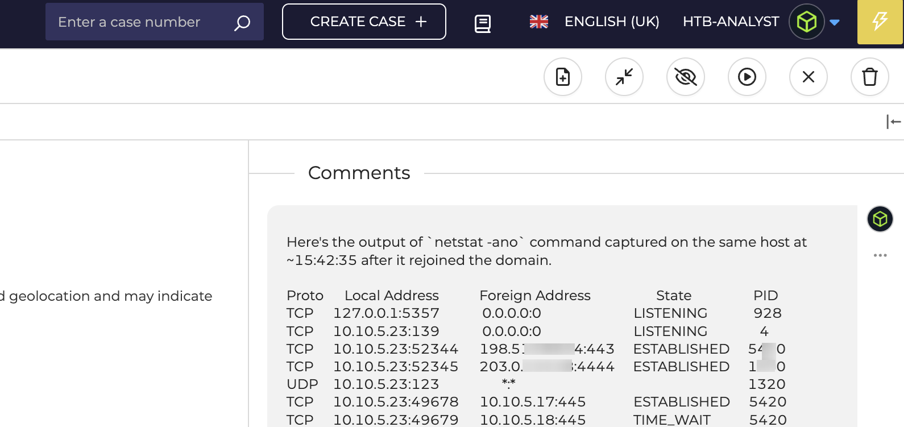

Đầu ra này được thu thập sau khi máy tính gia nhập lại domain sau phục hồi. Tuy nhiên, nó vẫn đang kết nối đến một địa chỉ IP. Nhà phân tích đã thêm thông tin này vào phần bình luận của cảnh báo.

Có thêm một số câu hỏi ở cuối section này.

### Ánh xạ sang Cyber Kill Chain

Một người dùng mở tệp đính kèm, khiến một downloader được thực thi; downloader ghi một tệp .exe vào %AppData%, tạo một khóa registry Run, rồi sau đó nạp VaultCli.dll thông qua một công cụ đáng ngờ, đưa thông tin xác thực ra một IP bên ngoài. Nhiệm vụ của bạn là ánh xạ từng bước của cuộc tấn công vào giai đoạn tương ứng trong kill chain.

- Nhiệm vụ 1: Ánh xạ hoạt động tải tệp, thao tác registry và đưa dữ liệu ra ngoài sang MITRE ATT&CK.
- Nhiệm vụ 2: Kiểm tra cảnh báo liên quan đến Mimikatz trong TheHive và xác định MITRE Technique ID.

### Điều tra các log đã thu thập

- Nhiệm vụ 1: Ngoài ra, bạn được cung cấp một số tệp event log (tức logs-wazuh.zip). Một trong các nhiệm vụ là giải mã một số lệnh PowerShell và trích xuất IOC từ chúng.
- Nhiệm vụ 2: Xác định người dùng đã thực thi lệnh PowerShell đáng ngờ.


