# Module 02: Security Monitoring & SIEM Fundamentals

## Mục lục

- [Section 1/11 — Định nghĩa và kiến thức nền tảng về SIEM](#section-01)
- [Section 2/11 — Giới thiệu Elastic Stack](#section-02)
- [Section 3/11 — Định nghĩa và kiến thức nền tảng về SOC](#section-03)
- [Section 4/11 — MITRE ATT&CK và hoạt động vận hành bảo mật](#section-04)
- [Section 5/11 — Phát triển use case SIEM](#section-05)
- [Section 6/11 — Ví dụ trực quan hóa SIEM 1: Đăng nhập thất bại (Tất cả người dùng)](#section-06)
- [Section 7/11 — Ví dụ trực quan hóa SIEM 2: Đăng nhập thất bại (Người dùng bị vô hiệu hóa)](#section-07)
- [Section 8/11 — Ví dụ trực quan hóa SIEM 3: Đăng nhập RDP thành công liên quan đến tài khoản dịch vụ](#section-08)
- [Section 9/11 — Ví dụ trực quan hóa SIEM 4: Người dùng được thêm vào hoặc xóa khỏi nhóm cục bộ (Trong khung thời gian cụ thể)](#section-09)
- [Section 10/11 — Quy trình triage](#section-10)
- [Section 11/11 — Đánh giá kỹ năng](#section-11)

<a id="section-01"></a>

## Section 1/11 — Định nghĩa và kiến thức nền tảng về SIEM

### SIEM là gì?

Giữ vai trò quan trọng trong lĩnh vực bảo vệ hệ thống máy tính, Security Information and Event Management (SIEM — quản lý thông tin và sự kiện bảo mật) bao gồm việc sử dụng các sản phẩm và giải pháp phần mềm kết hợp quản lý dữ liệu bảo mật với giám sát sự kiện bảo mật. Những công cụ này hỗ trợ đánh giá theo thời gian thực các cảnh báo liên quan đến bảo mật do phần cứng mạng và ứng dụng tạo ra.

Các công cụ SIEM có nhiều chức năng cốt lõi, chẳng hạn thu thập và quản lý sự kiện log, khả năng kiểm tra sự kiện log cùng dữ liệu bổ sung từ nhiều nguồn, cũng như các tính năng vận hành như xử lý sự cố, tổng hợp trực quan và lập tài liệu.

Nhờ công nghệ SIEM, nhân sự CNTT có thể phát hiện cuộc tấn công mạng ngay khi hoặc thậm chí trước khi nó xảy ra, qua đó tăng tốc độ ứng phó trong quá trình giải quyết sự cố. Vì vậy, SIEM đóng vai trò không thể thiếu đối với hiệu quả và việc giám sát liên tục hệ thống bảo mật thông tin của công ty. Nó là nền tảng cho các chiến thuật bảo mật của tổ chức, cung cấp một phương pháp toàn diện để nhận diện và quản lý những mối đe dọa tiềm ẩn.

### Sự phát triển của công nghệ SIEM

Thuật ngữ viết tắt “SIEM” xuất hiện từ sự hợp tác của hai nhà phân tích Gartner, những người đề xuất một mô hình thông tin bảo mật mới kết hợp hai công nghệ trước đó: Security Information Management (SIM — quản lý thông tin bảo mật) và Security Event Management (SEM — quản lý sự kiện bảo mật). Đề xuất này xuất hiện trong một tài liệu Gartner năm 2005 có tiêu đề “Tăng cường bảo mật CNTT thông qua quản lý lỗ hổng”.

Công nghệ SIM thế hệ đầu được phát triển trên các hệ thống quản lý thu thập log truyền thống, cho phép lưu trữ dài hạn, kiểm tra và báo cáo dữ liệu log, đồng thời kết hợp log với threat intelligence (thông tin tình báo về mối đe dọa). Trong khi đó, công nghệ SEM thế hệ thứ hai xử lý các sự kiện bảo mật bằng cách tập hợp, tương quan và thông báo các sự kiện từ nhiều thiết bị hoặc công cụ bảo mật như phần mềm antivirus, tường lửa, Intrusion Detection Systems (IDS — hệ thống phát hiện xâm nhập), cùng các sự kiện được ghi nhận trực tiếp từ hoạt động xác thực, SNMP trap, máy chủ và cơ sở dữ liệu.

Trong những năm tiếp theo, các nhà cung cấp kết hợp khả năng của SIM và SEM để tạo ra SIEM, dẫn đến một định nghĩa mới theo nghiên cứu của Gartner. Công nghệ mới này được đón nhận rộng rãi vì cung cấp phương pháp toàn diện để phát hiện và quản lý mối đe dọa, bao gồm khả năng thu thập, lưu giữ và kiểm tra kỹ log cùng các sự kiện bảo mật từ nhiều nguồn.

### Giải pháp SIEM hoạt động như thế nào?

Các hệ thống SIEM hoạt động bằng cách thu thập dữ liệu từ nhiều nguồn, bao gồm PC, thiết bị mạng, máy chủ và các nguồn khác. Sau đó, dữ liệu được chuẩn hóa và tập hợp để việc phân tích trở nên dễ dàng.

Các nền tảng SIEM có sự tham gia của chuyên gia bảo mật, những người xem xét kỹ dữ liệu để nhận diện và phát hiện các mối đe dọa tiềm ẩn. Quy trình này cho phép doanh nghiệp xác định các vụ xâm phạm bảo mật và kiểm tra cảnh báo, cung cấp những hiểu biết quan trọng về tình trạng bảo mật của tổ chức.

Cảnh báo thông báo cho nhân sự vận hành/giám sát bảo mật rằng họ phải xem xét một sự kiện hoặc sự cố bảo mật có thể đã xảy ra. Những thông báo này thường ngắn gọn và cho nhân viên biết về một cuộc tấn công cụ thể nhắm vào các hệ thống thông tin của tổ chức. Cảnh báo có thể được chuyển qua nhiều kênh, chẳng hạn email, thông báo bật lên trên console, tin nhắn văn bản hoặc cuộc gọi đến điện thoại thông minh.

Các hệ thống SIEM tạo ra lượng cảnh báo rất lớn do số lượng đáng kể sự kiện được sinh ra cho mỗi nền tảng được giám sát. Việc log sự kiện trong một giờ lên đến hàng trăm hoặc hàng nghìn bản ghi không phải là hiếm. Vì vậy, tinh chỉnh SIEM để phát hiện và cảnh báo các sự kiện có rủi ro cao là điều thiết yếu.

Khả năng xác định chính xác các sự kiện có rủi ro cao là điểm phân biệt SIEM với những công cụ giám sát và phát hiện khác trên mạng, như Intrusion Prevention Systems (IPS — hệ thống ngăn chặn xâm nhập) hoặc Intrusion Detection Systems (IDS). SIEM không thay thế khả năng ghi log của những thiết bị này; thay vào đó, nó phối hợp với chúng bằng cách xử lý và kết hợp dữ liệu log để nhận diện các sự kiện có khả năng dẫn đến việc hệ thống bị khai thác. Bằng cách tích hợp dữ liệu từ nhiều nguồn, giải pháp SIEM cung cấp một chiến lược toàn diện để phát hiện và quản lý mối đe dọa.

### Yêu cầu nghiệp vụ và các use case của SIEM

#### Tập hợp và chuẩn hóa log

Không thể nhấn mạnh quá mức tầm quan trọng của khả năng quan sát mối đe dọa thông qua việc tập hợp log mà hệ thống SIEM cung cấp. Khi thiếu nó, năng lực an ninh mạng của tổ chức có giá trị chẳng hơn một vật chặn giấy. Tập hợp log bao gồm thu thập hàng terabyte thông tin bảo mật từ những tường lửa quan trọng, cơ sở dữ liệu mật và ứng dụng thiết yếu. Quy trình này cho phép đội SOC kiểm tra dữ liệu và nhận ra các mối liên hệ, cải thiện đáng kể khả năng quan sát mối đe dọa.

Sử dụng khả năng tập hợp log của SIEM, đội SOC có thể nhận diện và kiểm tra kỹ các sự cố, sự kiện bảo mật trên toàn bộ hạ tầng CNTT của tổ chức. Bằng cách tập trung và tương quan thông tin từ nhiều nguồn, SIEM cung cấp một chiến lược toàn diện để phát hiện và xử lý mối đe dọa. Cách tiếp cận này cho phép tổ chức nhận ra các mẫu, xu hướng và điểm bất thường có thể cho thấy những nguy cơ bảo mật tiềm ẩn. Nhờ đó, các đội SOC có thể phản ứng nhanh chóng và hiệu quả với sự cố bảo mật, giảm hậu quả đối với tổ chức.

#### Cảnh báo mối đe dọa

Việc có một giải pháp SIEM có thể nhận diện và thông báo cho đội bảo mật CNTT về những mối đe dọa có thể tồn tại trong khối lượng dữ liệu sự kiện bảo mật khổng lồ đã thu thập là điều thiết yếu. Tính năng này quan trọng vì cho phép đội bảo mật CNTT điều tra nhanh hơn, tập trung hơn và ứng phó với những sự cố bảo mật tiềm ẩn kịp thời, hiệu quả.

Các giải pháp SIEM sử dụng phân tích nâng cao và threat intelligence để nhận diện mối đe dọa tiềm ẩn và tạo cảnh báo theo thời gian thực. Khi phát hiện mối đe dọa, hệ thống chuyển cảnh báo đến đội bảo mật CNTT, cung cấp các chi tiết cần thiết để điều tra và giảm thiểu rủi ro hiệu quả. Bằng cách cảnh báo kịp thời cho đội bảo mật CNTT, giải pháp SIEM giúp giảm thiểu tác động tiềm tàng của sự cố bảo mật và bảo vệ các tài sản thiết yếu của tổ chức.

#### Bổ sung ngữ cảnh và ứng phó

Cần hiểu rằng chỉ tạo cảnh báo là chưa đủ. Nếu một giải pháp SIEM gửi cảnh báo cho mọi sự kiện bảo mật có thể xảy ra, đội bảo mật CNTT sẽ sớm bị quá tải bởi số lượng cảnh báo, và false positive (dương tính giả) có thể trở thành vấn đề thường xuyên, đặc biệt ở các giải pháp cũ. Vì vậy, bổ sung ngữ cảnh cho mối đe dọa là điều thiết yếu để sàng lọc cảnh báo, xác định những tác nhân liên quan đến sự kiện bảo mật, những phần của mạng bị ảnh hưởng và thời điểm xảy ra.

Việc bổ sung ngữ cảnh cho phép đội bảo mật CNTT xác định những mối đe dọa tiềm ẩn thực sự và hành động nhanh chóng. Các quy trình cấu hình tự động có thể lọc một số mối đe dọa đã được bổ sung ngữ cảnh, giảm số cảnh báo đội nhận được.

Một giải pháp SIEM lý tưởng nên cho phép doanh nghiệp trực tiếp quản lý mối đe dọa, thường bằng cách dừng hoạt động trong lúc điều tra. Cách tiếp cận này giúp giảm thiểu tác động tiềm tàng của sự cố bảo mật và bảo vệ các tài sản trọng yếu của tổ chức. Giải pháp SIEM cung cấp ngữ cảnh và tự động hóa việc lọc mối đe dọa, cho phép đội bảo mật CNTT tập trung vào các mối đe dọa thực sự, giảm alert fatigue (mệt mỏi do quá tải cảnh báo), đồng thời nâng cao hiệu suất và hiệu quả ứng phó sự cố.

#### Tuân thủ

Các giải pháp SIEM đóng vai trò đáng kể trong việc tuân thủ, hỗ trợ tổ chức đáp ứng yêu cầu của quy định thông qua cách tiếp cận toàn diện đối với phát hiện và quản lý mối đe dọa.

Những quy định như PCI DSS, HIPAA và GDPR yêu cầu tổ chức triển khai các biện pháp bảo mật vững chắc, bao gồm giám sát và phân tích lưu lượng mạng theo thời gian thực. Giải pháp SIEM có thể giúp tổ chức đáp ứng những yêu cầu này, cho phép đội SOC phát hiện và ứng phó kịp thời với sự cố bảo mật.

Giải pháp SIEM cũng cung cấp khả năng báo cáo và kiểm toán tự động, vốn rất cần thiết cho việc tuân thủ. Những tính năng này cho phép tổ chức tạo báo cáo tuân thủ nhanh chóng và chính xác, bảo đảm đáp ứng yêu cầu của quy định và có thể chứng minh việc tuân thủ với kiểm toán viên cùng cơ quan quản lý.

### Luồng dữ liệu bên trong SIEM

Bây giờ, hãy xem ngắn gọn cách dữ liệu di chuyển bên trong SIEM cho đến khi sẵn sàng để phân tích.

- Giải pháp SIEM tiếp nhận log từ nhiều nguồn dữ liệu. Mỗi công cụ SIEM có khả năng riêng để thu thập log từ các nguồn khác nhau. Quá trình này được gọi là data ingestion hoặc data collection (tiếp nhận hoặc thu thập dữ liệu).
- Dữ liệu thu thập được sẽ được xử lý và chuẩn hóa để correlation engine (bộ máy tương quan) của SIEM có thể hiểu. Dữ liệu thô phải được ghi hoặc đọc ở định dạng mà SIEM có thể hiểu, rồi chuyển đổi từ nhiều loại tập dữ liệu sang một định dạng chung. Quá trình này được gọi là data normalization và data aggregation (chuẩn hóa và tập hợp dữ liệu).
- Cuối cùng là phần quan trọng nhất của SIEM: đội SOC sử dụng dữ liệu đã chuẩn hóa do SIEM thu thập để tạo nhiều quy tắc phát hiện, dashboard, nội dung trực quan hóa, cảnh báo và sự cố. Điều này cho phép đội SOC nhận diện rủi ro bảo mật tiềm ẩn và ứng phó nhanh chóng với sự cố bảo mật.

### Lợi ích của việc sử dụng giải pháp SIEM là gì?

Rõ ràng, lợi ích của việc triển khai hệ thống Security Information and Event Management (SIEM) vượt xa những rủi ro tiềm ẩn khi không có nó, với giả định rằng biện pháp kiểm soát bảo mật này đang bảo vệ một thứ có tầm quan trọng cao hơn.

Khi không có SIEM, nhân sự CNTT sẽ không có góc nhìn tập trung về toàn bộ log và sự kiện; điều này có thể khiến họ bỏ qua sự kiện quan trọng và tích tụ một lượng lớn sự kiện chờ điều tra. Ngược lại, một SIEM được tinh chỉnh phù hợp củng cố quy trình ứng phó sự cố, cải thiện hiệu suất và cung cấp dashboard tập trung cho các thông báo dựa trên những danh mục cùng ngưỡng sự kiện đã xác định trước.

Ví dụ, nếu một tường lửa ghi nhận năm lần đăng nhập sai liên tiếp khiến tài khoản admin bị khóa, cần có một hệ thống ghi log tập trung tương quan toàn bộ log để giám sát tình huống. Tương tự, khi phần mềm lọc web ghi nhận một máy tính kết nối đến website độc hại 100 lần trong một giờ, SIEM cho phép xem và xử lý thông tin đó trong một giao diện duy nhất.

Các SIEM hiện đại thường tích hợp khả năng phân tích thông minh để phát hiện các ngưỡng có thể cấu hình và các sự kiện trong những khoảng thời gian cụ thể, cũng như cung cấp bản tổng hợp và báo cáo có thể tùy chỉnh. Các SIEM tinh vi hơn hiện đang tích hợp AI để thông báo dựa trên phân tích hành vi và mẫu hoạt động.

Khả năng báo cáo và thông báo của SIEM giúp nhân sự CNTT phản ứng, ứng phó nhanh chóng với sự cố tiềm ẩn, nhấn mạnh khả năng nhận diện các cuộc tấn công độc hại trước khi chúng xảy ra. Khả năng phân tích thông minh này có thể giảm chi phí liên quan đến một vụ xâm phạm bảo mật trên quy mô toàn diện, giúp tổ chức tránh thiệt hại đáng kể về tài chính và danh tiếng.

Nhiều tổ chức thuộc các lĩnh vực chịu quản lý theo quy định, như ngân hàng, tài chính, bảo hiểm và chăm sóc sức khỏe, bắt buộc phải có một SIEM được quản lý, đặt tại chỗ hoặc trên đám mây. Hệ thống SIEM cung cấp bằng chứng rằng các hệ thống đang được giám sát, ghi log, xem xét và tuân thủ chính sách lưu giữ log, đáp ứng những tiêu chuẩn tuân thủ như ISO và HIPAA.

<a id="section-02"></a>

## Section 2/11 — Giới thiệu Elastic Stack

### Elastic Stack là gì?

Elastic stack do Elastic tạo ra là một bộ công cụ mã nguồn mở gồm chủ yếu ba ứng dụng (Elasticsearch, Logstash và Kibana), phối hợp để cung cấp cho người dùng khả năng tìm kiếm và trực quan hóa toàn diện nhằm phân tích, khám phá các nguồn tệp log theo thời gian thực.

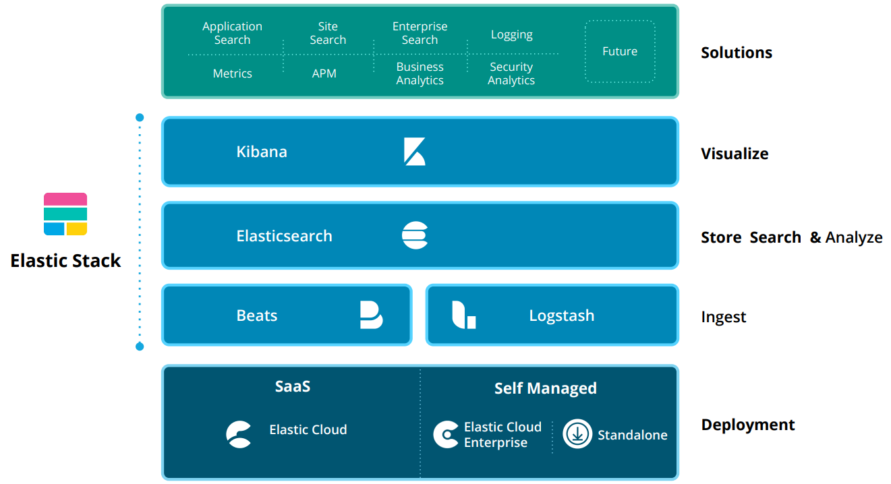

Trong những môi trường đòi hỏi nhiều tài nguyên, kiến trúc tổng thể của Elastic stack có thể được tăng cường bằng cách bổ sung Kafka, RabbitMQ và Redis để làm bộ đệm và nâng cao khả năng chịu lỗi, cùng nginx để phục vụ bảo mật.

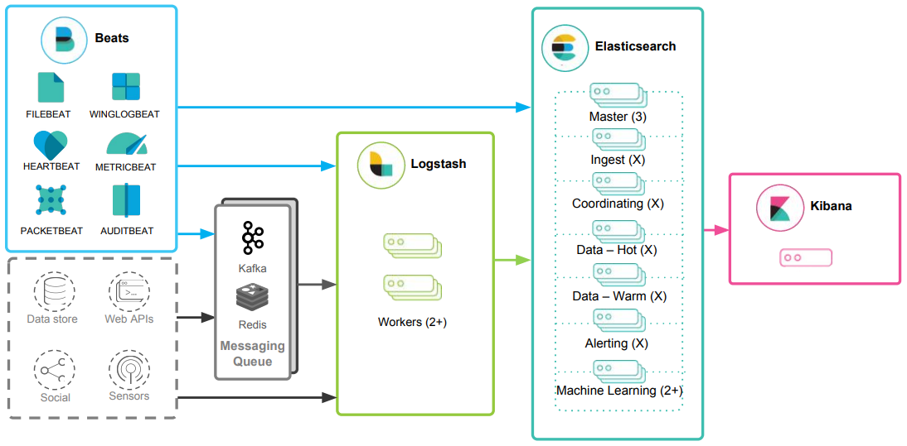

Hãy tìm hiểu từng thành phần của Elastic stack.

Elasticsearch là một công cụ tìm kiếm phân tán dựa trên JSON, được thiết kế với các RESTful API. Là thành phần cốt lõi của Elastic stack, nó đảm nhiệm việc lập chỉ mục, lưu trữ và truy vấn. Elasticsearch cho phép người dùng thực hiện các truy vấn phức tạp và thao tác phân tích trên những bản ghi tệp log đã được Logstash xử lý.

Logstash chịu trách nhiệm thu thập, biến đổi và vận chuyển các bản ghi tệp log. Thế mạnh của nó nằm ở khả năng tập hợp dữ liệu từ nhiều nguồn và chuẩn hóa chúng. Logstash hoạt động trong ba lĩnh vực chính:

- Xử lý đầu vào: Logstash tiếp nhận bản ghi tệp log từ các vị trí từ xa, chuyển đổi chúng sang định dạng máy có thể hiểu. Nó có thể nhận bản ghi qua nhiều phương thức đầu vào, chẳng hạn đọc từ một tệp phẳng, một TCP socket hoặc trực tiếp từ thông điệp syslog. Sau khi xử lý đầu vào, Logstash chuyển sang chức năng tiếp theo.
- Biến đổi và bổ sung thông tin cho bản ghi log: Logstash cung cấp nhiều cách để thay đổi định dạng, thậm chí nội dung của một bản ghi log. Cụ thể, các filter plugin có thể thực hiện xử lý trung gian trên một sự kiện, thường dựa trên điều kiện đã xác định trước. Sau khi bản ghi log được biến đổi, Logstash tiếp tục xử lý nó.
- Gửi bản ghi log đến Elasticsearch: Logstash sử dụng output plugin để truyền các bản ghi log đến Elasticsearch.

Kibana đóng vai trò công cụ trực quan hóa cho các document (tài liệu dữ liệu) trong Elasticsearch. Người dùng có thể xem dữ liệu lưu trong Elasticsearch và thực hiện truy vấn qua Kibana. Ngoài ra, Kibana giúp hiểu kết quả truy vấn dễ hơn bằng bảng, biểu đồ và dashboard tùy chỉnh.

Lưu ý: Beats là một thành phần bổ sung của Elastic stack. Các công cụ chuyển dữ liệu gọn nhẹ, chuyên dụng này được thiết kế để cài trên máy từ xa nhằm chuyển tiếp log và số liệu đo đến Logstash hoặc trực tiếp đến Elasticsearch. Beats đơn giản hóa việc thu thập dữ liệu từ nhiều nguồn và bảo đảm Elastic Stack nhận được thông tin cần thiết để phân tích, trực quan hóa.

Beats -> Logstash -> Elasticsearch -> Kibana

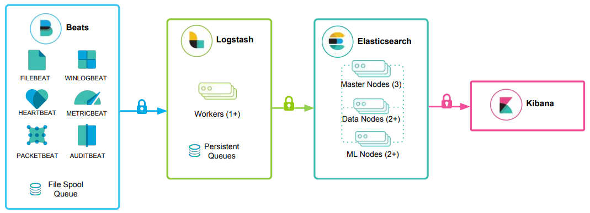

Beats -> Elasticsearch -> Kibana

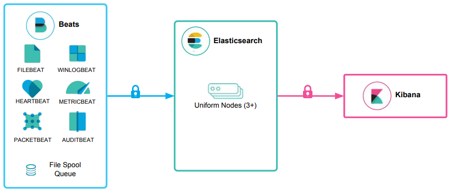

### Elastic Stack với vai trò giải pháp SIEM

Elastic stack có thể được sử dụng như một giải pháp Security Information and Event Management (SIEM) để thu thập, lưu trữ, phân tích và trực quan hóa dữ liệu liên quan đến bảo mật từ nhiều nguồn.

Để triển khai Elastic stack thành một giải pháp SIEM, dữ liệu liên quan đến bảo mật từ các nguồn như tường lửa, IDS/IPS và endpoint cần được đưa vào Elastic stack bằng Logstash. Elasticsearch cần được cấu hình để lưu trữ và lập chỉ mục dữ liệu bảo mật; Kibana nên được dùng để tạo dashboard cùng nội dung trực quan hóa tùy chỉnh nhằm cung cấp thông tin chuyên sâu về các sự kiện liên quan đến bảo mật.

Để phát hiện sự cố liên quan đến bảo mật, có thể sử dụng Elasticsearch để tìm kiếm và tương quan dữ liệu bảo mật đã thu thập.

Với vai trò nhà phân tích Security Operations Center (SOC — trung tâm vận hành bảo mật), nhiều khả năng chúng ta sẽ sử dụng Kibana thường xuyên như giao diện chính khi làm việc với Elastic stack. Vì vậy, thành thạo các chức năng và tính năng của nó là điều thiết yếu.

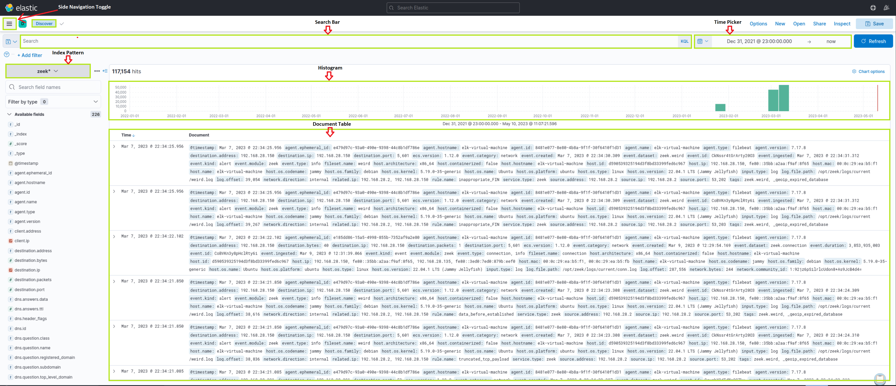

Kibana Query Language (KQL) là một ngôn ngữ truy vấn mạnh và thân thiện với người dùng, được thiết kế riêng cho việc tìm kiếm, phân tích dữ liệu trong Kibana. Nó đơn giản hóa quá trình rút ra thông tin chuyên sâu từ dữ liệu Elasticsearch đã được lập chỉ mục, cung cấp cách tiếp cận trực quan hơn Query DSL của Elasticsearch. Hãy khám phá các khía cạnh kỹ thuật và thành phần chính của ngôn ngữ KQL.

Cấu trúc cơ bản: Truy vấn KQL được tạo từ các cặp field:value, trong đó field biểu thị thuộc tính của dữ liệu và value biểu thị dữ liệu bạn đang tìm kiếm. Ví dụ:

```shellsession
event.code:4625
```

Truy vấn KQL event.code:4625 lọc dữ liệu trong Kibana để hiển thị các sự kiện có mã sự kiện Windows 4625. Mã sự kiện Windows này gắn với những lần đăng nhập thất bại trong hệ điều hành Windows.

Bằng truy vấn này, nhà phân tích SOC có thể nhận diện những lần đăng nhập thất bại trên máy Windows trong chỉ mục Elasticsearch, rồi điều tra nguồn gốc của các lần thử và những mối đe dọa bảo mật tiềm ẩn. Loại truy vấn này có thể giúp nhận diện các cuộc tấn công brute force (thử vét cạn), đoán mật khẩu và những hoạt động đáng ngờ khác liên quan đến đăng nhập trên hệ thống Windows.

Bằng cách tiếp tục tinh chỉnh truy vấn với các điều kiện bổ sung như địa chỉ IP nguồn, tên người dùng hoặc khoảng thời gian, nhà phân tích SOC có thể thu được thông tin cụ thể hơn và điều tra hiệu quả những sự cố bảo mật tiềm ẩn.

Tìm kiếm văn bản tự do: KQL hỗ trợ tìm kiếm văn bản tự do, cho phép bạn tìm một thuật ngữ cụ thể trên nhiều trường mà không chỉ định tên trường. Chẳng hạn:

```shellsession
"svc-sql1"
```

Truy vấn này trả về các bản ghi chứa chuỗi "svc-sql1" trong bất kỳ trường nào đã được lập chỉ mục.

Toán tử logic: KQL hỗ trợ các toán tử logic AND, OR và NOT để xây dựng truy vấn phức tạp hơn. Có thể sử dụng dấu ngoặc đơn để nhóm biểu thức và kiểm soát thứ tự đánh giá. Ví dụ:

```shellsession
event.code:4625 AND winlog.event_data.SubStatus:0xC0000072
```

Truy vấn KQL event.code:4625 AND winlog.event_data.SubStatus:0xC0000072 lọc dữ liệu trong Kibana để hiển thị các sự kiện có mã sự kiện Windows 4625 (đăng nhập thất bại) và giá trị SubStatus là 0xC0000072.

Trong Windows, giá trị SubStatus cho biết nguyên nhân đăng nhập thất bại. Giá trị SubStatus 0xC0000072 cho biết tài khoản hiện đang bị vô hiệu hóa.

Bằng truy vấn này, nhà phân tích SOC có thể nhận diện những lần đăng nhập thất bại vào các tài khoản bị vô hiệu hóa. Hành vi như vậy cần được điều tra thêm, vì có thể kẻ tấn công bằng cách nào đó đã xác định được thông tin xác thực của tài khoản bị vô hiệu hóa.

Toán tử so sánh: KQL hỗ trợ nhiều toán tử so sánh như :, :>, :>=, :<, :<= và :!. Những toán tử này cho phép bạn xác định các điều kiện chính xác để khớp giá trị trường. Chẳng hạn:

```shellsession
event.code:4625 AND winlog.event_data.SubStatus:0xC0000072 AND @timestamp >= "2023-03-03T00:00:00.000Z" AND @timestamp <= "2023-03-06T23:59:59.999Z"
```

Bằng truy vấn này, nhà phân tích SOC có thể nhận diện những lần đăng nhập thất bại vào tài khoản bị vô hiệu hóa diễn ra từ ngày 3 tháng 3 năm 2023 đến ngày 6 tháng 3 năm 2023.

Ký tự đại diện và biểu thức chính quy: KQL hỗ trợ ký tự đại diện và biểu thức chính quy để tìm các mẫu trong giá trị trường. Ví dụ:

```shellsession
event.code:4625 AND user.name: admin*
```

Truy vấn Kibana KQL event.code:4625 AND user.name: admin* lọc dữ liệu trong Kibana để hiển thị các sự kiện có mã sự kiện Windows 4625 (đăng nhập thất bại), đồng thời tên người dùng bắt đầu bằng "admin", chẳng hạn "admin", "administrator", "admin123", v.v.

Truy vấn này, nếu được mở rộng, có thể hữu ích trong việc nhận diện những lần đăng nhập có khả năng độc hại nhắm vào tài khoản quản trị.

### Cách xác định dữ liệu sẵn có

Bạn có thể hỏi: “Làm thế nào để xác định các trường và giá trị sẵn có?” Hãy xem chúng ta có thể xác định những trường và giá trị đã sử dụng trong section này như thế nào.

Ví dụ: Xác định những lần đăng nhập thất bại vào tài khoản bị vô hiệu hóa xảy ra từ ngày 3 tháng 3 năm 2023 đến ngày 6 tháng 3 năm 2023. KQL:

```shellsession
event.code:4625 AND winlog.event_data.SubStatus:0xC0000072 AND @timestamp >= "2023-03-03T00:00:00.000Z" AND @timestamp <= "2023-03-06T23:59:59.999Z"
```

#### Cách xác định dữ liệu và trường 1: Sử dụng tìm kiếm văn bản tự do của KQL

Với tính năng Discover, chúng ta có thể dễ dàng khám phá, sàng lọc dữ liệu sẵn có và hiểu cấu trúc của các trường hiện có trước khi bắt đầu xây dựng truy vấn KQL.

- Khi dùng công cụ tìm kiếm để tìm các Windows event log liên quan đến đăng nhập thất bại, chúng ta sẽ gặp những tài nguyên như https://www.ultimatewindowssecurity.com/securitylog/encyclopedia/event.aspx?eventid=4625
- Sử dụng tìm kiếm văn bản tự do của KQL, chúng ta có thể tìm "4625". Trong các bản ghi trả về, chúng ta thấy event.code:4625, winlog.event_id:4625 và @timestamp.
  - event.code liên quan đến Elastic Common Schema (ECS).
  - winlog.event_id liên quan đến Winlogbeat.
  - Nếu tổ chức đang sử dụng Elastic stack trên tất cả văn phòng và bộ phận bảo mật, nên ưu tiên dùng các trường ECS trong truy vấn vì những lý do sẽ được trình bày ở cuối section này.
  - @timestamp thường chứa thời gian được trích xuất từ sự kiện gốc và khác với event.created.

   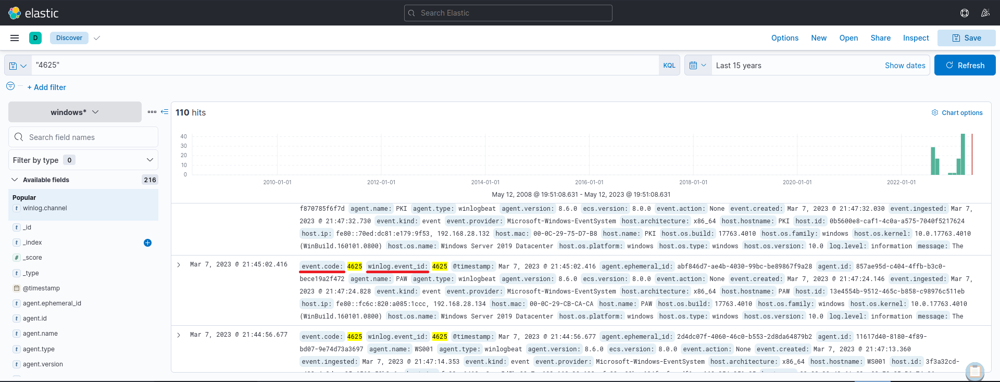

- Đối với tài khoản bị vô hiệu hóa, tài nguyên nêu trên cho biết giá trị SubStatus 0xC0000072 trong một Windows event log 4625 biểu thị tài khoản hiện đang bị vô hiệu hóa. Tiếp tục dùng tìm kiếm văn bản tự do của KQL, chúng ta có thể tìm "0xC0000072". Khi mở rộng bản ghi trả về, chúng ta thấy winlog.event_data.SubStatus liên quan đến Winlogbeat.

   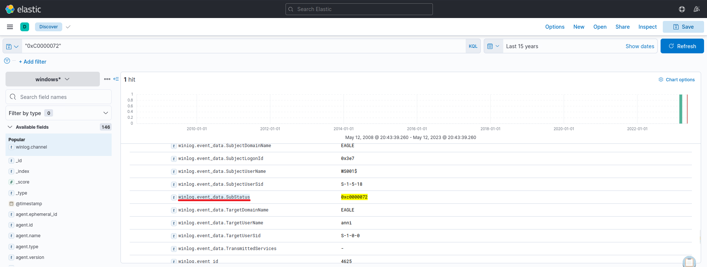

#### Cách xác định dữ liệu và trường 2: Sử dụng tài liệu của Elastic

Làm quen trước với hệ thống tài liệu đầy đủ của Elastic trước khi đi sâu vào tính năng "Discover" có thể là một ý hay. Tài liệu cung cấp rất nhiều thông tin về các loại trường khác nhau mà chúng ta có thể gặp. Một số tài nguyên phù hợp để bắt đầu là:

- Elastic Common Schema (ECS).
- Các trường sự kiện của Elastic Common Schema (ECS).
- Các trường Winlogbeat.
- Các trường ECS của Winlogbeat.
- Các trường module security của Winlogbeat.
- Các trường Filebeat.
- Các trường ECS của Filebeat.

### Elastic Common Schema (ECS)

Elastic Common Schema (ECS) là một bộ từ vựng dùng chung, có thể mở rộng cho sự kiện và log trên toàn Elastic Stack, bảo đảm định dạng trường nhất quán giữa các nguồn dữ liệu. Khi tìm kiếm bằng Kibana Query Language (KQL) trong Elastic Stack, sử dụng các trường ECS mang lại một số lợi ích chính:

- Góc nhìn dữ liệu thống nhất: ECS áp dụng cách tiếp cận dữ liệu có cấu trúc và nhất quán, cho phép có góc nhìn thống nhất trên nhiều nguồn dữ liệu. Ví dụ, dữ liệu từ log Windows, lưu lượng mạng, sự kiện endpoint hoặc nguồn dữ liệu trên đám mây đều có thể được tìm kiếm và tương quan bằng cùng các tên trường.
- Cải thiện hiệu suất tìm kiếm: Bằng cách chuẩn hóa tên trường giữa các loại dữ liệu, ECS đơn giản hóa việc viết truy vấn KQL. Điều này có nghĩa là nhà phân tích có thể xây dựng truy vấn hiệu quả mà không cần nhớ các tên trường riêng cho từng nguồn dữ liệu.
- Tăng cường tương quan: ECS giúp tương quan sự kiện giữa các nguồn dễ hơn, điều có vai trò then chốt trong điều tra an ninh mạng. Ví dụ, bạn có thể tương quan một địa chỉ IP liên quan đến sự cố bảo mật với log lưu lượng mạng, log tường lửa và dữ liệu endpoint để hiểu sự cố toàn diện hơn.
- Trực quan hóa tốt hơn: Quy ước đặt tên trường nhất quán nâng cao hiệu quả trực quan hóa trong Kibana. Vì mọi nguồn dữ liệu tuân theo cùng một schema, việc tạo dashboard và nội dung trực quan hóa trở nên dễ dàng, trực quan hơn. Điều này có thể giúp nhận ra xu hướng, xác định bất thường và trực quan hóa sự cố bảo mật.
- Khả năng tương tác với các giải pháp Elastic: Dùng các trường ECS bảo đảm khả năng tương thích đầy đủ với những tính năng và giải pháp nâng cao của Elastic Stack, như Elastic Security, Elastic Observability và Elastic Machine Learning. Điều này cho phép threat hunting nâng cao, phát hiện bất thường và giám sát hiệu năng.
- Bảo đảm khả năng tương thích về sau: Vì ECS là schema nền tảng trên toàn Elastic Stack, áp dụng ECS bảo đảm khả năng tương thích trong tương lai với những cải tiến và tính năng mới được đưa vào hệ sinh thái Elastic.

Vui lòng chờ 3-5 phút để Kibana sẵn sàng sau khi khởi tạo máy mục tiêu của các câu hỏi bên dưới.

<a id="section-03"></a>

## Section 3/11 — Định nghĩa và kiến thức nền tảng về SOC

### SOC là gì?

Security Operations Center (SOC — trung tâm vận hành bảo mật) là một cơ sở thiết yếu, nơi có đội ngũ chuyên gia an toàn thông tin chịu trách nhiệm liên tục giám sát và đánh giá tình trạng bảo mật của tổ chức. Mục tiêu chính của đội SOC là nhận diện, kiểm tra và xử lý sự cố an ninh mạng bằng cách kết hợp các giải pháp công nghệ với một tập hợp quy trình toàn diện.

Đội SOC thường gồm các nhà phân tích bảo mật có chuyên môn, kỹ sư và người quản lý giám sát hoạt động bảo mật. Họ phối hợp chặt chẽ với các đội ứng phó sự cố trong tổ chức để bảo đảm những vấn đề bảo mật được phát hiện và giải quyết kịp thời.

Đội SOC sử dụng nhiều giải pháp công nghệ, chẳng hạn hệ thống Security Information and Event Management (SIEM), Intrusion Detection and Prevention Systems (IDS/IPS) và công cụ Endpoint Detection and Response (EDR — phát hiện và ứng phó trên thiết bị đầu cuối), để giám sát và nhận diện mối đe dọa bảo mật. Họ cũng sử dụng threat intelligence và thực hiện các hoạt động threat hunting (chủ động săn tìm mối đe dọa) để chủ động phát hiện những mối đe dọa và lỗ hổng tiềm ẩn.

Bên cạnh các giải pháp công nghệ, đội SOC tuân theo một loạt quy trình được xác định rõ để xử lý sự cố bảo mật. Các quy trình này bao gồm triage (phân loại và đánh giá ban đầu), ngăn chặn, loại bỏ và phục hồi sự cố. Đội SOC phối hợp chặt chẽ với đội ứng phó sự cố để bảo đảm sự cố bảo mật được xử lý đúng cách, bảo vệ tình trạng bảo mật của tổ chức.

Tóm lại, SOC là một thành phần quan trọng trong cách tiếp cận an ninh mạng của tổ chức. Nó cung cấp khả năng giám sát và ứng phó liên tục, cho phép tổ chức phát hiện, xử lý kịp thời sự cố bảo mật, giảm thiểu hậu quả của một vụ xâm phạm bảo mật và giảm khả năng xảy ra các cuộc tấn công trong tương lai.

### SOC hoạt động như thế nào?

Chức năng chính của đội SOC là quản lý khía cạnh vận hành thường xuyên của an toàn thông tin doanh nghiệp, thay vì tập trung vào xây dựng chiến lược bảo mật, thiết kế kiến trúc bảo mật hoặc triển khai các biện pháp bảo vệ.

Đội SOC chủ yếu gồm các nhà phân tích bảo mật cùng làm việc để phát hiện, đánh giá, ứng phó, báo cáo và ngăn ngừa sự cố an ninh mạng.

Ngoài những trách nhiệm chính của đội SOC, một số SOC có thể có các năng lực nâng cao như phân tích điều tra số và phân tích mã độc. Những khả năng này cho phép đội SOC điều tra chuyên sâu các sự cố bảo mật và xem xét nguyên nhân gốc rễ để ngăn các cuộc tấn công trong tương lai.

Như đã đề cập, đội SOC cũng phối hợp chặt chẽ với đội ứng phó sự cố để bảo đảm xử lý đúng sự cố bảo mật và duy trì tình trạng bảo mật của tổ chức.

### Các vai trò trong SOC

Đội SOC gồm nhiều vai trò chịu trách nhiệm xử lý khía cạnh vận hành liên tục của an toàn thông tin doanh nghiệp. Những vai trò này có thể bao gồm:

- SOC Director (giám đốc SOC): Chịu trách nhiệm quản lý tổng thể và lập kế hoạch chiến lược cho SOC, bao gồm ngân sách, nhân sự và bảo đảm phù hợp với các mục tiêu bảo mật của tổ chức.
- SOC Manager (quản lý SOC): Giám sát hoạt động hằng ngày, quản lý đội ngũ, điều phối các nỗ lực ứng phó sự cố và bảo đảm phối hợp trôi chảy với những bộ phận khác.
- Tier 1 Analyst (nhà phân tích cấp 1): Giám sát cảnh báo và sự kiện bảo mật, triage các sự cố tiềm ẩn và chuyển lên các cấp cao hơn để điều tra thêm.
- Tier 2 Analyst (nhà phân tích cấp 2): Phân tích chuyên sâu các sự cố được chuyển lên, xác định mẫu hoạt động và xu hướng, xây dựng chiến lược giảm thiểu để xử lý mối đe dọa bảo mật.
- Tier 3 Analyst (nhà phân tích cấp 3): Cung cấp chuyên môn nâng cao để xử lý những sự cố bảo mật phức tạp, thực hiện threat hunting và phối hợp với các đội khác nhằm cải thiện tình trạng bảo mật của tổ chức.
- Detection Engineer (kỹ sư phát hiện): Chịu trách nhiệm phát triển, triển khai và duy trì quy tắc cùng chữ ký phát hiện cho các công cụ giám sát bảo mật như SIEM, IDS/IPS và EDR. Họ làm việc chặt chẽ với nhà phân tích bảo mật để xác định khoảng trống trong phạm vi phát hiện và liên tục cải thiện khả năng phát hiện, ứng phó với mối đe dọa của tổ chức.
- Incident Responder (nhân sự ứng phó sự cố): Phụ trách các sự cố bảo mật đang diễn ra, thực hiện điều tra số chuyên sâu cùng các hoạt động ngăn chặn, khắc phục, phối hợp với các đội khác để khôi phục hệ thống bị ảnh hưởng và ngăn sự cố tái diễn.
- Threat Intelligence Analyst (nhà phân tích tình báo mối đe dọa): Thu thập, phân tích và phổ biến dữ liệu threat intelligence để giúp các thành viên SOC hiểu rõ hơn bối cảnh mối đe dọa và chủ động phòng vệ trước rủi ro mới nổi.
- Security Engineer (kỹ sư bảo mật): Phát triển, triển khai và duy trì công cụ, công nghệ, hạ tầng bảo mật; cung cấp chuyên môn kỹ thuật cho đội SOC.
- Compliance and Governance Specialist (chuyên viên tuân thủ và quản trị): Bảo đảm các thực hành và quy trình bảo mật của tổ chức tuân theo những tiêu chuẩn ngành, quy định và thông lệ tốt nhất có liên quan, đồng thời hỗ trợ đáp ứng yêu cầu kiểm toán và báo cáo.
- Security Awareness and Training Coordinator (điều phối viên đào tạo và nhận thức bảo mật): Xây dựng, triển khai các chương trình đào tạo và nâng cao nhận thức bảo mật để hướng dẫn nhân viên về những thực hành an ninh mạng tốt nhất và thúc đẩy văn hóa bảo mật trong tổ chức.

Cần lưu ý rằng vai trò và trách nhiệm cụ thể trong mỗi cấp có thể khác nhau tùy quy mô, lĩnh vực hoạt động và yêu cầu bảo mật riêng của tổ chức.

Nhìn chung, cấu trúc phân cấp có thể được mô tả như sau:

- Nhà phân tích Tier 1: Còn được gọi là “những người ứng phó đầu tiên”, họ giám sát sự kiện và cảnh báo bảo mật, thực hiện triage ban đầu và chuyển những sự cố tiềm ẩn lên cấp cao hơn để điều tra thêm. Mục tiêu chính của họ là nhanh chóng nhận diện và xác định thứ tự ưu tiên cho sự cố bảo mật.
- Nhà phân tích Tier 2: Có kinh nghiệm hơn và phân tích sâu hơn các sự cố được chuyển lên. Họ xác định mẫu hoạt động và xu hướng, xây dựng chiến lược giảm thiểu và đôi khi hỗ trợ ứng phó sự cố. Họ cũng có thể chịu trách nhiệm tinh chỉnh công cụ giám sát bảo mật để giảm false positive và cải thiện khả năng phát hiện.
- Nhà phân tích Tier 3: Thường được xem là những nhà phân tích giàu kinh nghiệm và kiến thức nhất trong đội, họ xử lý các sự cố bảo mật phức tạp và đáng chú ý nhất. Họ cũng có thể chủ động threat hunting, phát triển chiến lược phát hiện và ngăn ngừa nâng cao, phối hợp với các đội khác để cải thiện tình trạng bảo mật tổng thể của tổ chức.

### Các giai đoạn phát triển của SOC

Các Security Operations Center (SOC) đã phát triển đáng kể từ thời kỳ đầu là Network Operation Center, chủ yếu tập trung vào bảo mật mạng. Trong thế hệ đầu, được gọi là SOC 1.0, tổ chức đầu tư vào một số lớp bảo mật như nền tảng tình báo bảo mật hoặc hệ thống quản lý danh tính. Tuy nhiên, thiếu sự tích hợp phù hợp dẫn đến các cảnh báo không được tương quan và công việc tồn đọng trên nhiều nền tảng. Giai đoạn này có đặc trưng là chú trọng bảo mật mạng và vành đai, ngay cả khi các mối đe dọa bắt đầu khai thác những phương thức khác. Đáng ngạc nhiên là một số tổ chức vẫn tiếp tục dựa vào cách tiếp cận lỗi thời này, dường như chờ một vụ xâm nhập lớn xảy ra.

Sự xuất hiện của các mối đe dọa tinh vi, bao gồm những cuộc tấn công nhiều hướng, dai dẳng và không đồng bộ với các chỉ báo xâm nhập bị che giấu, đã thúc đẩy quá trình chuyển sang SOC 2.0. Mã độc, bao gồm cả biến thể trên thiết bị di động, và botnet là các phương thức chuyển giao chính cho những cuộc tấn công này. Khả năng tồn tại lâu dài, hành vi biến đổi và sự phát triển của botnet theo thời gian trở thành các trọng tâm của threat intelligence. SOC 2.0 được xây dựng trên nền tảng tình báo, tích hợp dữ liệu telemetry bảo mật, threat intelligence, phân tích luồng mạng và các kỹ thuật phát hiện bất thường khác. Ngoài ra, phân tích lớp 7 được sử dụng ở giai đoạn này để nhận diện những cuộc tấn công cường độ thấp, kéo dài và các mối đe dọa ẩn khác. Cách tiếp cận chủ động hướng tới tương lai trong nghiên cứu mối đe dọa và sự hợp tác giữa các SOC, trong cùng lĩnh vực hoặc ở cấp quốc gia, có vai trò thiết yếu đối với thành công của SOC 2.0. Giai đoạn này chú trọng nhận thức đầy đủ về tình hình, chuẩn bị trước sự kiện thông qua quản lý lỗ hổng, quản lý cấu hình và quản lý rủi ro linh hoạt, cũng như phân tích, học hỏi sau sự kiện thông qua ứng phó sự cố và điều tra số chuyên sâu. Tinh chỉnh quy tắc tình báo bảo mật và triển khai biện pháp đối phó cũng là những việc quan trọng trong giai đoạn này.

Cognitive SOC (SOC có khả năng nhận thức), hay SOC thế hệ tiếp theo, hướng đến giải quyết những thiếu sót còn lại của SOC 2.0. Mặc dù SOC 2.0 có đầy đủ các hệ thống con thiết yếu, nó thường thiếu kinh nghiệm vận hành và sự phối hợp hiệu quả giữa các đội nghiệp vụ và bảo mật để tạo quy tắc phát hiện những mối đe dọa đặc thù đối với quy trình, hệ thống kinh doanh. Hơn nữa, nhiều tổ chức vẫn thiếu quy trình ứng phó và phục hồi sự cố được chuẩn hóa.

Cognitive SOC hướng đến giải quyết các vấn đề này bằng cách tích hợp những hệ thống có khả năng học để bù đắp khoảng trống kinh nghiệm trong việc đưa ra quyết định bảo mật. Mặc dù tỷ lệ thành công của cách tiếp cận này có thể không hoàn hảo trong mọi trường hợp, nó được kỳ vọng sẽ cải thiện theo thời gian.

Tham khảo: https://www.linkedin.com/pulse/evolution-security-operations-center-20-beyond-krishnan-jagannathan/

<a id="section-04"></a>

## Section 4/11 — MITRE ATT&CK và hoạt động vận hành bảo mật

### MITRE ATT&CK là gì?

Framework MITRE ATT&CK (Adversarial Tactics, Techniques, and Common Knowledge) là một nguồn tài nguyên phong phú, được cập nhật thường xuyên, mô tả các tactics, techniques, and procedures (TTPs — chiến thuật, kỹ thuật và quy trình) mà tác nhân đe dọa mạng sử dụng. Phương pháp có cấu trúc này hỗ trợ chuyên gia an ninh mạng hiểu, nhận diện và phản ứng trước mối đe dọa chủ động hơn, với hiểu biết đầy đủ hơn.

Framework ATT&CK gồm các ma trận được điều chỉnh cho nhiều bối cảnh điện toán, chẳng hạn hệ thống doanh nghiệp, di động hoặc đám mây. Mỗi ma trận liên kết các chiến thuật (mục tiêu kẻ tấn công muốn đạt được) và kỹ thuật (phương pháp dùng để đạt mục tiêu) với những TTP riêng biệt. Sự liên kết này cho phép đội bảo mật xem xét và dự đoán hoạt động của kẻ tấn công một cách có phương pháp.

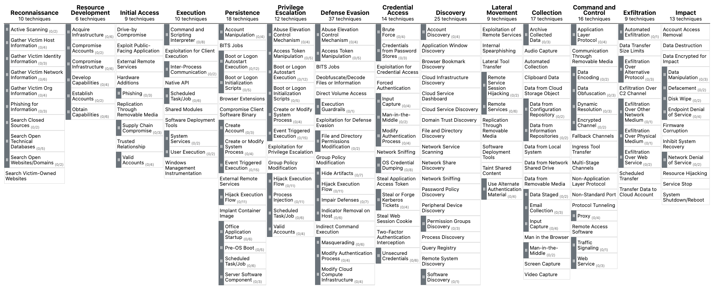

### Các use case của MITRE ATT&CK trong vận hành bảo mật

Framework MITRE ATT&CK không chỉ là nguồn tài nguyên toàn diện để hiểu các chiến thuật, kỹ thuật và quy trình (TTPs) của đối phương mà còn đóng vai trò quan trọng trong nhiều khía cạnh của hoạt động vận hành bảo mật. Chúng bao gồm:

- Phát hiện và ứng phó: Framework hỗ trợ SOC xây dựng kế hoạch phát hiện và ứng phó dựa trên những TTP đã nhận diện của kẻ tấn công, giúp đội bảo mật xác định nguy cơ tiềm ẩn và phát triển biện pháp đối phó chủ động.
- Đánh giá bảo mật và phân tích khoảng trống: Tổ chức có thể sử dụng framework ATT&CK để xác định điểm mạnh, điểm yếu trong tình trạng bảo mật, từ đó ưu tiên đầu tư các biện pháp kiểm soát để phòng vệ hiệu quả trước những mối đe dọa có liên quan.
- Đánh giá mức độ trưởng thành của SOC: Framework ATT&CK cho phép tổ chức đánh giá mức độ trưởng thành của SOC bằng cách đo khả năng phát hiện, ứng phó và giảm thiểu các TTP khác nhau. Đánh giá này giúp xác định những mặt cần cải thiện và ưu tiên nguồn lực để củng cố tình trạng bảo mật tổng thể.
- Threat Intelligence: Framework cung cấp ngôn ngữ và định dạng thống nhất để mô tả hành động của đối phương, cho phép tổ chức củng cố năng lực threat intelligence và cải thiện sự hợp tác giữa các đội nội bộ hoặc với bên liên quan bên ngoài.
- Bổ sung thông tin tình báo về mối đe dọa mạng: Sử dụng framework ATT&CK có thể giúp tổ chức làm phong phú dữ liệu tình báo về mối đe dọa mạng bằng cách cung cấp ngữ cảnh về TTP của kẻ tấn công, cũng như hiểu biết về mục tiêu tiềm năng và các chỉ báo xâm nhập (IOC). Việc bổ sung này giúp đưa ra quyết định có căn cứ hơn và xây dựng chiến lược giảm thiểu mối đe dọa hiệu quả.
- Phát triển phân tích hành vi: Bằng cách ánh xạ các TTP được mô tả trong framework ATT&CK với hành vi cụ thể của người dùng và hệ thống, tổ chức có thể xây dựng mô hình phân tích hành vi để xác định hoạt động bất thường cho thấy mối đe dọa tiềm ẩn. Cách tiếp cận này nâng cao năng lực phát hiện và giúp đội bảo mật chủ động giảm thiểu rủi ro.
- Red Teaming và kiểm thử xâm nhập: Framework ATT&CK cung cấp một cách có hệ thống để tái hiện kỹ thuật thực tế của kẻ tấn công trong các cuộc diễn tập red team và kiểm thử xâm nhập, qua đó đánh giá năng lực phòng thủ của tổ chức.
- Đào tạo và giáo dục: Tính toàn diện và cách tổ chức chặt chẽ của framework ATT&CK khiến nó trở thành nguồn tài nguyên đặc biệt hữu ích để đào tạo chuyên gia bảo mật về những chiến thuật, phương pháp mới nhất của đối phương.

Kết luận, framework MITRE ATT&CK là một tài sản không thể thiếu đối với hoạt động vận hành bảo mật, cung cấp ngôn ngữ và cấu trúc dùng chung để mô tả, hiểu hành vi của đối phương. Nó giữ vai trò quan trọng trong việc cải thiện nhiều khía cạnh của vận hành bảo mật, từ threat intelligence và phân tích hành vi đến đánh giá mức độ trưởng thành SOC và bổ sung thông tin tình báo về mối đe dọa mạng.

<a id="section-05"></a>

## Section 5/11 — Phát triển use case SIEM

### Use case SIEM là gì?

Sử dụng các use case SIEM là một khía cạnh nền tảng của việc xây dựng chiến lược an ninh mạng vững chắc, vì chúng cho phép nhận diện và phát hiện hiệu quả sự cố bảo mật tiềm ẩn. Use case được thiết kế để minh họa những tình huống cụ thể có thể áp dụng một sản phẩm hoặc dịch vụ; chúng có thể trải rộng từ tình huống phổ biến như đăng nhập thất bại đến tình huống phức tạp hơn như phát hiện một đợt bùng phát ransomware.

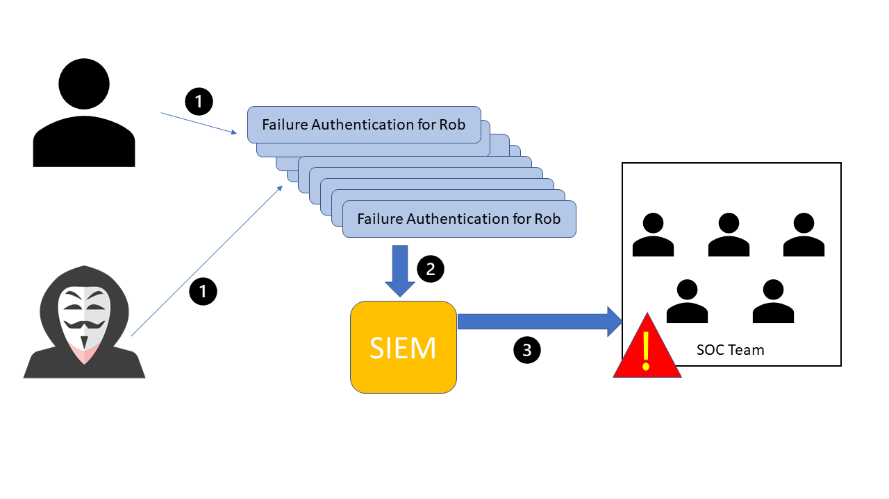

Ví dụ, xét tình huống một người dùng tên Rob có 10 lần xác thực thất bại liên tiếp. Những sự kiện này có thể bắt nguồn từ chính người dùng đã quên thông tin xác thực, hoặc từ một tác nhân độc hại đang cố brute force để xâm nhập tài khoản. Trong cả hai trường hợp, 10 sự kiện này được gửi đến hệ thống SIEM; hệ thống tương quan chúng thành một sự kiện duy nhất và kích hoạt cảnh báo cho đội SOC thuộc nhóm use case “brute force”.

Dựa trên dữ liệu log được tạo trong SIEM, đội SOC có trách nhiệm thực hiện hành động thích hợp. Ví dụ này chỉ thể hiện một trong nhiều use case có thể được xây dựng, từ những tình huống đơn giản đến phức tạp hơn.

### Vòng đời phát triển use case SIEM

Cần cân nhắc những giai đoạn quan trọng sau khi phát triển bất kỳ use case nào:

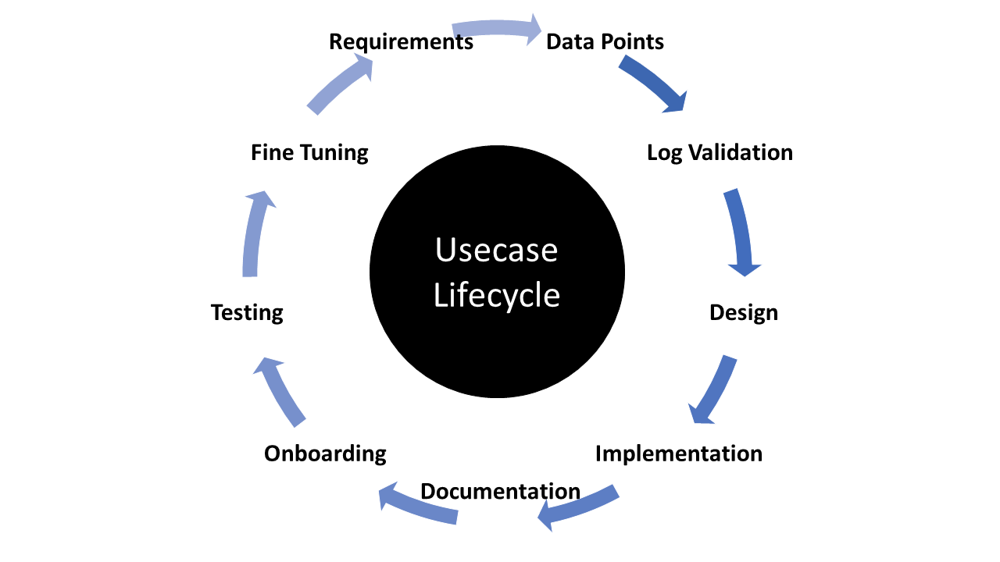

- Yêu cầu: Hiểu mục đích hoặc sự cần thiết của use case, xác định chính xác tình huống cụ thể cần có cảnh báo hay thông báo. Yêu cầu có thể do khách hàng, nhà phân tích hoặc nhân viên đề xuất. Ví dụ, mục tiêu có thể là thiết kế một use case phát hiện tấn công brute force, kích hoạt cảnh báo sau 10 lần đăng nhập thất bại liên tiếp trong vòng 4 phút.
- Điểm dữ liệu: Xác định tất cả các điểm dữ liệu trong mạng mà tài khoản người dùng có thể được sử dụng để đăng nhập. Thu thập thông tin về nguồn dữ liệu tạo log cho các lần thử truy cập trái phép hoặc đăng nhập thất bại. Ví dụ, dữ liệu có thể đến từ máy Windows, máy Linux, endpoint, máy chủ hoặc ứng dụng. Bảo đảm log ghi lại những chi tiết thiết yếu như người dùng, dấu thời gian, nguồn, đích, v.v.
- Xác thực log: Kiểm tra và xác thực log, bảo đảm chúng chứa mọi thông tin quan trọng như người dùng, dấu thời gian, nguồn, đích, tên máy và tên ứng dụng. Xác nhận nhận được đầy đủ log trong các sự kiện xác thực người dùng khác nhau đối với những điểm dữ liệu quan trọng, bao gồm xác thực cục bộ, qua web, ứng dụng, VPN và OWA (Outlook).
- Thiết kế và triển khai: Sau khi xác định và kiểm tra tất cả log với các điểm, nguồn dữ liệu khác nhau, bắt đầu thiết kế use case bằng cách định nghĩa điều kiện kích hoạt cảnh báo. Cân nhắc ba tham số chính: Condition (điều kiện), Aggregation (tổng hợp) và Priority (mức ưu tiên). Ví dụ, trong use case tấn công brute force, tạo cảnh báo cho 10 lần đăng nhập thất bại trong 4 phút, đồng thời cân nhắc cách tổng hợp để tránh false positive và đặt mức ưu tiên cảnh báo theo đặc quyền của người dùng bị nhắm tới.
- Tài liệu: Standard Operating Procedures (SOP — quy trình vận hành tiêu chuẩn) mô tả chi tiết những quy trình chuẩn mà nhà phân tích phải tuân theo khi xử lý cảnh báo. Nội dung này bao gồm điều kiện, cách tổng hợp, mức ưu tiên và thông tin về các đội khác mà nhà phân tích cần báo cáo hoạt động. SOP cũng chứa ma trận chuyển cấp xử lý.
- Đưa vào vận hành: Bắt đầu từ giai đoạn phát triển trước khi đưa cảnh báo trực tiếp vào môi trường production. Xác định và khắc phục mọi khoảng trống để giảm false positive, sau đó mới chuyển sang production.
- Cập nhật/tinh chỉnh định kỳ: Thường xuyên thu nhận phản hồi từ nhà phân tích và duy trì các quy tắc tương quan được cập nhật bằng danh sách cho phép. Liên tục tinh chỉnh, tối ưu use case để bảo đảm hiệu quả và độ chính xác.

### Cách xây dựng use case SIEM

- Hiểu nhu cầu, rủi ro và thiết lập cảnh báo tương ứng để giám sát tất cả hệ thống cần thiết.
- Xác định mức ưu tiên, tác động, rồi ánh xạ cảnh báo với kill chain hoặc framework MITRE.
- Thiết lập Time to Detection (TTD — thời gian đến khi phát hiện) và Time to Response (TTR — thời gian đến khi ứng phó) cho cảnh báo để đánh giá hiệu quả của SIEM và hiệu suất của nhà phân tích.
- Tạo SOP để quản lý cảnh báo.
- Phác thảo quy trình tinh chỉnh cảnh báo dựa trên việc giám sát SIEM.
- Xây dựng Incident Response Plan (IRP — kế hoạch ứng phó sự cố) để xử lý những sự cố được xác nhận là true positive (dương tính thật).
- Thiết lập Service Level Agreements (SLA — thỏa thuận mức dịch vụ) và Operational Level Agreements (OLA — thỏa thuận mức vận hành) giữa các đội để xử lý cảnh báo và tuân theo IRP.
- Triển khai, duy trì quy trình kiểm toán đối với việc quản lý cảnh báo và báo cáo sự cố của nhà phân tích.
- Tạo tài liệu để xem xét trạng thái ghi log của máy hoặc hệ thống, cơ sở tạo cảnh báo và tần suất kích hoạt của chúng.
- Thiết lập tài liệu cơ sở tri thức cho những thông tin thiết yếu và các cập nhật đối với công cụ quản lý case.

### Ví dụ 1 — Microsoft Build Engine được khởi chạy bởi một ứng dụng Office

Bây giờ, hãy xem một ví dụ thực tế sử dụng Elastic stack như một giải pháp SIEM để hiểu cách áp dụng từng nội dung ở trên.

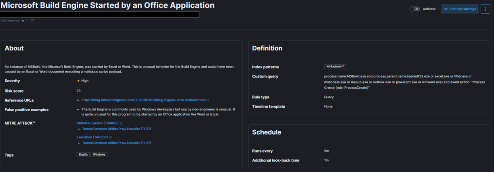

Trong ảnh chụp được cung cấp (use case phát hiện), chúng ta cần xác định rủi ro và đối tượng của hoạt động giám sát.

MSBuild, thuộc Microsoft Build Engine, là một hệ thống build phần mềm tạo ra ứng dụng theo tệp đầu vào XML của nó. Thông thường, Microsoft Visual Studio tạo tệp đầu vào, nhưng .NET framework và các trình biên dịch khác cũng có thể biên dịch ứng dụng mà không cần Visual Studio. Kẻ tấn công lợi dụng khả năng của MSBuild trong việc chứa mã nguồn độc hại bên trong tệp cấu hình hoặc tệp dự án.

Khi giám sát đối số dòng lệnh thực thi tiến trình, điều thiết yếu là điều tra những trường hợp một trình duyệt web hoặc tệp thực thi Microsoft Office khởi chạy MSBuild. Hành vi đáng ngờ này gợi ý khả năng đã xảy ra xâm nhập. Sau khi thiết lập baseline (mức hoạt động chuẩn), các lần gọi MSBuild bất thường nên dễ nhận diện và tương đối hiếm, tránh tăng khối lượng công việc cho đội.

Để xử lý rủi ro này, chúng ta tạo một use case phát hiện trong giải pháp SIEM để giám sát những trường hợp MSBuild được Excel hoặc Word khởi chạy, vì hành vi này có thể cho thấy việc thực thi payload script độc hại.

Tiếp theo, hãy xác định mức ưu tiên, tác động và ánh xạ cảnh báo với kill chain hoặc framework MITRE.

Dựa trên rủi ro và threat intelligence nêu trên, kỹ thuật này, được gọi là Living-off-the-land binaries (LoLBins), tạo ra mối đe dọa đáng kể nếu bị phát hiện, khiến nó thuộc nhóm rủi ro tổng thể cao. Vì vậy, chúng ta gán mức độ nghiêm trọng HIGH, dù mức này có thể thay đổi tùy bối cảnh và môi trường cụ thể của tổ chức.

Về ánh xạ MITRE, use case này liên quan đến việc vượt qua các kỹ thuật phát hiện bằng cách sử dụng LoLBins, thuộc chiến thuật Defense Evasion (TA0005), kỹ thuật Trusted Developer Utilities Proxy Execution (T1127) và kỹ thuật con Trusted Developer Utilities Proxy Execution: MSBuild (T1127.001). Ngoài ra, việc thực thi tệp nhị phân MSBuild trên endpoint cũng thuộc chiến thuật Execution (TA0002).

Để xác định TTD và TTR, chúng ta cần tập trung vào khoảng thời gian thực thi quy tắc và pipeline tiếp nhận dữ liệu đã thảo luận trước đó. Trong ví dụ này, đặt quy tắc chạy mỗi năm phút, giám sát toàn bộ log đầu vào.

Khi tạo SOP và ghi lại quy trình xử lý cảnh báo, hãy cân nhắc những nội dung sau:

- process.name
- process.parent.name
- event.action
- Máy phát hiện cảnh báo.
- Người dùng gắn với máy đó.
- Hoạt động của người dùng trong khoảng +/- 2 ngày quanh thời điểm tạo cảnh báo.

Sau khi thu thập thông tin này, bên phòng thủ nên trao đổi với người dùng và kiểm tra máy của họ để phân tích log hệ thống, log antivirus và log proxy từ SIEM, nhằm có khả năng quan sát đầy đủ.

Đội SOC nên ghi lại tất cả các nội dung trên cùng kế hoạch ứng phó sự cố, để người xử lý sự cố có thể tham khảo trong quá trình phân tích.

Đối với tinh chỉnh quy tắc, điều thiết yếu là hiểu các điều kiện có thể gây ra false positive. Ví dụ, mặc dù Build Engine phổ biến với nhà phát triển Windows, việc người không làm kỹ thuật sử dụng nó lại là điều bất thường. Loại trừ tên tiến trình cha hợp lệ khỏi quy tắc giúp tránh false positive. Chi tiết hơn về tinh chỉnh quy tắc SIEM sẽ được trình bày ở phần sau.

### Ví dụ 2 — MSBuild tạo kết nối mạng

Ví dụ 1 đã thảo luận một use case và quy tắc phát hiện có mức độ nghiêm trọng cao. Bây giờ, hãy xem một use case có mức độ nghiêm trọng trung bình sử dụng giải pháp SIEM để hiểu rõ hơn cách từng nội dung góp phần vào hiệu quả của use case.

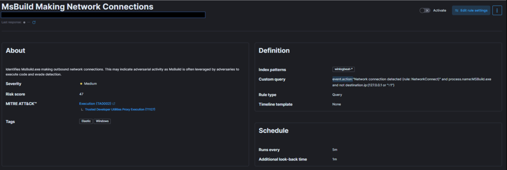

Trong ảnh chụp được cung cấp, chúng ta cần xác định rủi ro và điều mình đang cố giám sát.

Tương tự ví dụ 1, chúng ta tiếp tục tập trung vào tệp nhị phân MsBuild.exe. Tuy nhiên, lần này xét tình huống một máy cố giao tiếp ra ngoài với địa chỉ IP từ xa hoặc có khả năng độc hại, và tiến trình đứng sau kết nối đó là MsBuild.exe. Điều này sẽ làm phát sinh cảnh báo vì có thể cho thấy hoạt động của đối phương. MsBuild thường bị đối phương lợi dụng để thực thi mã và né tránh phát hiện.

Để xử lý rủi ro này, chúng ta cần một giải pháp giám sát có khả năng phát hiện các trường hợp MsBuild chịu trách nhiệm cho những kết nối đi ra độc hại. Chúng ta tạo một use case phát hiện trong giải pháp SIEM cho mục đích này.

Tiếp theo, hãy xác định mức ưu tiên, tác động và ánh xạ cảnh báo với kill chain hoặc framework MITRE.

Khác với ví dụ trước, tình huống này có thể xảy ra bất cứ khi nào MsBuild.exe thiết lập kết nối đi ra. Tiến trình này cũng có thể kết nối đến địa chỉ IP hợp lệ, chẳng hạn IP Microsoft để cập nhật. Vì vậy, có thể gặp nhiều false positive hơn nếu không triển khai quy trình threat intelligence vững chắc. Do đó, nên gán mức độ nghiêm trọng MEDIUM cho quy tắc phát hiện này thay vì HIGH.

Như ở ví dụ 1, để thực hiện mối đe dọa cụ thể này, kẻ tấn công cần thực thi tệp nhị phân MsBuild trên endpoint; hoạt động đó thuộc chiến thuật Execution (TA0002).

Phần lớn các nội dung khác vẫn giữ nguyên, nhưng SOP và kế hoạch ứng phó sự cố sẽ khác khi xử lý loại cảnh báo cụ thể này. Bên phòng thủ sẽ cần tập trung vào event.action, địa chỉ IP và uy tín của IP, cùng những yếu tố khác.

<a id="section-06"></a>

## Section 6/11 — Ví dụ trực quan hóa SIEM 1: Đăng nhập thất bại (Tất cả người dùng)

Dashboard trong giải pháp SIEM đóng vai trò nơi chứa nhiều nội dung trực quan hóa, cho phép chúng ta tổ chức và hiển thị dữ liệu theo cách có ý nghĩa.

Trong section này và những section tiếp theo, chúng ta sẽ tạo một dashboard cùng một số nội dung trực quan hóa từ đầu.

### Xây dựng dashboard và nội dung trực quan hóa đầu tiên

Di chuyển xuống cuối section này và nhấp vào Click here to spawn the target system! (nhấp vào đây để khởi tạo hệ thống mục tiêu).

Bây giờ, truy cập http://[Target IP]:5601, nhấp nút bật/tắt điều hướng bên cạnh, rồi nhấp "Dashboard".

Xóa dashboard "SOC-Alerts" hiện có như sau.

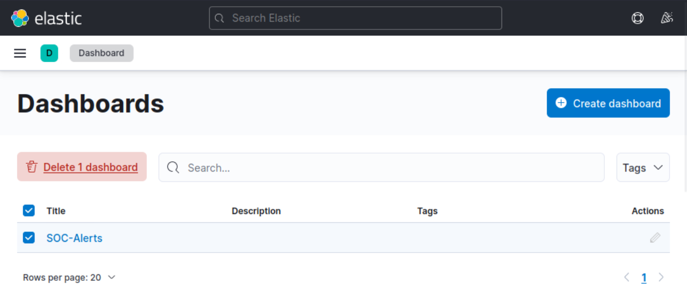

Khi truy cập lại trang Dashboard, chúng ta sẽ thấy thông báo cho biết hiện không có dashboard nào. Ngoài ra, sẽ có tùy chọn tạo Dashboard mới và nội dung trực quan hóa đầu tiên của nó. Để bắt đầu tạo dashboard đầu tiên, chỉ cần nhấp nút "Create new dashboard".

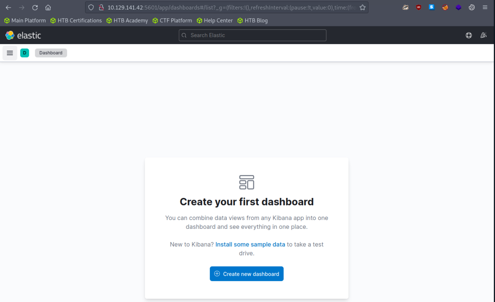

Bây giờ, để bắt đầu tạo nội dung trực quan hóa đầu tiên, chỉ cần nhấp nút "Create visualization".

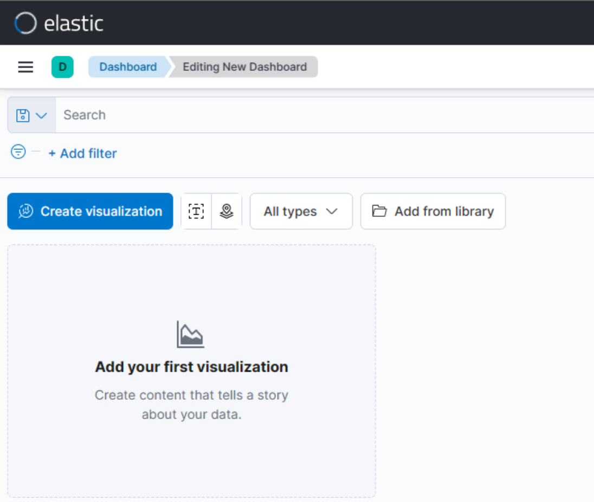

Khi bắt đầu tạo nội dung trực quan hóa đầu tiên, cửa sổ mới sau đây sẽ xuất hiện với nhiều tùy chọn và thiết lập.

Trước khi tiến hành bất kỳ cấu hình nào, điều quan trọng là nhấp biểu tượng lịch để mở bộ chọn thời gian trước. Sau đó, cần chỉ định khoảng ngày là "last 15 years". Cuối cùng, nhấp nút "Apply" để áp dụng khoảng ngày đã chỉ định cho dữ liệu.

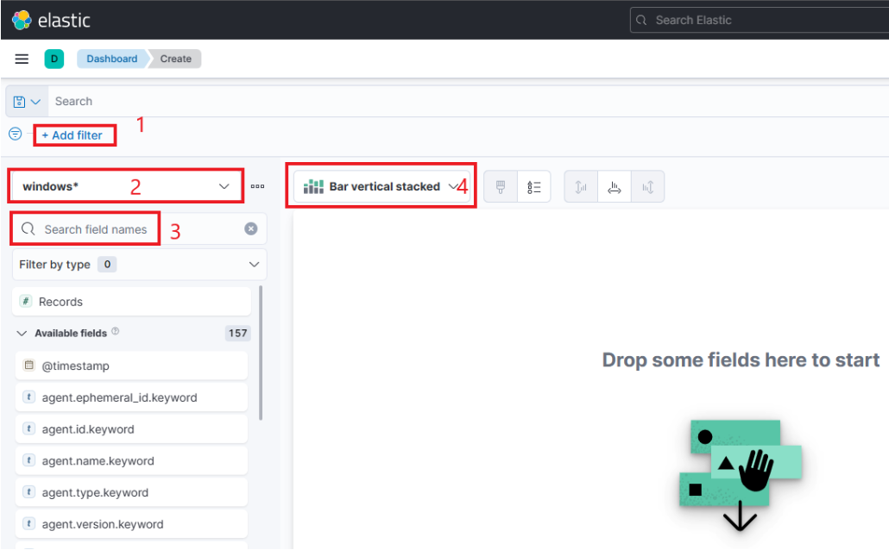

Có bốn điều cần chú ý trong cửa sổ này:

1. Tùy chọn lọc cho phép lọc dữ liệu trước khi tạo biểu đồ. Ví dụ, nếu mục tiêu là hiển thị những lần đăng nhập thất bại, chúng ta có thể sử dụng bộ lọc để chỉ xem xét các event ID khớp với 4625 — lần đăng nhập thất bại trên hệ thống Windows. Hình sau minh họa cách chỉ định bộ lọc như vậy.

   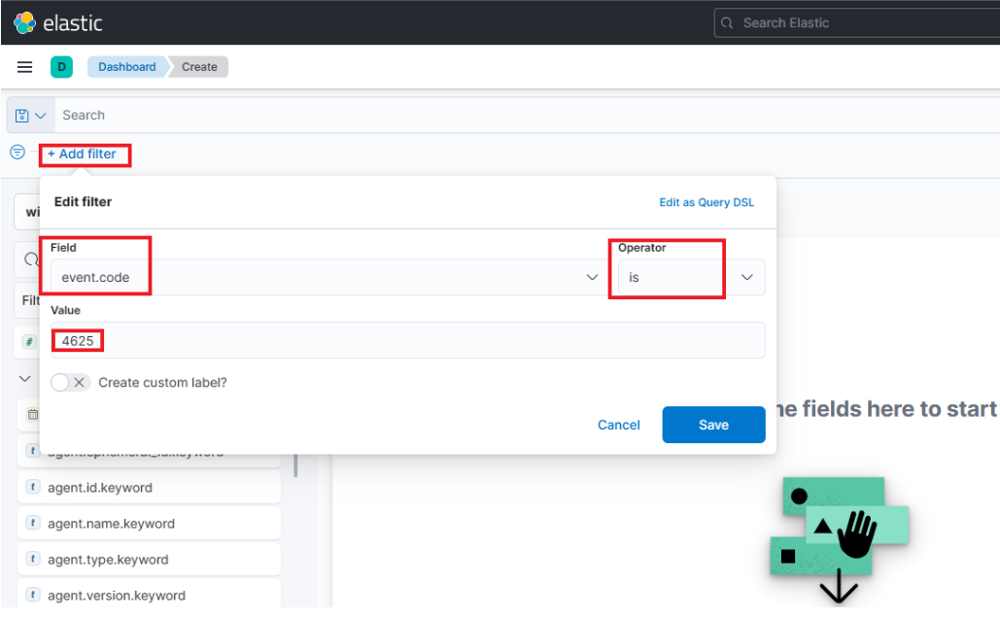

2. Trường này cho biết tập dữ liệu (index — chỉ mục) mà chúng ta sẽ sử dụng. Dữ liệu từ các nguồn hạ tầng khác nhau thường được tách vào những chỉ mục khác nhau, chẳng hạn mạng, Windows, Linux, v.v. Trong ví dụ cụ thể này, chúng ta sẽ chỉ định windows* trong "Index pattern".
3. Thanh tìm kiếm này cho phép kiểm tra lại sự tồn tại của một trường cụ thể trong tập dữ liệu, như một cách khác để bảo đảm đang xem đúng dữ liệu. Ví dụ, giả sử chúng ta quan tâm đến trường user.name.keyword. Có thể dùng thanh tìm kiếm để nhanh chóng tìm và xác minh trường này có tồn tại, được phát hiện trong tập dữ liệu đã chọn hay không. Điều này cho phép xác nhận đang truy cập trường mong muốn và làm việc với dữ liệu chính xác.
   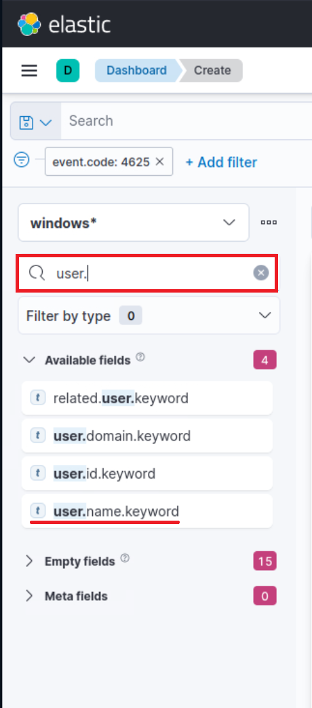

   Bạn có thể hỏi: “Tại sao dùng user.name.keyword mà không phải user.name?” Chúng ta nên dùng trường .keyword khi thực hiện aggregation (tổng hợp dữ liệu). Hãy tham khảo câu hỏi trên Stack Overflow này để có câu trả lời chi tiết hơn.

4. Cuối cùng, menu thả xuống này cho phép chọn loại trực quan hóa muốn tạo. Tùy chọn mặc định hiển thị trong hình trước là "Bar vertical stacked". Nếu nhấp nút đó, những tùy chọn khác sẽ được hiển thị (hình đã lược bớt vì không phải tất cả tùy chọn đều vừa trên màn hình). Từ danh sách mở rộng, chúng ta có thể chọn loại trực quan hóa phù hợp nhất với yêu cầu và nhu cầu trình bày dữ liệu.

   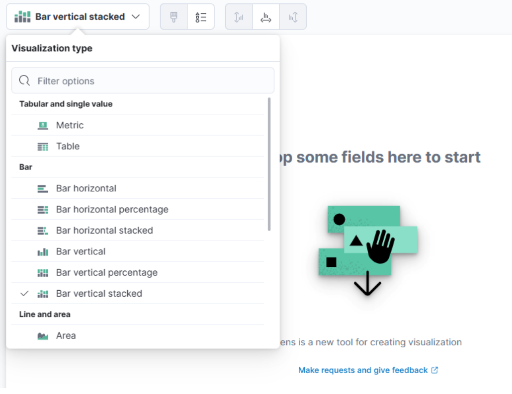

Đối với nội dung trực quan hóa này, hãy chọn "Table". Sau khi chọn "Table", tiếp tục nhấp tùy chọn "Rows". Thao tác này cho phép chọn các thành phần dữ liệu cụ thể muốn đưa vào dạng xem bảng.

   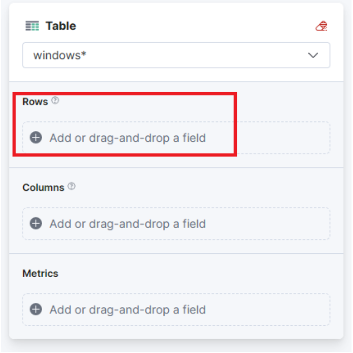

Hãy cấu hình thiết lập "Rows" như sau.

   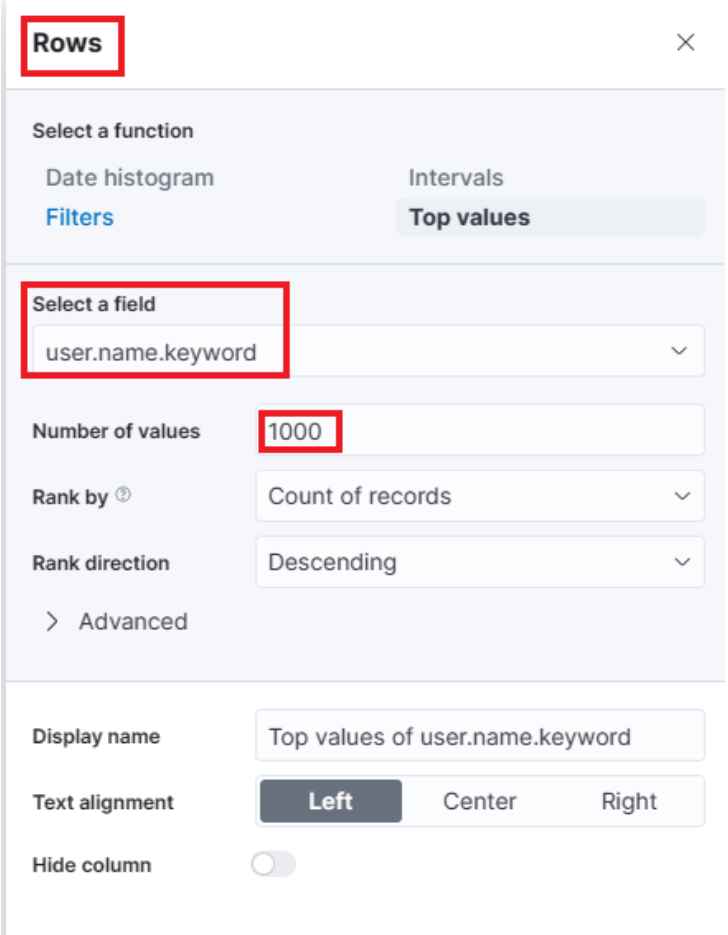

Lưu ý: Bạn sẽ thấy Rank by Alphabetical thay vì Rank by Count of records như trong ảnh phía trên. Điều này không sao. Khi thực hiện cấu hình tiếp theo bên dưới, Count of records sẽ xuất hiện.

Tiếp theo, đóng cửa sổ "Rows" và chuyển sang cấu hình "Metrics".

   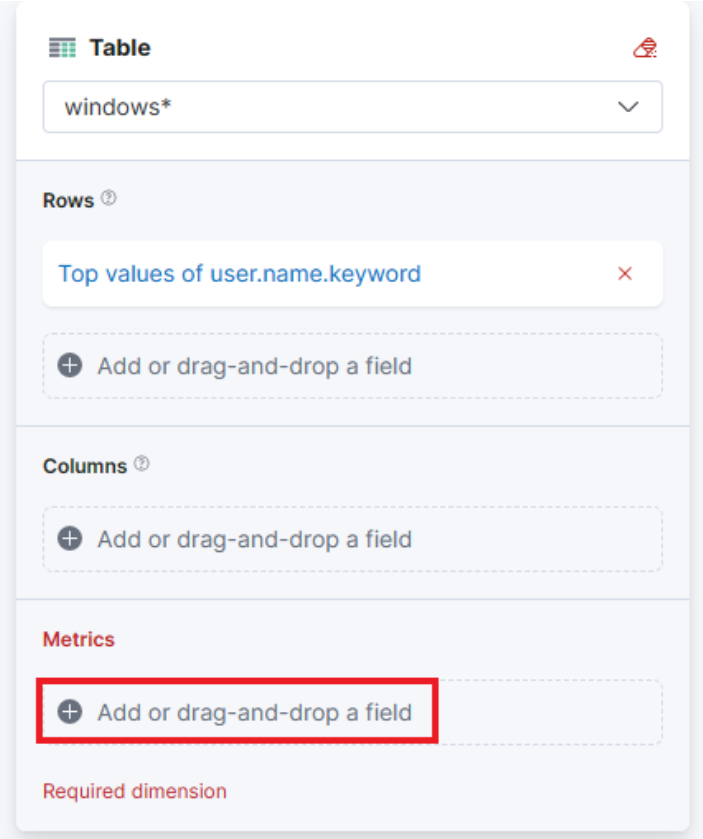

Trong cửa sổ "Metrics", chọn "count" làm phép đo mong muốn.

   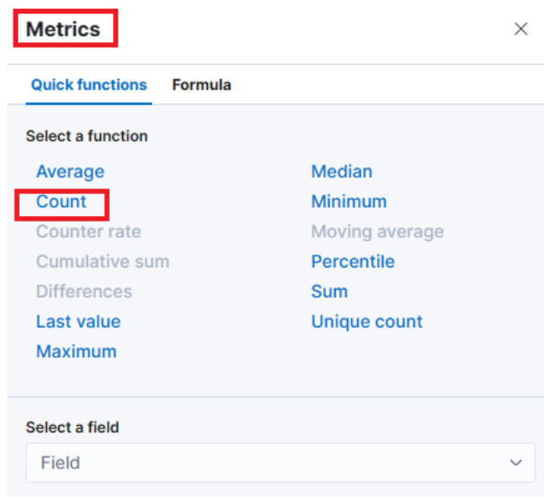

Ngay khi chọn "Count" làm phép đo, chúng ta sẽ thấy bảng được điền dữ liệu (giả sử có sự kiện trong tập dữ liệu đã chọn).

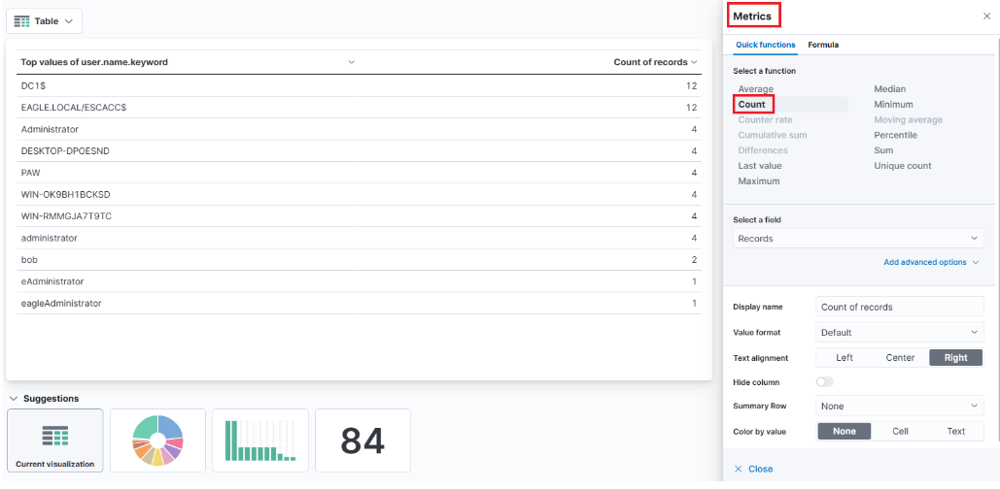

Bổ sung cuối cùng cho bảng là thêm một thiết lập "Rows" để hiển thị máy xảy ra lần đăng nhập thất bại. Để làm điều này, chọn trường host.hostname.keyword, biểu thị máy tính báo cáo lần đăng nhập thất bại. Nhờ đó, chúng ta có thể hiển thị hostname hoặc tên máy bên cạnh số lần đăng nhập thất bại, như trong hình.

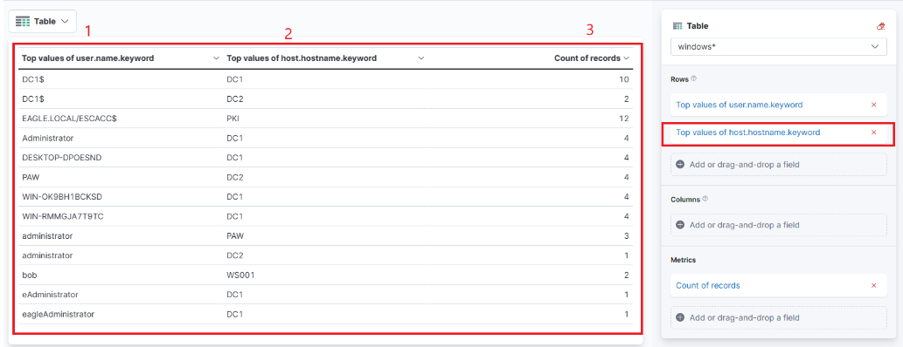

Bây giờ, có thể thấy ba cột trong bảng chứa những thông tin sau:

- Tên người dùng của các đối tượng đăng nhập (lưu ý: hiện hiển thị cả người dùng và máy tính. Lý tưởng nhất là áp dụng bộ lọc để loại trừ thiết bị máy tính và chỉ hiển thị người dùng).
- Máy xảy ra lần thử đăng nhập.
- Số lần sự kiện xảy ra (dựa trên khung thời gian được chỉ định hoặc toàn bộ tập dữ liệu, tùy thiết lập).

Cuối cùng, nhấp "Save and return"; bạn sẽ thấy nội dung trực quan hóa mới được thêm vào dashboard, hiển thị như trong hình sau.

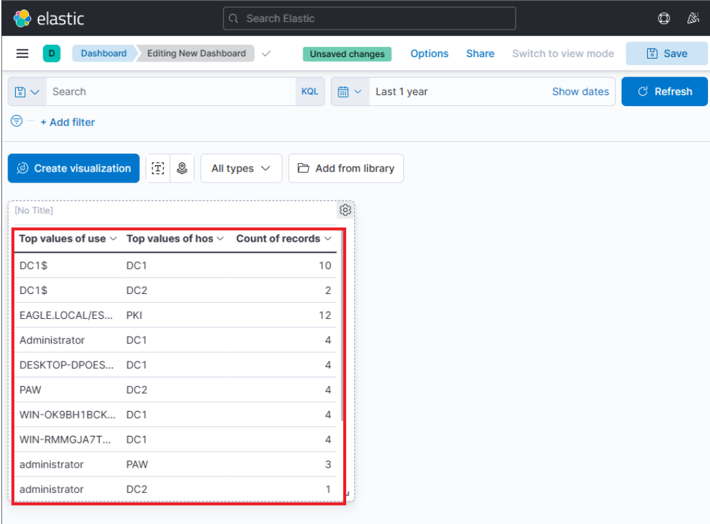

Đừng quên lưu cả dashboard. Có thể thực hiện đơn giản bằng cách nhấp nút "Save".

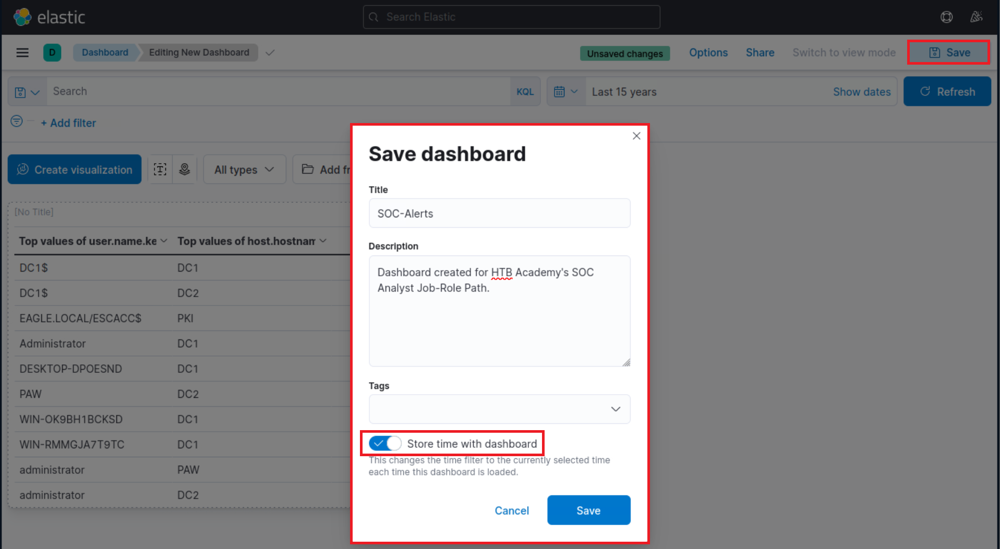

### Tinh chỉnh nội dung trực quan hóa

Giả sử quản lý SOC đề xuất những tinh chỉnh sau:

- Cần chỉ định tên cột rõ ràng hơn trong nội dung trực quan hóa.
- Cần bổ sung Logon Type vào nội dung trực quan hóa.
- Cần sắp xếp kết quả trong nội dung trực quan hóa.
- Không giám sát các tên người dùng DESKTOP-DPOESND, WIN-OK9BH1BCKSD và WIN-RMMGJA7T9TC.
- Không giám sát tài khoản máy tính (đây không phải cách làm tốt).

Hãy tinh chỉnh nội dung trực quan hóa đã tạo để đáp ứng những đề xuất trên.

Truy cập http://[Target IP]:5601, nhấp nút bật/tắt điều hướng bên cạnh, rồi nhấp "Dashboard".

Dashboard đã tạo trước đó sẽ hiển thị. Hãy nhấp biểu tượng “bút chì”/chỉnh sửa.

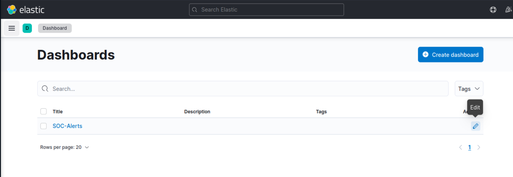

Bây giờ, nhấp nút “bánh răng” ở góc trên bên phải nội dung trực quan hóa, rồi nhấp "Edit lens".

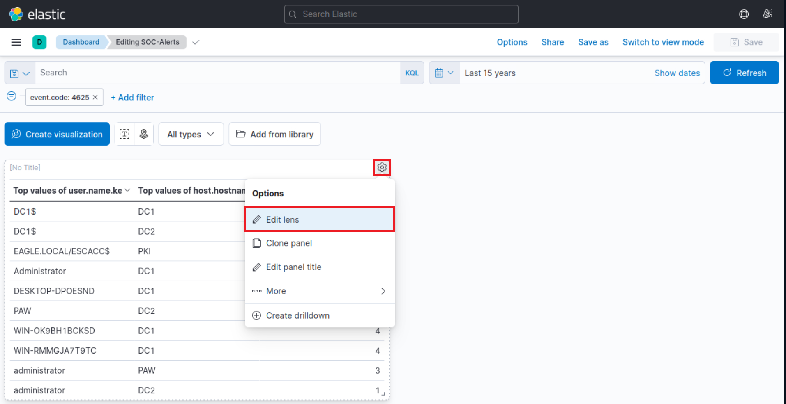

Cần thay đổi "Top values of user.name.keyword" như sau.

   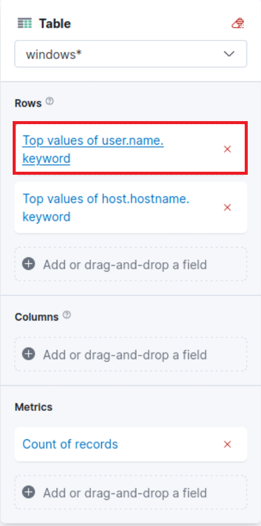

   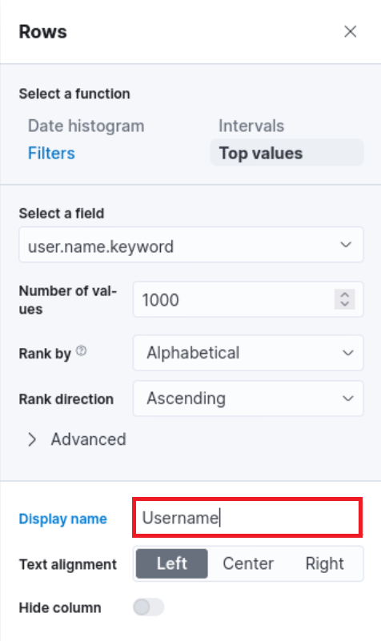

Cần thay đổi "Top values of host.hostname.keyword" như sau.

   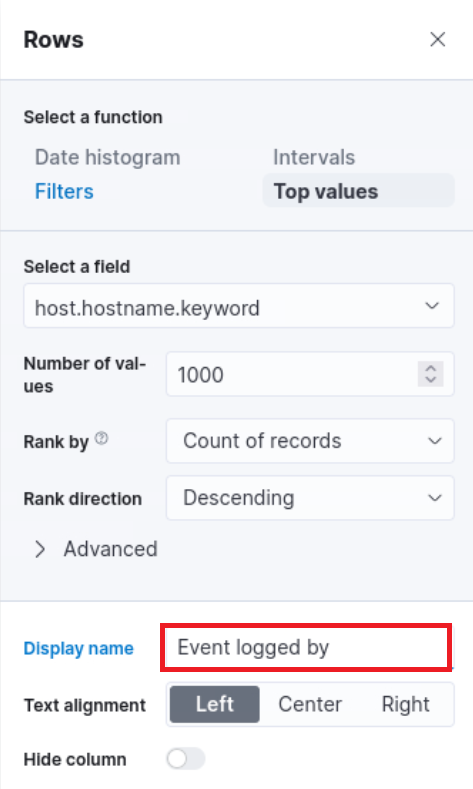

Có thể bổ sung "Logon Type" như sau (chúng ta sẽ dùng trường winlog.logon.type.keyword).

   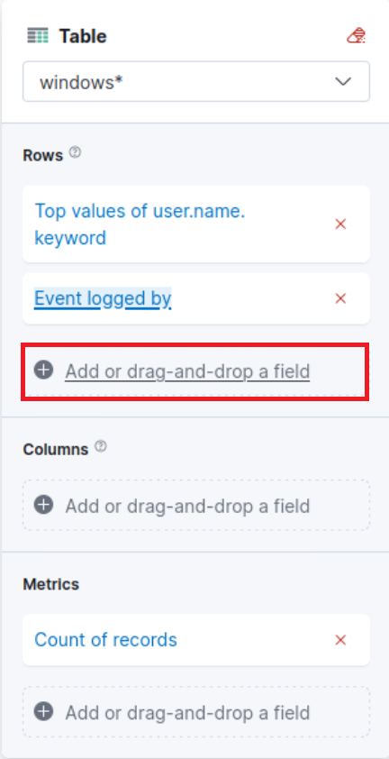

   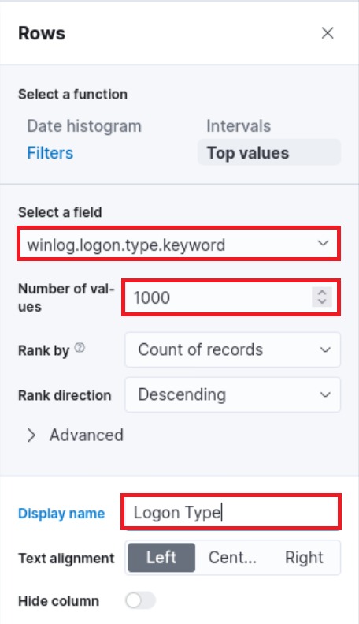

Cần thay đổi "Count of records" như sau.

   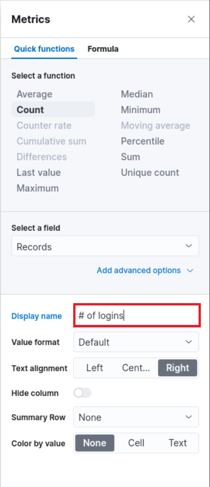

Có thể thêm việc sắp xếp kết quả như sau.

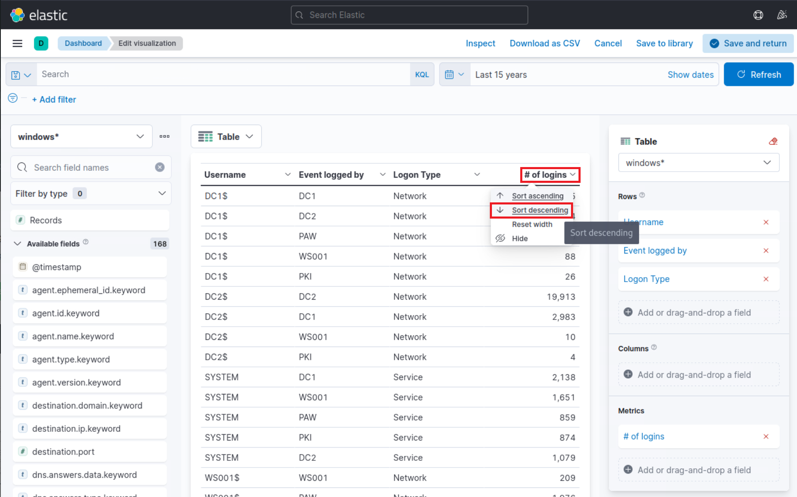

Bây giờ, chỉ cần nhấp "Save and return".

Có thể loại trừ các tên người dùng DESKTOP-DPOESND, WIN-OK9BH1BCKSD và WIN-RMMGJA7T9TC bằng cách chỉ định những bộ lọc bổ sung như sau.

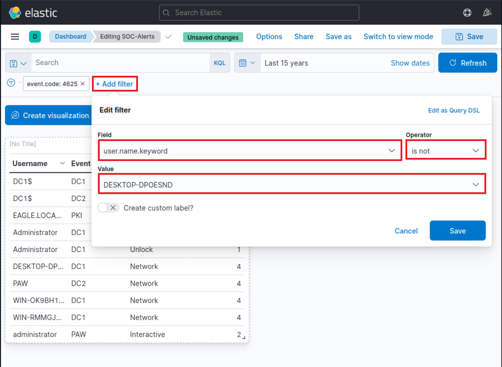

Có thể loại trừ tài khoản máy tính bằng cách chỉ định truy vấn KQL sau và nhấp nút "Update".

```shellsession
NOT user.name: *$ AND winlog.channel.keyword: Security
```

Phần AND winlog.channel.keyword: Security nhằm bảo đảm không tính đến những log không liên quan.

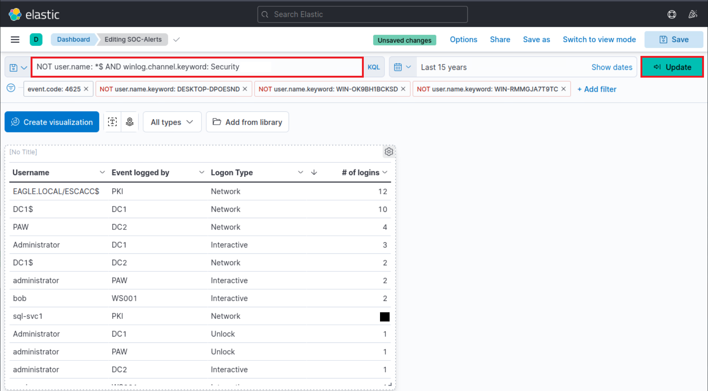

Đây là nội dung trực quan hóa sau tất cả những tinh chỉnh đã thực hiện.

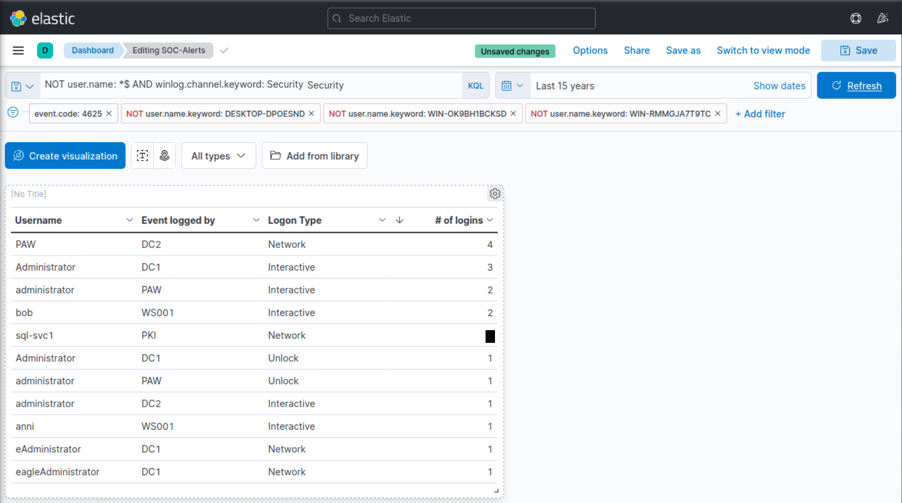

Cuối cùng, hãy đặt tiêu đề cho nội dung trực quan hóa bằng cách nhấp "No Title".

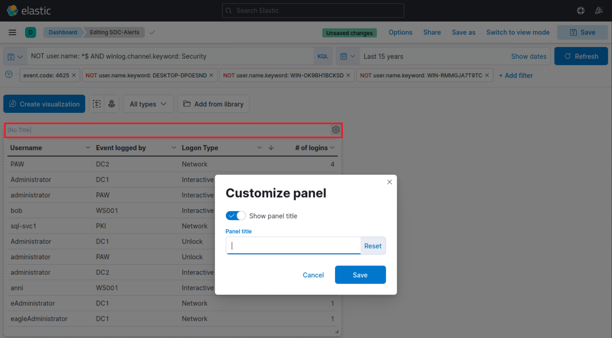

Đừng quên nhấp nút "Save" (nút ở góc trên bên phải cửa sổ).

Vui lòng chờ 3-5 phút để Kibana sẵn sàng sau khi khởi tạo máy mục tiêu của các câu hỏi bên dưới.

<a id="section-07"></a>

## Section 7/11 — Ví dụ trực quan hóa SIEM 2: Đăng nhập thất bại (Người dùng bị vô hiệu hóa)

Trong ví dụ trực quan hóa SIEM này, chúng ta muốn tạo nội dung trực quan hóa để giám sát những lần đăng nhập thất bại vào các tài khoản người dùng bị vô hiệu hóa.

Chúng ta nói “thất bại” vì không thể đăng nhập bằng một người dùng bị vô hiệu hóa, nên việc đăng nhập sẽ không bao giờ thành công ngay cả khi cung cấp đúng thông tin xác thực. Trong tình huống cung cấp đúng thông tin xác thực, log Windows sẽ chứa thêm giá trị SubStatus 0xC0000072, cho biết nguyên nhân thất bại.

Di chuyển xuống cuối section này và nhấp vào Click here to spawn the target system! (nhấp vào đây để khởi tạo hệ thống mục tiêu).

Truy cập http://[Target IP]:5601, nhấp nút bật/tắt điều hướng bên cạnh, rồi nhấp "Dashboard".

Một dashboard được chuẩn bị sẵn sẽ hiển thị. Hãy nhấp biểu tượng “bút chì”/chỉnh sửa.


Bây giờ, để bắt đầu tạo nội dung trực quan hóa đầu tiên, chỉ cần nhấp nút "Create visualization".

Khi bắt đầu tạo nội dung trực quan hóa đầu tiên, cửa sổ mới sau đây sẽ xuất hiện với nhiều tùy chọn và thiết lập.


Có bốn điều cần chú ý trong cửa sổ này:

1. Tùy chọn lọc cho phép lọc dữ liệu trước khi tạo biểu đồ. Trong trường hợp này, mục tiêu là chỉ hiển thị những lần đăng nhập thất bại vào người dùng bị vô hiệu hóa. Có thể dùng bộ lọc để chỉ xem xét các event ID khớp với 4625 — lần đăng nhập thất bại trên hệ thống Windows, như đã làm trong ví dụ trực quan hóa trước. Tuy nhiên, trong trường hợp này, cũng cần xét SubStatus (trường winlog.event_data.SubStatus); khi được đặt là 0xC0000072, nó cho biết thất bại là do đăng nhập bằng người dùng bị vô hiệu hóa. Hình sau minh họa cách chỉ định bộ lọc như vậy.

   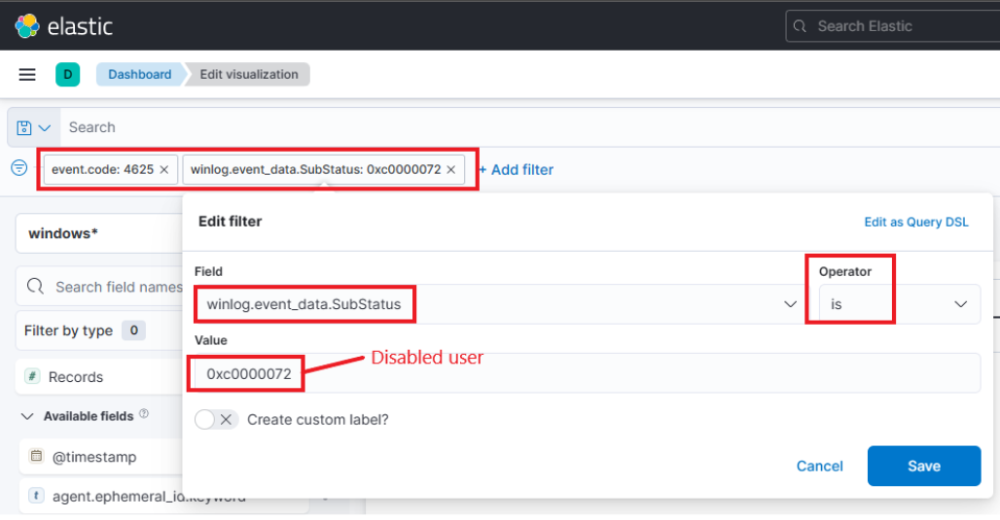

2. Trường này cho biết tập dữ liệu (index) mà chúng ta sẽ sử dụng. Dữ liệu từ các nguồn hạ tầng khác nhau thường được tách vào những chỉ mục khác nhau, chẳng hạn mạng, Windows, Linux, v.v. Trong ví dụ cụ thể này, chúng ta sẽ chỉ định windows* trong "Index pattern".

3. Thanh tìm kiếm này cho phép kiểm tra lại sự tồn tại của một trường cụ thể trong tập dữ liệu, như một cách khác để bảo đảm đang xem đúng dữ liệu. Tương tự nội dung trực quan hóa trước, chúng ta quan tâm đến trường user.name.keyword. Có thể dùng thanh tìm kiếm để nhanh chóng tìm và xác minh trường này có tồn tại, được phát hiện trong tập dữ liệu đã chọn hay không. Điều này cho phép xác nhận đang truy cập trường mong muốn và làm việc với dữ liệu chính xác.

   

4. Cuối cùng, menu thả xuống này cho phép chọn loại trực quan hóa muốn tạo. Tùy chọn mặc định hiển thị trong hình trước là "Bar vertical stacked". Nếu nhấp nút đó, những tùy chọn khác sẽ được hiển thị (hình đã lược bớt vì không phải tất cả tùy chọn đều vừa trên màn hình). Từ danh sách mở rộng, chúng ta có thể chọn loại trực quan hóa phù hợp nhất với yêu cầu và nhu cầu trình bày dữ liệu.

   

Đối với nội dung trực quan hóa này, hãy chọn "Table". Sau khi chọn "Table", tiếp tục nhấp tùy chọn "Rows". Thao tác này cho phép chọn các thành phần dữ liệu cụ thể muốn đưa vào dạng xem bảng.

   

Hãy cấu hình thiết lập "Rows" như sau.

   

Tiếp theo, đóng cửa sổ "Rows" và chuyển sang cấu hình "Metrics".

   

Trong cửa sổ "Metrics", chọn "count" làm phép đo mong muốn.

   

Bổ sung cuối cùng cho bảng là thêm một thiết lập "Rows" để hiển thị máy xảy ra lần đăng nhập thất bại. Để làm điều này, chọn trường host.hostname.keyword, biểu thị máy tính báo cáo lần đăng nhập thất bại. Nhờ đó, chúng ta có thể hiển thị hostname hoặc tên máy bên cạnh số lần đăng nhập thất bại, như trong hình.

   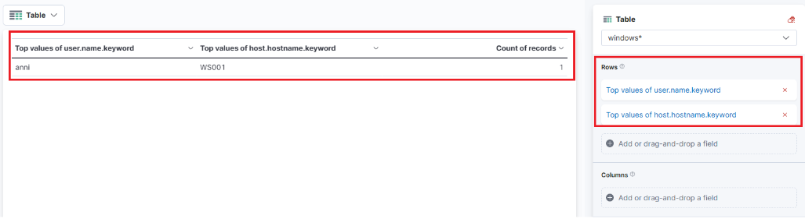

Bây giờ, có thể thấy ba cột trong bảng chứa những thông tin sau:

- Người dùng bị vô hiệu hóa có thông tin xác thực đã tạo ra sự kiện đăng nhập thất bại.
- Máy xảy ra lần thử đăng nhập.
- Số lần sự kiện xảy ra (dựa trên khung thời gian được chỉ định hoặc toàn bộ tập dữ liệu, tùy thiết lập).

Cuối cùng, nhấp "Save and return"; bạn sẽ thấy nội dung trực quan hóa mới được thêm vào dashboard.

Vui lòng chờ 3-5 phút để Kibana sẵn sàng sau khi khởi tạo máy mục tiêu của các câu hỏi bên dưới.

<a id="section-08"></a>

## Section 8/11 — Ví dụ trực quan hóa SIEM 3: Đăng nhập RDP thành công liên quan đến tài khoản dịch vụ

Trong ví dụ trực quan hóa SIEM này, mục tiêu là tạo nội dung trực quan hóa để giám sát những lần đăng nhập RDP thành công dành riêng cho tài khoản dịch vụ. Thông tin xác thực của tài khoản dịch vụ không bao giờ được sử dụng để đăng nhập RDP trong môi trường doanh nghiệp/thực tế. Bộ phận vận hành CNTT đã cho biết tất cả tài khoản dịch vụ trong môi trường đều bắt đầu bằng svc-.

Động lực cho nội dung trực quan hóa này xuất phát từ việc tài khoản dịch vụ thường có đặc quyền đặc biệt cao. Chúng ta cần theo dõi chặt chẽ cách tài khoản dịch vụ được sử dụng.

Nội dung trực quan hóa sẽ dựa trên Windows event log sau.

4624: Một tài khoản đã đăng nhập thành công

Di chuyển xuống cuối section này và nhấp vào Click here to spawn the target system! (nhấp vào đây để khởi tạo hệ thống mục tiêu).

Truy cập http://[Target IP]:5601, nhấp nút bật/tắt điều hướng bên cạnh, rồi nhấp "Dashboard".

Một dashboard được chuẩn bị sẵn sẽ hiển thị. Hãy nhấp biểu tượng “bút chì”/chỉnh sửa.


Bây giờ, để bắt đầu tạo nội dung trực quan hóa đầu tiên, chỉ cần nhấp nút "Create visualization".

Khi bắt đầu tạo nội dung trực quan hóa đầu tiên, cửa sổ mới sau đây sẽ xuất hiện với nhiều tùy chọn và thiết lập.


Có bốn điều cần chú ý trong cửa sổ này:

1. Tùy chọn lọc cho phép lọc dữ liệu trước khi tạo biểu đồ. Trong trường hợp này, mục tiêu là hiển thị những lần đăng nhập RDP thành công dành riêng cho tài khoản dịch vụ. Có thể dùng bộ lọc để chỉ xem xét các event ID khớp với 4624 — một tài khoản đã đăng nhập thành công. Tuy nhiên, trong trường hợp này, cũng cần xét loại đăng nhập, phải là RemoteInteractive (trường winlog.logon.type). Các hình sau minh họa cách chỉ định những bộ lọc như vậy.

   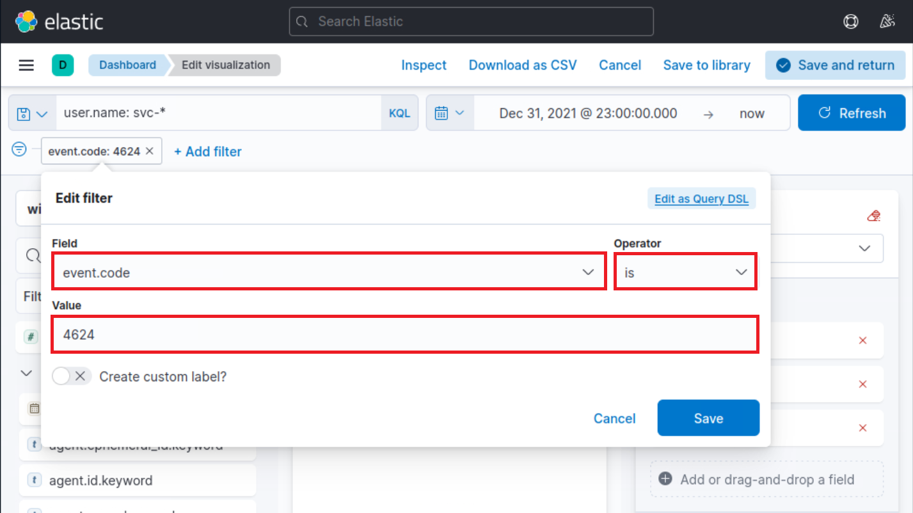

   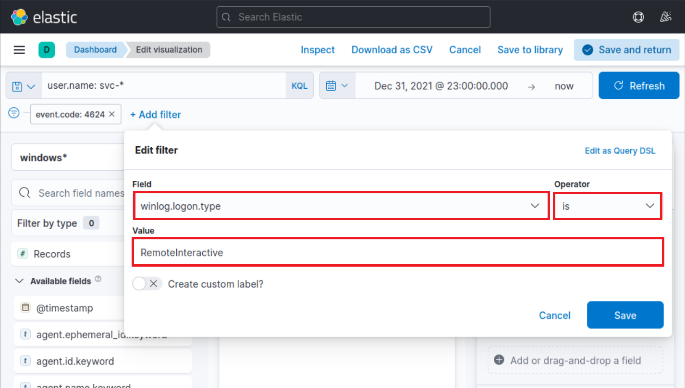

2. Trường này cho biết tập dữ liệu (index) mà chúng ta sẽ sử dụng. Dữ liệu từ các nguồn hạ tầng khác nhau thường được tách vào những chỉ mục khác nhau, chẳng hạn mạng, Windows, Linux, v.v. Trong ví dụ cụ thể này, chúng ta sẽ chỉ định windows* trong "Index pattern".
3. Thanh tìm kiếm này cho phép kiểm tra lại sự tồn tại của một trường cụ thể trong tập dữ liệu, như một cách khác để bảo đảm đang xem đúng dữ liệu. Chúng ta quan tâm đến trường user.name.keyword. Có thể dùng thanh tìm kiếm để nhanh chóng tìm và xác minh trường này có tồn tại, được phát hiện trong tập dữ liệu đã chọn hay không. Điều này cho phép xác nhận đang truy cập trường mong muốn và làm việc với dữ liệu chính xác.

   

4. Cuối cùng, menu thả xuống này cho phép chọn loại trực quan hóa muốn tạo. Tùy chọn mặc định hiển thị trong hình trước là "Bar vertical stacked". Nếu nhấp nút đó, những tùy chọn khác sẽ được hiển thị (hình đã lược bớt vì không phải tất cả tùy chọn đều vừa trên màn hình). Từ danh sách mở rộng, chúng ta có thể chọn loại trực quan hóa phù hợp nhất với yêu cầu và nhu cầu trình bày dữ liệu.

   

Đối với nội dung trực quan hóa này, hãy chọn "Table". Sau khi chọn "Table", tiếp tục nhấp tùy chọn "Rows". Thao tác này cho phép chọn các thành phần dữ liệu cụ thể muốn đưa vào dạng xem bảng.

   

Hãy cấu hình thiết lập "Rows" như sau.

   

Tiếp theo, đóng cửa sổ "Rows" và chuyển sang cấu hình "Metrics".

   

Trong cửa sổ "Metrics", chọn "count" làm phép đo mong muốn.

   

Bổ sung cuối cùng cho bảng là thêm hai thiết lập "Rows" để hiển thị máy xảy ra lần đăng nhập RDP thành công và máy khởi tạo lần đăng nhập RDP thành công đó. Để làm điều này, chọn trường host.hostname.keyword biểu thị máy tính báo cáo lần đăng nhập RDP thành công, và trường related.ip.keyword biểu thị IP của máy tính khởi tạo lần đăng nhập RDP thành công. Nhờ đó, chúng ta có thể hiển thị các máy liên quan bên cạnh số lần đăng nhập thành công, như trong hình.

   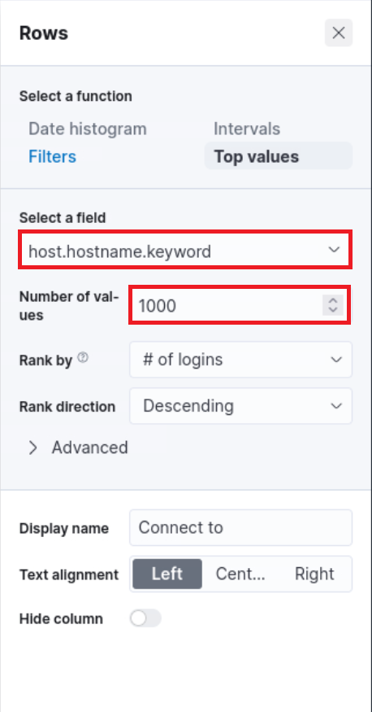

   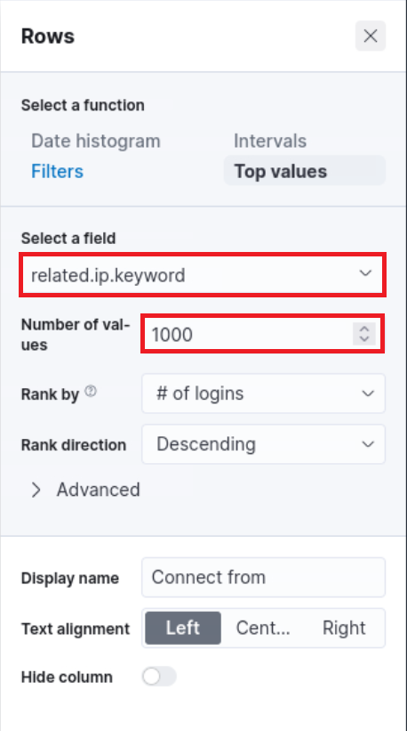

Như đã thảo luận, chúng ta muốn giám sát những lần đăng nhập RDP thành công dành riêng cho tài khoản dịch vụ, biết chắc rằng mọi tài khoản dịch vụ của môi trường đều bắt đầu bằng svc-. Vì vậy, để hoàn tất nội dung trực quan hóa, cần chỉ định truy vấn KQL sau.

```shellsession
user.name: svc-*
```

Lưu ý: Như bạn thấy, chúng ta không sử dụng trường .keyword trong các truy vấn KQL.

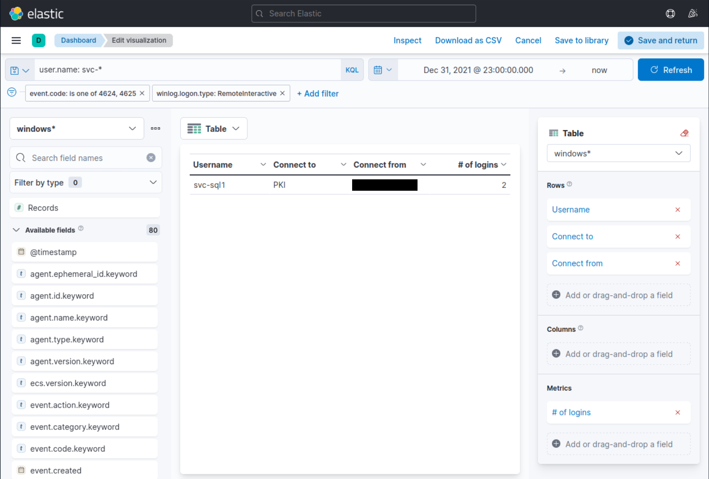

Bây giờ, có thể thấy bốn cột trong bảng chứa những thông tin sau:

- Tài khoản dịch vụ có thông tin xác thực đã tạo ra sự kiện đăng nhập RDP thành công.
- Máy xảy ra lần thử đăng nhập.
- IP của máy khởi tạo lần thử đăng nhập.
- Số lần sự kiện xảy ra (dựa trên khung thời gian được chỉ định hoặc toàn bộ tập dữ liệu, tùy thiết lập).

Cuối cùng, nhấp "Save and return"; bạn sẽ thấy nội dung trực quan hóa mới được thêm vào dashboard.

Vui lòng chờ 3-5 phút để Kibana sẵn sàng sau khi khởi tạo máy mục tiêu của các câu hỏi bên dưới.

<a id="section-09"></a>

## Section 9/11 — Ví dụ trực quan hóa SIEM 4: Người dùng được thêm vào hoặc xóa khỏi nhóm cục bộ (Trong khung thời gian cụ thể)

Trong ví dụ trực quan hóa SIEM này, mục tiêu là tạo nội dung trực quan hóa để giám sát việc thêm người dùng vào hoặc xóa khỏi nhóm "Administrators" cục bộ từ ngày 5 tháng 3 năm 2023 đến hiện tại.

Nội dung trực quan hóa sẽ dựa trên các Windows event log sau.

- 4732: Một thành viên đã được thêm vào nhóm cục bộ có chức năng bảo mật.
- 4733: Một thành viên đã bị xóa khỏi nhóm cục bộ có chức năng bảo mật.

Di chuyển xuống cuối section này và nhấp vào Click here to spawn the target system! (nhấp vào đây để khởi tạo hệ thống mục tiêu).

Truy cập http://[Target IP]:5601, nhấp nút bật/tắt điều hướng bên cạnh, rồi nhấp "Dashboard".

Một dashboard được chuẩn bị sẵn sẽ hiển thị. Hãy nhấp biểu tượng “bút chì”/chỉnh sửa.


Bây giờ, để bắt đầu tạo nội dung trực quan hóa đầu tiên, chỉ cần nhấp nút "Create visualization".

Khi bắt đầu tạo nội dung trực quan hóa đầu tiên, cửa sổ mới sau đây sẽ xuất hiện với nhiều tùy chọn và thiết lập.


Có bốn điều cần chú ý trong cửa sổ này:

1. Tùy chọn lọc cho phép lọc dữ liệu trước khi tạo biểu đồ. Trong trường hợp này, mục tiêu là hiển thị việc thêm người dùng vào hoặc xóa khỏi nhóm "Administrators" cục bộ. Có thể dùng bộ lọc để chỉ xem xét các event ID khớp với 4732 — một thành viên đã được thêm vào nhóm cục bộ có chức năng bảo mật, và 4733 — một thành viên đã bị xóa khỏi nhóm cục bộ có chức năng bảo mật. Cũng có thể dùng bộ lọc để chỉ xem xét những sự kiện 4732 và 4733 mà nhóm cục bộ là "Administrators".

   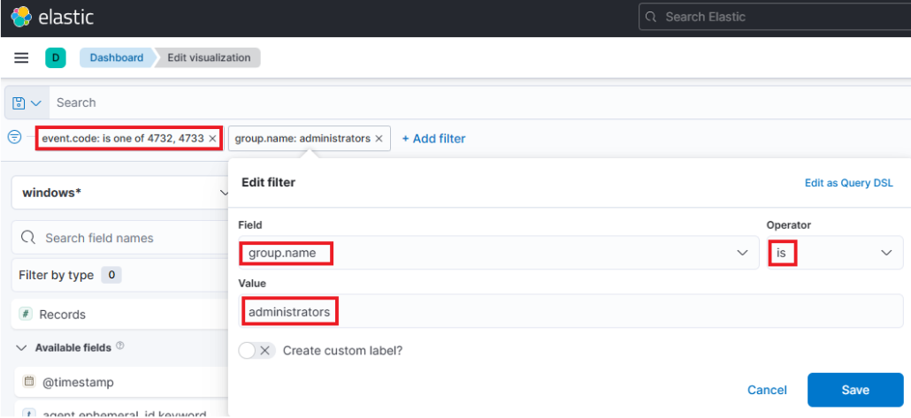

2. Trường này cho biết tập dữ liệu (index) mà chúng ta sẽ sử dụng. Dữ liệu từ các nguồn hạ tầng khác nhau thường được tách vào những chỉ mục khác nhau, chẳng hạn mạng, Windows, Linux, v.v. Trong ví dụ cụ thể này, chúng ta sẽ chỉ định windows* trong "Index pattern".

3. Thanh tìm kiếm này cho phép kiểm tra lại sự tồn tại của một trường cụ thể trong tập dữ liệu, như một cách khác để bảo đảm đang xem đúng dữ liệu. Chúng ta quan tâm đến trường user.name.keyword. Có thể dùng thanh tìm kiếm để nhanh chóng tìm và xác minh trường này có tồn tại, được phát hiện trong tập dữ liệu đã chọn hay không. Điều này cho phép xác nhận đang truy cập trường mong muốn và làm việc với dữ liệu chính xác.

   

4. Cuối cùng, menu thả xuống này cho phép chọn loại trực quan hóa muốn tạo. Tùy chọn mặc định hiển thị trong hình trước là "Bar vertical stacked". Nếu nhấp nút đó, những tùy chọn khác sẽ được hiển thị (hình đã lược bớt vì không phải tất cả tùy chọn đều vừa trên màn hình). Từ danh sách mở rộng, chúng ta có thể chọn loại trực quan hóa phù hợp nhất với yêu cầu và nhu cầu trình bày dữ liệu.

   

Đối với nội dung trực quan hóa này, hãy chọn "Table". Sau khi chọn "Table", tiếp tục nhấp tùy chọn "Rows". Thao tác này cho phép chọn các thành phần dữ liệu cụ thể muốn đưa vào dạng xem bảng.

   

Hãy cấu hình thiết lập "Rows" như sau.

   

Tiếp theo, đóng cửa sổ "Rows" và chuyển sang cấu hình "Metrics".

   

Trong cửa sổ "Metrics", chọn "count" làm phép đo mong muốn.

   

Bổ sung cuối cùng cho bảng là thêm một số thiết lập "Rows" để giúp chúng ta hiểu rõ hơn.

- Người dùng nào được thêm vào hoặc xóa khỏi nhóm? (trường winlog.event_data.MemberSid.keyword)
- Việc thêm hoặc xóa được thực hiện đối với nhóm nào? (kiểm tra lại rằng đó là "Administrators") (trường group.name.keyword)
- Người dùng được thêm vào hay xóa khỏi nhóm? (trường event.action.keyword)
- Hành động xảy ra trên máy nào? (trường host.name.keyword)
   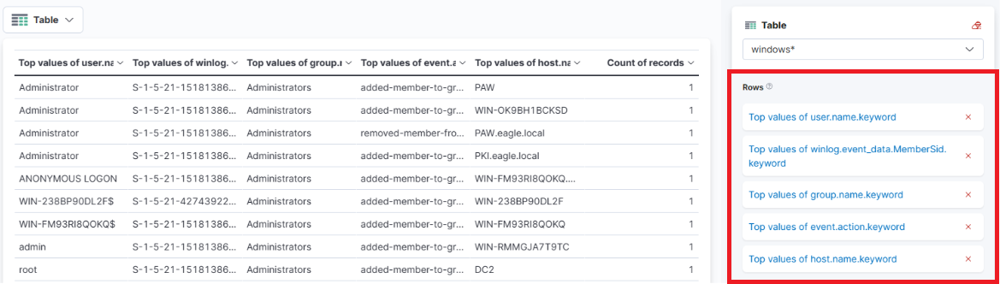

Nhấp "Save and return"; bạn sẽ thấy nội dung trực quan hóa mới được thêm vào dashboard.

Như đã thảo luận, chúng ta muốn giám sát việc thêm người dùng vào hoặc xóa khỏi nhóm "Administrators" cục bộ trong một khung thời gian cụ thể (từ ngày 5 tháng 3 năm 2023 đến hiện tại).

Có thể thu hẹp phạm vi của nội dung trực quan hóa như sau.


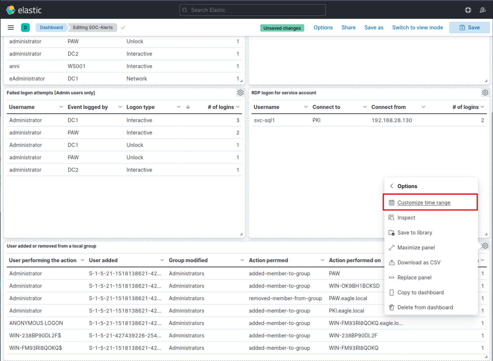

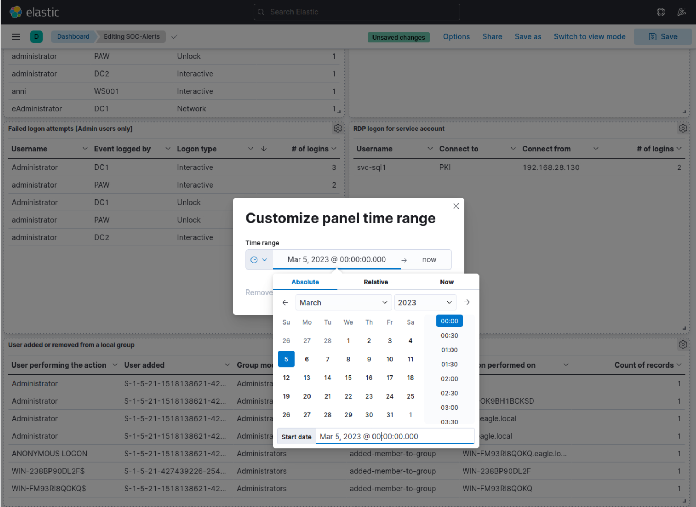

Cuối cùng, nhấp nút "Save" để lưu lại tất cả chỉnh sửa.

Vui lòng chờ 3-5 phút để Kibana sẵn sàng sau khi khởi tạo máy mục tiêu của các câu hỏi bên dưới.

Lưu ý: Vì Elasticsearch sử dụng bucket để tổng hợp dữ liệu (khoảng thời gian, v.v.) thành nhóm, chúng ta phải luôn dùng khoảng thời gian tuyệt đối khi tạo nội dung trực quan hóa. Nếu không xét điều này, bucket sẽ hiển thị khoảng theo tuần thay vì theo ngày. Ví dụ, một khoảng thời gian tuyệt đối có thể là từ ngày 1 tháng 1 đến ngày 31 tháng 1 năm 2023.

<a id="section-10"></a>

## Section 10/11 — Quy trình triage

### Triage cảnh báo là gì?

Triage cảnh báo, do nhà phân tích SOC thực hiện, là quá trình đánh giá và xác định thứ tự ưu tiên cho các cảnh báo bảo mật do nhiều hệ thống giám sát, phát hiện tạo ra, nhằm xác định mức độ đe dọa và tác động tiềm tàng của chúng đối với hệ thống, dữ liệu của tổ chức. Quá trình này bao gồm việc xem xét và phân loại cảnh báo một cách có hệ thống để phân bổ nguồn lực, ứng phó sự cố bảo mật hiệu quả.

Escalation (chuyển lên cấp xử lý cao hơn) là một khía cạnh quan trọng của triage cảnh báo trong môi trường SOC. Quá trình chuyển cấp thường bao gồm thông báo cho người giám sát, đội ứng phó sự cố hoặc các cá nhân được chỉ định trong tổ chức có thẩm quyền ra quyết định và điều phối hoạt động ứng phó. Nhà phân tích SOC cung cấp thông tin chi tiết về cảnh báo, bao gồm mức độ nghiêm trọng, tác động tiềm tàng và mọi phát hiện liên quan từ điều tra ban đầu. Điều này cho phép người ra quyết định đánh giá tình hình và xác định hướng hành động phù hợp, chẳng hạn huy động đội chuyên môn, khởi động quy trình ứng phó sự cố rộng hơn hoặc sử dụng nguồn lực bên ngoài khi cần.

Chuyển cấp bảo đảm những cảnh báo trọng yếu được chú ý kịp thời và hỗ trợ phối hợp hiệu quả giữa các bên liên quan, cho phép ứng phó nhanh chóng, hiệu quả với sự cố bảo mật tiềm ẩn. Nó giúp tận dụng chuyên môn và khả năng ra quyết định của những người chịu trách nhiệm quản lý, giảm thiểu mối đe dọa hoặc sự cố ở cấp cao hơn trong tổ chức.

### Quy trình triage lý tưởng là gì?

#### Xem xét cảnh báo ban đầu

- Xem xét kỹ cảnh báo ban đầu, bao gồm metadata, dấu thời gian, IP nguồn, IP đích, hệ thống bị ảnh hưởng và quy tắc/chữ ký đã kích hoạt cảnh báo.
- Phân tích các log liên quan (lưu lượng mạng, hệ thống, ứng dụng) để hiểu ngữ cảnh của cảnh báo.

#### Phân loại cảnh báo

- Phân loại cảnh báo theo mức độ nghiêm trọng, tác động và tính khẩn cấp bằng hệ thống phân loại đã được tổ chức xác định trước.

#### Tương quan cảnh báo

- Đối chiếu cảnh báo với các cảnh báo, sự kiện hoặc sự cố liên quan để nhận diện mẫu hoạt động, điểm tương đồng hoặc các chỉ báo xâm nhập (IOC) tiềm năng.
- Truy vấn SIEM hoặc hệ thống quản lý log để thu thập dữ liệu log có liên quan.
- Sử dụng các nguồn cấp threat intelligence để kiểm tra những mẫu tấn công hoặc chữ ký mã độc đã biết.

#### Bổ sung dữ liệu cảnh báo

Thu thập thông tin bổ sung để làm phong phú dữ liệu cảnh báo và có thêm ngữ cảnh:

- Thu thập bản bắt gói tin mạng, bản dump bộ nhớ hoặc mẫu tệp liên quan đến cảnh báo.
- Sử dụng nguồn threat intelligence bên ngoài, công cụ mã nguồn mở hoặc sandbox để phân tích tệp, URL hay địa chỉ IP đáng ngờ.
- Khảo sát các hệ thống bị ảnh hưởng để tìm bất thường (kết nối mạng, tiến trình, thay đổi tệp).

#### Đánh giá rủi ro

Đánh giá rủi ro tiềm ẩn và tác động đối với tài sản, dữ liệu hoặc hạ tầng trọng yếu:

- Cân nhắc giá trị của hệ thống bị ảnh hưởng, mức độ nhạy cảm của dữ liệu, yêu cầu tuân thủ và những hệ quả liên quan đến quy định.
- Xác định khả năng cuộc tấn công thành công hoặc khả năng có di chuyển ngang.

#### Phân tích ngữ cảnh

- Nhà phân tích xem xét ngữ cảnh xung quanh cảnh báo, bao gồm các tài sản bị ảnh hưởng, mức độ trọng yếu của chúng và mức độ nhạy cảm của dữ liệu chúng xử lý.
- Họ đánh giá những biện pháp kiểm soát bảo mật hiện có, như tường lửa, hệ thống phát hiện/ngăn chặn xâm nhập và giải pháp bảo vệ endpoint, để xác định cảnh báo có cho thấy khả năng biện pháp kiểm soát thất bại hoặc một kỹ thuật né tránh hay không.
- Nhà phân tích đánh giá các yêu cầu tuân thủ, quy định ngành và nghĩa vụ hợp đồng có liên quan để hiểu tác động của cảnh báo đến tình trạng tuân thủ pháp luật và quy định của tổ chức.

#### Lập kế hoạch ứng phó sự cố

Khởi động kế hoạch ứng phó sự cố nếu cảnh báo có mức độ đáng kể:

- Ghi lại chi tiết cảnh báo, hệ thống bị ảnh hưởng, hành vi quan sát được, IOC tiềm năng và dữ liệu bổ sung.
- Phân công thành viên đội ứng phó sự cố với vai trò, trách nhiệm được xác định rõ.
- Phối hợp với những đội khác (vận hành mạng, quản trị viên hệ thống, nhà cung cấp) khi cần.

#### Tham vấn bộ phận vận hành CNTT

Đánh giá nhu cầu bổ sung ngữ cảnh hoặc thông tin còn thiếu bằng cách tham vấn bộ phận vận hành CNTT hoặc các bộ phận liên quan:

- Trao đổi hoặc họp để thu thập hiểu biết về hệ thống bị ảnh hưởng, những thay đổi gần đây hoặc hoạt động bảo trì đang diễn ra.
- Phối hợp để hiểu các vấn đề đã biết, cấu hình sai hoặc thay đổi mạng có khả năng tạo cảnh báo false positive.
- Có được hiểu biết toàn diện về môi trường và mọi hoạt động không độc hại có thể đã kích hoạt cảnh báo.
- Ghi lại những hiểu biết và thông tin thu được trong quá trình tham vấn.

#### Thực hiện ứng phó

- Dựa trên việc xem xét cảnh báo, đánh giá rủi ro và tham vấn, xác định các hành động ứng phó phù hợp.
- Nếu ngữ cảnh bổ sung giải đáp được cảnh báo hoặc xác định đó là sự kiện không độc hại, thực hiện các hành động cần thiết mà không chuyển cấp.
- Nếu cảnh báo vẫn cho thấy vấn đề bảo mật tiềm ẩn hoặc cần điều tra thêm, tiếp tục thực hiện các hành động ứng phó sự cố.

#### Chuyển cấp xử lý

Xác định các điều kiện chuyển cấp dựa trên chính sách của tổ chức và mức độ nghiêm trọng của cảnh báo:

- Các điều kiện có thể bao gồm hệ thống/tài sản trọng yếu bị xâm nhập, cuộc tấn công đang diễn ra, kỹ thuật chưa quen thuộc hoặc tinh vi, tác động trên diện rộng hoặc mối đe dọa nội bộ.
- Đánh giá cảnh báo theo các điều kiện chuyển cấp, cân nhắc hậu quả tiềm tàng nếu không chuyển cấp.
- Tuân theo quy trình chuyển cấp nội bộ, thông báo cho các đội/cấp quản lý cao hơn chịu trách nhiệm ứng phó sự cố.
- Cung cấp bản tổng hợp đầy đủ về cảnh báo, mức độ nghiêm trọng, tác động tiềm tàng, dữ liệu bổ sung và đánh giá rủi ro.
- Ghi lại mọi trao đổi liên quan đến chuyển cấp.
- Trong một số trường hợp, chuyển sự việc đến các đơn vị bên ngoài (cơ quan thực thi pháp luật, nhà cung cấp dịch vụ ứng phó sự cố, CERT) theo yêu cầu pháp luật/quy định.

#### Giám sát liên tục

- Liên tục giám sát tình hình và tiến độ ứng phó sự cố.
- Duy trì liên lạc thông suốt với các đội nhận xử lý sau chuyển cấp, cập nhật diễn biến, phát hiện hoặc thay đổi về mức độ nghiêm trọng/tác động.
- Phối hợp chặt chẽ với các đội nhận xử lý để ứng phó thống nhất.

#### Hạ cấp xử lý

- Đánh giá nhu cầu hạ cấp xử lý khi việc ứng phó sự cố tiến triển và tình hình đã được kiểm soát.
- Hạ cấp khi rủi ro đã được giảm thiểu, sự cố đã được ngăn chặn và không cần chuyển lên cấp cao hơn nữa.
- Thông báo cho các bên liên quan, cung cấp bản tổng hợp về hành động đã thực hiện, kết quả và bài học rút ra.

Thường xuyên xem xét và cập nhật quy trình, bảo đảm phù hợp với chính sách, thủ tục và hướng dẫn của tổ chức. Điều chỉnh quy trình để xử lý những mối đe dọa mới nổi và nhu cầu thay đổi.

<a id="section-11"></a>

## Section 11/11 — Đánh giá kỹ năng

### Bài tập xem xét dashboard và tư duy phản biện

Chúc mừng,

Bạn đã được Eagle tuyển dụng làm nhà phân tích SOC Tier 1. Hôm qua là ngày làm thủ tục gia nhập công ty, và hôm nay bạn sẽ được làm quen với SOC. Ngày làm việc bắt đầu bằng cuộc gặp với một nhà phân tích cấp cao, người sẽ cung cấp hiểu biết về môi trường; sau đó, bạn được kỳ vọng bắt đầu giám sát cảnh báo và sự kiện bảo mật trên các dashboard SOC do chúng ta tự xây dựng.

Dưới đây là ghi chú của bạn sau khi gặp nhà phân tích cấp cao và được cung cấp thông tin về môi trường:

- Tổ chức đã chuyển toàn bộ hoạt động hosting lên đám mây; mạng DMZ cũ đã đóng, vì vậy không còn máy chủ nào ở đó.
- Đội vận hành CNTT (các quản trị viên CNTT nòng cốt) gồm bốn người. Họ là những người duy nhất có đặc quyền cao trong môi trường.
- Đội vận hành CNTT thường có xu hướng sử dụng các tài khoản administrator mặc định, ngay cả khi đã được yêu cầu không làm vậy.
- Tất cả thiết bị đầu cuối được tăng cường bảo mật theo baseline của CIS. Danh sách cho phép được triển khai ở mức hạn chế.
- Bộ phận bảo mật CNTT đã tạo một privileged admin workstation (PAW — máy trạm quản trị đặc quyền) và yêu cầu mọi hoạt động quản trị phải được thực hiện trên máy này.
- Môi trường Linux chủ yếu là những máy chủ “còn sót lại” từ trước đây, có rất ít hoặc gần như không có hoạt động trong một ngày bình thường. Tài khoản root không được sử dụng; do các phát hiện trong kiểm toán, tài khoản này đã bị chặn kết nối từ xa, và người dùng cần những quyền đó phải nâng quyền qua lệnh sudo.
- Có quy ước đặt tên và chúng được tuân thủ nghiêm ngặt; ví dụ, tài khoản dịch vụ chứa '-svc' trong tên. Tài khoản dịch vụ được tạo với mật khẩu dài, phức tạp và thực hiện một nhiệm vụ rất cụ thể (nhiều khả năng là chạy dịch vụ cục bộ trên máy).

Nếu đang có một phiên máy mục tiêu chạy sẵn, hãy đặt lại bằng cách nhấp biểu tượng "Reset Target". Điều này bảo đảm bạn lấy lại quyền truy cập dashboard được cấu hình sẵn, có thể đã bị bạn xóa trong những section liên quan đến trực quan hóa SIEM.

Bây giờ, bạn có thể ngồi vào vị trí và bắt đầu giám sát. Truy cập http://[Target IP]:5601, nhấp nút bật/tắt điều hướng bên cạnh, rồi nhấp "Dashboard". Xem xét dashboard SOC-Alerts.

#### Nội dung trực quan hóa 1: Đăng nhập thất bại (Tất cả người dùng)

Nội dung trực quan hóa như vậy có thể làm lộ ra những cuộc tấn công brute force tiềm ẩn. Điều quan trọng là xác định một người dùng riêng lẻ có nhiều lần đăng nhập thất bại, hoặc nhiều người dùng kết nối đến (hay từ) cùng một thiết bị đầu cuối. Tuy nhiên, dữ liệu hiện tại không cho thấy tình huống nào như vậy. Dù thế, có thể nhận thấy một điểm bất thường. Gợi ý: Nó liên quan đến tài khoản "sql-svc1".

#### Nội dung trực quan hóa 2: Đăng nhập thất bại (Người dùng bị vô hiệu hóa)

Có vẻ có một sự việc mà người dùng "Anni" đã cố xác thực dù tài khoản bị vô hiệu hóa.

#### Nội dung trực quan hóa 3: Đăng nhập thất bại (Chỉ người dùng quản trị)

Gợi ý: Kiểm tra xem tất cả sự kiện có xảy ra trên Privileged Access Workstations (PAW — máy trạm truy cập đặc quyền) hoặc Domain Controller hay không.

#### Nội dung trực quan hóa 4: Đăng nhập RDP bằng tài khoản dịch vụ

Các tài khoản dịch vụ trong môi trường này phục vụ một chức năng rất chuyên biệt. Bạn có nhận thấy điều gì đáng nghi không?

#### Nội dung trực quan hóa 5: Người dùng được thêm vào hoặc xóa khỏi nhóm cục bộ

Một quản trị viên đã thêm một cá nhân (chỉ được biểu diễn bằng giá trị SID) vào nhóm "Administrators". Bạn nên chuyển lên nhà phân tích Tier 2/3 hay tham vấn bộ phận vận hành CNTT trước?

#### Nội dung trực quan hóa 6: Đăng nhập quản trị không xuất phát từ PAW

Quản trị viên chỉ nên dùng PAW cho những kết nối từ xa đến máy chủ. Bạn nên chuyển lên nhà phân tích Tier 2/3 hay tham vấn bộ phận vận hành CNTT trước?

#### Nội dung trực quan hóa 7: Đăng nhập SSH

Hãy nhớ rằng tài khoản root thông thường không được sử dụng.


